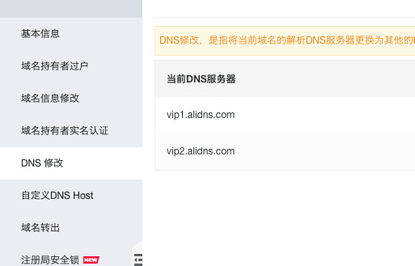

# 域名

## DNS解析

选择阿里云解析或[DNSPod](https://www.dnspod.cn/)，如果是阿里云买的域名，建议就用阿里云解析，
因为可以免费申请一个SSL证书。

## 域名 A 记录和 CNAME 如何配置解析

**概念**：主机记录、记录类型、记录值、权重、MX 优先级和 TTL。

* 记录类型

  记录类型：A 记录、CNAME、MX、TXT、NS、AAAA、SRV、显性 URL 和 隐性 URL。

  * A 记录：Address，最常用。是将一个域名映射到一个IP地址。
    * 如填 www 的话，就是二级域名 `www.vfa25.cn`
    * 如填 123.api 的话，就是三级域名 `123.api.vfa25.cn`
    * 如填 @ 的话，就是顶级域名 `vfa25.cn`
    * 如填 * 的话，就是泛解析，通配符域名
  * CNAME：别名指向记录，可以将一个域名指向另一个域名。通常用作如“七牛云”静态资源代理。
    * 如果把域名绑到七牛的一个 bucket 上，先把自己的域名 SSL 证书先上传到七牛
    * 然后把七牛提供的 CNAME 的值配置到自己的域名解析商这里，让它指向七牛的服务器
    * 等待审核并生效之后，就可以通过域名来访问到七牛的资源了
  * MX：多用于邮件验证，设置企业邮箱的时候，让邮件可以收到邮件，就添加 MX 记录。

* 权重和 MX 优先级

  来调整不同域名的解析权重，如果规则有重叠时的优先级。

* TTL

  一般是 600 秒，不用修改，设置被本地 DNS 缓存的时间，缓存失效后，会再次到 DNS 上获取记录值。
