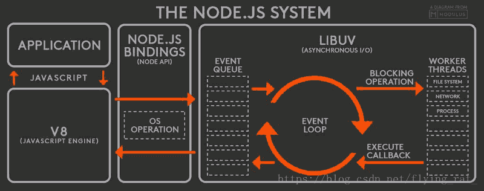
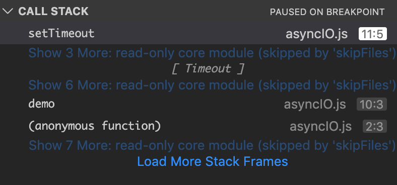

Node.js系统架构如下（[图片来源于网络](https://blog.csdn.net/flying_rat_/article/details/81673558)）：


- 图左（APP/V8/Node API）：Node.js 是一个基于 Chrome V8 引擎的 JavaScript 运行环境。
- 图右（libuv）：Node.js 使用了一个**事件驱动**、**非阻塞式I/O**的模型。

如图示：内置模块提供了 JS App $\Longleftrightarrow$ V8引擎 $\Longleftrightarrow$ 操作系统 的能力。

## 异步

### Node.js的非阻塞I/O

- I/O即Input/Output，一个系统的输入和输出。
- 阻塞I/O和非阻塞I/O的区别就在于系统接收输入再到输出期间，能不能就收其他输入。

### 异步编程-callback

- 回调函数格式规范
  - error-first callback
  - Node-style callback
- 第一个参数是error，后面的参数才是结果

```js
try { // catch无法捕获异步throw的错误
  demo(() => {
    console.log('result');
  });
} catch (e) {
  console.log('error', e);
}

function demo(callback) {
  setTimeout(() => {
    throw new Error('fail');
    callback('success');
  }, 500);
}
/*
    throw new Error('fail');
    ^
Error: fail*/
```

这是因为，setTimeout API将开启一个异步线程、且在满足条件（如500ms）时，这个回调函数将被推入`Task Queues`，`Event Loop`机制会不断轮询`Task Queues`并取队头执行，这个callback将成为新的事件循环调用栈的底部。那么，Error只会抛向全局。


### 异步编程-Promise

- Promise
  - [Promises/A+规范](https://www.ituring.com.cn/article/66566)、[手写Promise](https://github.com/xieranmaya/blog/issues/2)。
  - 执行then和catch会返回一个新的Promise，该Promise的最终状态根据then和catch的回调函数的执行结果决定
    - （冻结态）如果回调函数最终是throw，该Promise是rejected状态。
    - （冻结态）如果回调函数最终是return（或return undefined），该Promise是resolved状态。
    - （叠加态）如果回调函数最终return了新的Promise，这个新的Promise将完全替代该Promise。

### 异步编程-async/await

- async function是Promise的语法糖封装
- 异步编程的最终解决方案——以同步的方式写异步
  - await关键字可以“暂停”async function的执行
  - await关键字可以以同步的写法获取Promise的执行结果
  - try-catch可以捕获await所得到的错误
  - async的并行异步，函数体中以`await Promise.all`即可
- 一个穿越事件循环存在的function

## 事件循环

```c
// src/node_main.cc
return node::Start(argc, argv);
// src/node.cc 第2865行的Start方法
bool more;
do {
  // 基于libuv；#include "uv.h"，用于维护管理事件循环；uv_run不停的跑队列
  // 参考 https://www.cnblogs.com/lsgxeva/p/9999135.html
  uv_run(env.event_loop(), UV_RUN_DEFAULT);

  v8_platform.DrainVMTasks(isolate);

  more = uv_loop_alive(env.event_loop());
  if (more)
    continue;

  RunBeforeExit(&env);

  // Emit `beforeExit` if the loop became alive either after emitting
  // event, or after running some callbacks.
  // 若more 恒!= true, 即listen可以控制server主进程一直不会退出的原因
  more = uv_loop_alive(env.event_loop());
} while (more == true); // more初始非true，do while语法

env.stop_sub_worker_contexts(); // 停止上下文
// 扫尾工作
return exit_code;
```

## Reference

- [Node.js机制及原理理解初步](https://blog.csdn.net/leftfist/article/details/41891407)
- [NodeJS底层原理](https://blog.csdn.net/flying_rat_/article/details/81673558)
