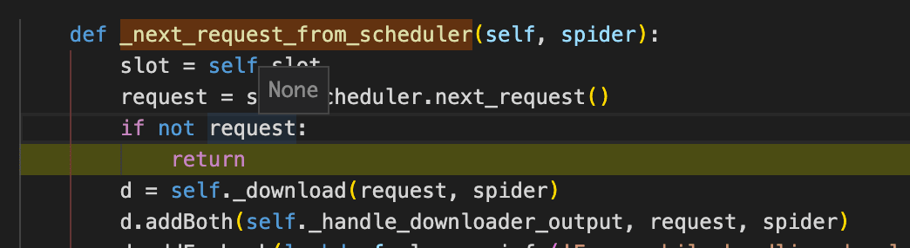
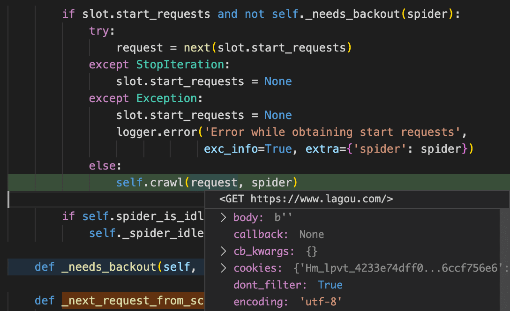

## Scrapy架构图


[图片来源自官网](https://docs.scrapy.org/en/latest/topics/architecture.html#)

**重点思想：[`Request`](https://docs.scrapy.org/en/latest/topics/request-response.html#request-objects)是通过`Spider`yield出来的，[`Response`](https://docs.scrapy.org/en/latest/topics/request-response.html#response-objects)是通过`Downloader`下载完成后返回的。**

## 源码看数据流

我本地虚拟环境py3scrapy下的源码路径是：`~/.virtualenvs/py3scrapy/lib`，
测试代码如下：

```py
from scrapy.cmdline import execute
execute(['scrapy', 'crawl', 'lagou'])
```

<font size=1>本示例调用流程如下：`execute`方法实例化`scrapy.crawler.CrawlerProcess`并随即辅助方法调用其`crawl`方法，该类继承自`scrapy.crawler.CrawlerRunner`，后者随即调用`scrapy.crawler.Crawler的crawl方法`，至此，开始进入核心逻辑。</font>

如官网介绍，Scrapy中的数据流由执行引擎控制，其过程如下:

1. 引擎打开一个网站(open a domain)，找到处理该网站的Spider并向该spider请求第一个要爬取的URL(s)（即业务Spider的`start_urls`字段，默认值为`[]`）。

    <details>
      <summary>流程图中①步骤代码逻辑</summary>

      ```py
      # scrapy.crawler.Crawler
      class Crawler(object):

          def crawl(self, *args, **kwargs):
              assert not self.crawling, "Crawling already taking place"
              self.crawling = True

              try:
                  self.spider = self._create_spider(*args, **kwargs)
                  self.engine = self._create_engine()
                  # 关键逻辑，通常 业务spider 会继承 Spider类，
                  # 并Override其start_requests方法，该方法也应yield Request示例
                  start_requests = iter(self.spider.start_requests())
                  yield self.engine.open_spider(self.spider, start_requests)
                  yield defer.maybeDeferred(self.engine.start)
              except Exception:
                  pass

      # scrapy.core.engine.ExecutionEngine
      class ExecutionEngine(object):

          def open_spider(self, spider, start_requests=(), close_if_idle=True):
              assert self.has_capacity(), "No free spider slot when opening %r" % \
                  spider.name
              logger.info("Spider opened", extra={'spider': spider})
              nextcall = CallLaterOnce(self._next_request, spider)
              scheduler = self.scheduler_cls.from_crawler(self.crawler)
              start_requests = yield self.scraper.spidermw.process_start_requests(start_requests, spider)
              slot = Slot(start_requests, close_if_idle, nextcall, scheduler)
              self.slot = slot
              self.spider = spider
              yield scheduler.open(spider)
              yield self.scraper.open_spider(spider)
              self.crawler.stats.open_spider(spider)
              yield self.signals.send_catch_log_deferred(signals.spider_opened, spider=spider)
              slot.nextcall.schedule()
              slot.heartbeat.start(5)

          def _next_request(self, spider):
              slot = self.slot
              if not slot:
                  return

              if self.paused:
                  return

              while not self._needs_backout(spider):
                  if not self._next_request_from_scheduler(spider):
                      break

              if slot.start_requests and not self._needs_backout(spider):
                  try:
                      request = next(slot.start_requests)
                  except StopIteration:
                      slot.start_requests = None
                  except Exception:
                      slot.start_requests = None
                      logger.error('Error while obtaining start requests',
                                  exc_info=True, extra={'spider': spider})
                  else:
                      self.crawl(request, spider)

              if self.spider_is_idle(spider) and slot.close_if_idle:
                  self._spider_idle(spider)

          def _next_request_from_scheduler(self, spider):
              slot = self.slot
              request = slot.scheduler.next_request()
              if not request:
                  return
              d = self._download(request, spider)
              d.addBoth(self._handle_downloader_output, request, spider)
              d.addErrback(lambda f: logger.info('Error while handling downloader output',
                                                exc_info=failure_to_exc_info(f),
                                                extra={'spider': spider}))
              d.addBoth(lambda _: slot.remove_request(request))
              d.addErrback(lambda f: logger.info('Error while removing request from slot',
                                                exc_info=failure_to_exc_info(f),
                                                extra={'spider': spider}))
              d.addBoth(lambda _: slot.nextcall.schedule())
              d.addErrback(lambda f: logger.info('Error while scheduling new request',
                                                exc_info=failure_to_exc_info(f),
                                                extra={'spider': spider}))
              return d

          def crawl(self, request, spider):
              assert spider in self.open_spiders, \
                  "Spider %r not opened when crawling: %s" % (spider.name, request)
              self.schedule(request, spider)
              self.slot.nextcall.schedule()
      ```

      > 先来关注下`scrapy.core.engine.ExecutionEngine`逻辑

      `_next_request`函数体内调用，流程进入`self._next_request_from_scheduler`，首次时如下：
      
      因为此时并无Request，随后`_next_request`函数体内执行`request = next(slot.start_requests)`，
      这也是`Spider.start_requests方法`要`yield Request`的原因，
      
      取到`Request`实例，并随后进入`self.crawl(request, spider)`，执行`self.schedule(request, spider)`

    </details>

2. 引擎从Spider中获取到第一个要爬取的URL并在调度器(Scheduler)以Request调度。
    <details>
      <summary>流程图中②两步骤代码逻辑</summary>

      ```py
      # scrapy.core.engine.ExecutionEngine
      class ExecutionEngine(object):
          def schedule(self, request, spider):
              self.signals.send_catch_log(signal=signals.request_scheduled,
                      request=request, spider=spider)
              # 关键逻辑
              if not self.slot.scheduler.enqueue_request(request):
                  self.signals.send_catch_log(signal=signals.request_dropped,
                                              request=request, spider=spider)
      ```

      - enqueue（调度器使之入队）：`engine.schedule(self, request, spider)`内部调用`slot.scheduler.enqueue_request(request)`入队，即`scheduler._mqpush(request)`或`scheduler._dqpush(request)`；
      这是通过维护两个（`mqs(in-memory)` and `dqs(on-disk)`）`优先队列(priority queue instance)`来实现。

    </details>
3. 引擎向调度器请求下一个要爬取的URL。

    这里应注意下数据流向，`Engine`在处理`Request`时，是经过`Scheduler`处理过之后，才交由`Downloader`。

    <details>
      <summary>流程图中③步骤代码逻辑</summary>

      `engine.slot.nextcall.schedule()`后将重新进入`engine._next_request`逻辑。

      - dequeue：`engine._next_request_from_scheduler`内部调用`request = slot.scheduler.next_request()`，
      即`request = scheduler.mqs.pop()`。

    </details>
4. 调度器返回下一个要爬取的URL给引擎，引擎将URL通过**Downloader中间件**(请求(request)方向)转发给下载器(Downloader)。

    路径`scrapy/core/downloader/handlers`下可知，支持诸如`datauri、file、ftp、http、http10、http11、s3`等协议。
5. 一旦页面下载完毕，下载器生成一个该页面的Response，并将其通过**Downloader中间件**(返回(response)方向)发送给引擎。
6. 引擎从下载器中接收到Response并通过**Spider中间件**(输入方向)发送给Spider处理。
7. Spider处理Response并返回爬取到的Item及(跟进的)新的Request给引擎。
8. 引擎将(Spider返回的)爬取到的Item给Item Pipeline，将(Spider返回的)Request给调度器。
9. (从第二步)重复直到调度器中没有更多地request，引擎关闭该网站。
