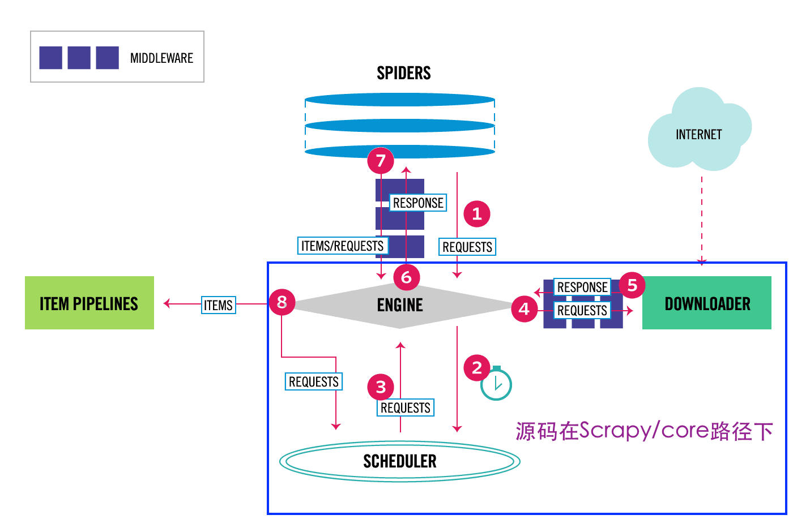

## Scrapy架构图

[图片来源自官网](https://docs.scrapy.org/en/latest/topics/architecture.html#)

## 源码看数据流

如官网介绍，Scrapy中的数据流由执行引擎控制，其过程如下:

1. 引擎打开一个网站(open a domain)，找到处理该网站的Spider并向该spider请求第一个要爬取的URL(s)。

    即业务Spider的`start_urls`字段。
2. 引擎从Spider中获取到第一个要爬取的URL并在调度器(Scheduler)以Request调度。
3. 引擎向调度器请求下一个要爬取的URL。

    

      
流程图中②、③两步代码逻辑

      - enqueue：`engine.schedule(self, request, spider)`内部调用`slot.scheduler.enqueue_request(request)`入队，
      后者通过维护两个（in-memory and on-disk）优先队列（priority queue instance）`scheduler.dqs.push(request)`实现；
      - dequeue：`engine._next_request_from_scheduler`内部调用`request = slot.scheduler.next_request()`，
      即`request = scheduler.mqs.pop()`。

    

4. 调度器返回下一个要爬取的URL给引擎，引擎将URL通过下载中间件(请求(request)方向)转发给下载器(Downloader)。

    路径`scrapy/core/downloader/handlers`下可知，支持诸如`datauri、file、ftp、http、http10、http11、s3`等协议。
5. 一旦页面下载完毕，下载器生成一个该页面的Response，并将其通过下载中间件(返回(response)方向)发送给引擎。
6. 引擎从下载器中接收到Response并通过Spider中间件(输入方向)发送给Spider处理。
7. Spider处理Response并返回爬取到的Item及(跟进的)新的Request给引擎。
8. 引擎将(Spider返回的)爬取到的Item给Item Pipeline，将(Spider返回的)Request给调度器。
9. (从第二步)重复直到调度器中没有更多地request，引擎关闭该网站。
