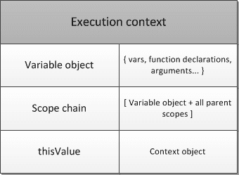

# 执行上下文

执行上下文（Execution Context），每个执行上下文可抽象为对象。图示三个基本属性：


## thisValue

```js
// 1
function show() {
  console.log('this:', this);
}
var obj = {
  show
}
obj.show(); // obj
function show() {
  console.log('this:', this);
}
var obj = {
  show: function() {
    show();
  }
}
obj.show(); // window

// 2
var obj = {
  show: function() {
    console.log('this:', this);
  }
};
(0, obj.show)(); // window，this来自于表达式的返回值

// 3
var obj = {
  sub: {
    show: function() {
      console.log('this:', this);
    }
  }
};
obj.sub.show(); // sub

// 4
var obj = {
  show: function () {
    console.log('this:', this);
  }
};
var newobj = new obj.show(); // newobj

// 5
var obj = {
  show: function() {
    console.log('this:', this);
  },
	mark: true
};
var newobj = new(obj.show.bind(obj))(); // newobj

// 6
var obj = {
  show: function() {
    console.log('this:', this);
  }
};
var elem = document.getElementById("lg");
elem.addEventListener('click', obj.show); // DOM node
elem.addEventListener('click', obj.show.bind(obj)); // obj
elem.addEventListener('click', function() {
  obj.show(); // obj
});
```

## scope chain

```js
// 1
var person = 1;
function showPerson() {
  var person = 2;
  console.log(person);
}
showPerson(); // 2

// 2
var person = 1;
function showPerson() {
  console.log(person);
  var person = 2;
}
showPerson(); // undefined

// 3
var person = 1;
function showPerson() {
  console.log(person);
  var person = 2;
  function person() {}
}
showPerson(); // function person，函数声明会覆盖

// 4
var person = 1;
function showPerson() {
  console.log(person);
  function person() {}
  var person = 2;
}
showPerson(); // function person，var声明不作处理

// 5
for (var i = 0; i < 10; i++) {
  console.log(i);
}
for (var i = 0; i < 10; i++) {
  setTimeout(function() {
    console.log(i);
  }, 0);
}
for (var i = 0; i < 10; i++) {
  (function(i) {
    setTimeout(function() {
      console.log(i);
    }, 0);
  })(i);
}
for (let i = 0; i < 10; i++) {
  console.log(i);
}
// 0, 1, 2 ... 9
// 0, 1, 2 ... 9
// 10, 10 ... 10
// 0, 1, 2 ... 9
```

## face to object

```js
// 1
function Person() {
  this.name = 1;
  return {};
}
var person = new Person();
console.log('name:', person.name); // undefined, 构造器仅且仅当返回对象，返回值生效

// 2
function Person() {
  this.name = 1;
}
Person.prototype = {
  show: function() {
    console.log('name is:', this.name);
  }
}
var person = new Person();
person.show(); // name is: 1

// 3
function Person() {
  this.name = 1;
}
Person.prototype = {
  name: 2,
  show: function() {
    console.log('name is:', this.name);
  }
}
var person = new Person();
Person.prototype.show = function() {
  console.log('new show');
};
person.show(); // new show

// 4
function Person() {
  this.name = 1;
}
Person.prototype = {
  name: 2,
  show: function() {
    console.log('name is:', this.name);
  }
}
var person = new Person();
var person2 = new Person();
person.show = function() {
  console.log('new show');
};
person2.show(); // name is: 1
person.show(); // new show

// 综合
function Person() {
  this.name = 1;
}
Person.prototype = {
  name: 2,
  show: function() {
    console.log('name is:', this.name);
  }
}
Person.prototype.show(); // name is:2
(new Person()).show(); // name is:1
```
