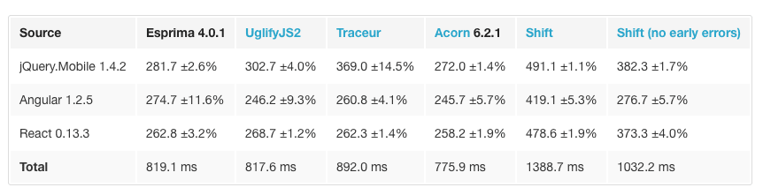

`AST`即`Abstract Syntax Tree`，汉译为`抽象语法树`。

在前端颇为常见：比如前端框架`Vue`的模版语法，就是先通过正则匹配Template字符串，再根据规则解析并构建（解析器）为`AST`，
后者既可以经`codegen`形成渲染函数，又可以作为下次`patch`的依据（`diff`算法）。

不仅如此，稍后会更新浏览器渲染进程或JS引擎进程工作机制，基本概念请转场[浏览器的工作原理](/doc/howbrowserswork)。

## Reference

- [使用 Acorn 来解析 JavaScript](https://juejin.im/post/582425402e958a129926fcb4)

## parser介绍

**本章节的主角：Acorn ——— 它是 Webpack 的解析器**。

简单介绍下Github几款加星比较高的解析器：

- [Esprima](https://github.com/jquery/esprima)
- [Acorn](https://github.com/acornjs/acorn)
- [UglifyJS 2](https://github.com/mishoo/UglifyJS2)

Acorn的作者或许是觉着好玩，造的Esprima的轮子，却比后者代码量更少。这两个比较关键的点是解析出来的 AST 结果（只是 AST，tokens 不一样）且都是符合[The Estree Spec 规范](https://developer.mozilla.org/en-US/docs/Mozilla/Projects/SpiderMonkey/Parser_API)。

`Acorn`非常快，易于使用，并且针对非标准特性(以及那些未来的标准特性) 设计了一个基于插件的架构。

Uglify有自己的代码解析器（UglifyJS 3），也可以输出 AST，但它的功能更多还是用于压缩代码。

Babylon是`Babel`的解析器。最初是从`Acorn`fork出来的。

来看一下[性能比较](https://esprima.org/test/compare.html)：


可以在[Esprima: Parser](https://esprima.org/demo/parse.html)测试各种代码的解析结果。

用于把满足 Estree 标准的 AST 转换为 ESMAScript 代码的一个工具，：[escodegen](https://github.com/estools/escodegen)。

## Acorn API

**解析 acorn.parse**

```js
let acorn = require("acorn");
console.log(acorn.parse("1 + 1"));
```

**分词 acorn.tokenizer**

```js
console.log([...acorn.tokenizer("1 + 1")])
```

## Acorn Plugins

Acorn，提供了一种扩展的方式来编写相关的插件：[Acorn Plugins](https://github.com/acornjs/acorn#plugins)。

如解析jsx语法插件[acorn-jsx](https://github.com/RReverser/acorn-jsx)

## Demo:实现方法来解析Node.js模块依赖

要求：解析符合CommonJS规范的`require(modulename: string)`的模块依赖，并输出树图。

- 该demo的文件目录及内容

```js
├── demo1
│   └── exports1.js
├── demo2
│   └── exports2.js
├── index.js

// demo1/exports1.js
var lodash = require("lodash");
var exports2 = require("../demo2/exports2.js");
// demo2/exports2.js
var fs = require("fs");
```

- 方法实现

```js
// index.js
const fs = require("fs");
const path = require("path"); // 原生模块
const acorn = require("acorn");
const treeify = require('treeify'); // 用于打印🌲图

const { readFileSync } = fs;

// 解析目标字符串，并打印模块依赖树图
var result = parseDependencies(`
var os = require("os");
var exports1 = require("./demo1/exports1.js");
`, __dirname);

console.log(treeify.asTree(result, true));

function parseDependencies(str, dirname) {
  const ast = acorn.parse(str);
  const resource = []; // 依赖模块
  walkNode(ast, (node) => { // 从根节点开始深度遍历
    const callee = node.callee;
    const args = node.arguments;
    if (
      node.type === 'CallExpression' && // 函数调用表达式
      callee.type === 'Identifier' && //标识符，如变量声明、函数声明...
      callee.name === 'require' && // 泛函参数require
      args.length === 1 &&
      args[0].type === 'Literal' // 字面量
    ) {
      let item = {
        string: str.substring(node.start, node.end),
        path: args[0].value,
        start: node.start,
        end: node.end
      };

      // 根据paths索引数组，判断模块类型
      let resolvePaths = require.resolve.paths(args[0].value);
      if (resolvePaths === null || Array.isArray(resolvePaths) && resolvePaths.length !== 1) {
        // 原生模块 或 第三方模块
      } else {
        // 文件模块
        const resolvedFile = path.resolve(dirname, args[0].value);
        if (fs.existsSync(resolvedFile)) {
          let data = readFileSync(resolvedFile, 'utf-8');
          let resolveDir = path.dirname(resolvedFile);
          item.children = parseDependencies(data, resolveDir);
        }
      }
      resource.push(item);
    }
  });
  return resource;
}

// 深度遍历，包括当前结点、支结点
function walkNode(node, callback) {
  callback(node);

  // 有 type 字段的被认为是一个节点
  Object.keys(node).forEach((key) => {
    const item = node[key];
    if (Array.isArray(item)) {
      item.forEach((sub) => {
        sub.type && walkNode(sub, callback);
      });
    } else {
      item && item.type && walkNode(item, callback);
    }
  });
}
```

```md
# 控制台打印结果
├─ 0
│  ├─ string: require("os")
│  ├─ path: os
│  ├─ start: 10
│  └─ end: 23
└─ 1
   ├─ string: require("./demo1/exports1.js")
   ├─ path: ./demo1/exports1.js
   ├─ start: 40
   ├─ end: 70
   └─ children
      ├─ 0
      │  ├─ string: require("lodash")
      │  ├─ path: lodash
      │  ├─ start: 13
      │  └─ end: 30
      └─ 1
         ├─ string: require("../demo2/exports2.js")
         ├─ path: ../demo2/exports2.js
         ├─ start: 47
         ├─ end: 78
         └─ children
            └─ 0
               ├─ string: require("fs")
               ├─ path: fs
               ├─ start: 9
               └─ end: 22
```

