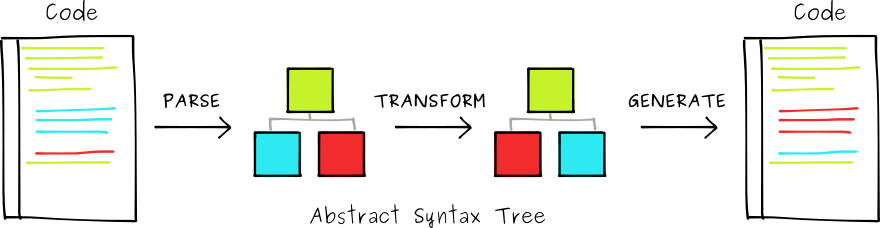
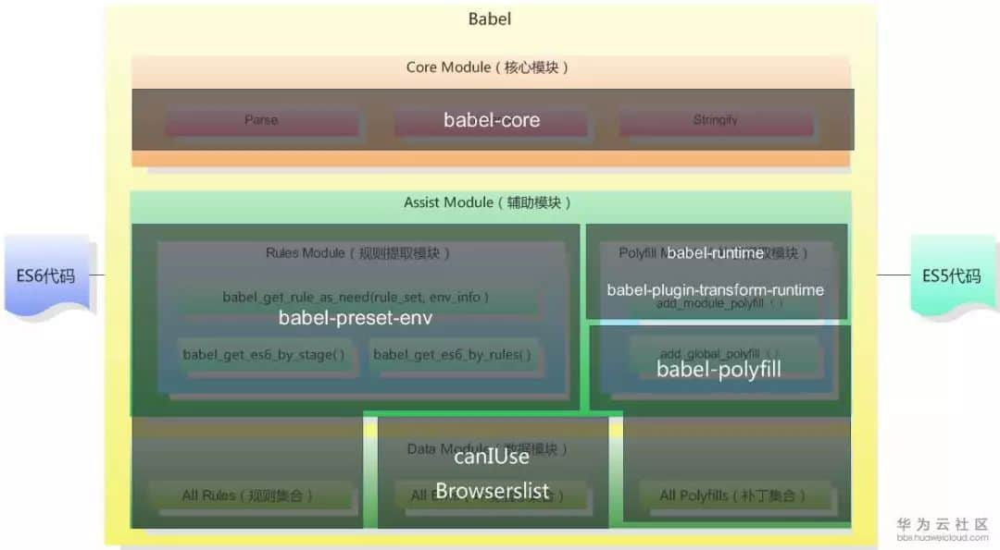

# Babel初见


>传说古时候一群人想建一个通天塔，去天上看看上帝在干什么。上帝于是挥挥手，让这群人说不同的语言，于是他们再也不能顺畅沟通，塔也就建不起来了。

由于各个浏览器对JS版本的支持不同，很多优秀的新语法不能直接在浏览器中运行。babel 因此而生。

>Babel is a JavaScript compiler. [Babel官方文档](https://babeljs.io/)

## Reference

- [你真的会用 Babel 吗?](https://juejin.im/post/59b9ffa8f265da06710d8e89#heading-28)
- [一口(很长的)气了解 babel](https://juejin.im/post/5c19c5e0e51d4502a232c1c6)
<!-- - [Commonjs模块的值拷贝和ES模块的值引用](https://www.jianshu.com/p/1cfc5673e61d) -->

## Babel 编译

babel 总共分为三个阶段：解析，转换，生成。



### plugins：transform 的载体

babel 自 6.0 起，就不再对代码进行转换。现在只负责图中的 parse 和 generate 流程，转换代码的 transform 过程全都交给`plugin`去做。所以没有配置任何`plugin`时，经过 babel 输出的代码是没有改变的。

例如，转换模版字面量：

```js
const str = 'world'
let hello = `hello ${str}`;
```

需要配置babel文件

```json
{
  "plugins": ["transform-es2015-template-literals"],// 转译模版字符串的 plugins
  "presets": ["@babel/preset-env"]
}
```

### presets：babel plugin集合的预设

>当前 babel 推荐使用 @babel/preset-env 替代 babel-preset-es201X , 前者包含后者的所有语法编译，并且可以根据项目运行平台的支持情况自行选择编译版本。

用法如下：

```json
{
  "presets": [
    [
      "@babel/preset-env",
      {
        "targets": { // 目标环境
          "browsers": [ // 浏览器
            "last 2 versions",
            "ie >= 10"
          ],
          "node": "current" // node
        },
        "modules": true, // 是否转译module syntax，默认是 commonjs
        "debug": true, // 是否输出启用的plugins列表
        "spec": false, // 是否允许more spec compliant，但可能转译出的代码更慢
        "loose": false, // 是否允许生成更简单es5的代码，但可能不那么完全符合ES6语义
        "useBuiltIns": false, // 怎么运用 polyfill
        "include": [], // 总是启用的 plugins
        "exclude": [],  // 强制不启用的 plugins
        "forceAllTransforms": false, // 强制使用所有的plugins，用于只能支持ES5的uglify可以正确压缩代码
      }
    ]
  ],
}
```

plugins 与 presets 同时存在的执行顺序:

- 先执行 plugins 的配置项,再执行 presets 的配置项；
- plugins 配置项，按照声明顺序执行；
- presets 配置项，按照声明逆序执行。

### @babel/polyfill

`@babel/polyfill`作用：提供ES6内置方法和函数转化垫片(shim)，如Map,Promise,Object.assign等。

需要注意，在整个项目中，`@babel/polyfill`只能require一次，否则报错。

对上文配置稍作改动：

```json
{
  "plugins": ["transform-es2015-template-literals"],// 转译模版字符串的 plugins
  "presets": [
    ["@babel/preset-env", {
      // 是否自动引入 polyfill，开启此选项必须保证已经安装了@babel/polyfill
      // “usage” | “entry” | false, defaults to false.
      "useBuiltIns": "usage"
    }]
  ]
}
```

useBuiltIns 参数说明：

- false: 对 polyfill 不做任何处理。
- entry: 根据 target 中浏览器版本的支持，将 polyfill 拆分引入，仅引入有浏览器不支持的 polyfill。
- usage(新)：检测代码中 ES6/7/8 等的使用情况，仅仅加载代码中用到的 polyfill。即当每个文件里用到（需要polyfill的特性）时，在文件中添加特定的import语句。这可以保证每个polyfill的特性仅load一次。

## 各司其职的Babel



- **@babel/core（核心）**

`babel`的核心编译模块。将`ES6`代码解析成`AST`；然后由`plugins`对`AST`做操作后，再解析为`ES5`代码（`AST`见下一章节）。

- @babel/cli

[@babel/cli](https://babeljs.io/docs/en/@babel/cli/)为babel提供了命令行操作。

- **@babel/node**

@babel/node 使`ES6语法`可以直接运行在`node`环境，不是独立安装。babel7版本，需要安装 @babel/core、@babel/cli 两个包。

（开发环境可以直接在入口文件头部引入`require('@babel/register')`，运行时在内存中对ES6转码）

- **@babel/polyfill（内部集成了 core-js 和 regenerator）**

@babel/polyfill为诸如 Generator、Set、Proxy、Promise 等全局对象，includes、Array.form 等方法提供`垫片`。
是为了模拟一个完整的 ES6+ 环境，旨在用于应用程序而不是个库/工具。

@babel/polyfill 若直接require使用，主要有两个缺点：

1. 会导致打出来的包变大，且不能按需引入。
2. @babel/polyfill 通过向全局对象和内置对象的prototype上添加方法来达成目的，会造成全局污染。

尝试解决：

1. 问题1：
babel6 后增加了`@babel/preset-env`，只需要设置`"useBuiltIns":"usage"`这个参数值就可以实现按需加载 `@babel/polyfill`了。
2. 问题2：这是 @babel/polyfill 的特性造成的，不可能解决，除非不用它（替代者：@babel/runtime）。

- **@babel/runtime & @babel/plugin-transform-runtime**

`@babel/runtime`内部集成了 core-js、 regenerator、helpers 等，特点是不会污染全局空间和内置对象原型。事实上它就是一个模块，把它作为依赖来达成ES2015的支持。

在Babel6后，`@babel/plugin-transform-runtime`作为`@babel/polyfill`的 **完全替代** 以解决后者的全局污染，
运行机制是通过重写ES6代码，转换为使用`@babel/runtime`export的ES6-like对象。

注意： plugin-transform-runtime一般用于开发（生产环境还是要先转为完全commonJS规范），而runtime自身用于部署的代码（dependencies），两者配合来一起工作。

配置如下

```json
{
  "presets": [
    ["@babel/preset-env"]
  ],
  "plugins": [
    ["transform-runtime", {
      ：
      "corejs": false, // defaults to false，或者数字：{ corejs: 2 }，代表需要使用corejs的版本。
      "helpers": false, // defaults to true，是否替换helpers
      "polyfill": false, // defaults to true，v7移除该属性
      "regenerator": true, // defaults to true，generator是否被转译成用regenerator runtime包装不污染全局作用域的代码
      "moduleName": "@babel/runtime", // defaults to "@babel/runtime"
      "useESModules": false // defaults to false，如果是true将不会用plugin-transform-modules-commonjs进行转译，这样会减小打包体积，因为不需要保持语义
    }]
  ]
}
```

`@babel/runtime & @babel/plugin-transform-runtime`的两个特点：

- 避免多次编译出helper函数

在ES6转化为ES5时，会有很多helper函数，`@babel/runtime`就是声明了所有需要用到的帮助函数。

而`@babel/plugin-transform-runtime` 作用就是将所有需要helper函数的文件，依赖`@babel/runtime`。

- 解决`@babel/polyfill`提供的类或者实例方法污染全局作用域的情况

由于`@babel/plugin-transform-runtime`创建了沙盒环境，为core-js这里内建的实例提供假名，可以无缝的使用这些新特性，而不需要使用`require("polyfill")`。即`@babel/runtime`不会污染全局变量，也不会去修改内建类的原型。

三种方案对比（其实就是俩方案）：

|               方案                |                   优点                  |        缺点       |
| -------------------------------- | --------------------------------------- | ---------------- |
| @babel/runtime & @babel/plugin-transform-runtime  | 按需引入, 打包体积小，不会全局污染 | 不能兼容实例方法 |
| babel-polyfill  |  完整模拟 ES2015+ 环境 |  打包体积过大, 污染全局对象和内置的对象原型 |
| @babel/preset-env(@babel/polyfill的v2.0)|  按需引入, 可配置性高  |  - |

## 抉择：@babel/polyfill VS @babel/runtime

通篇看来：@babel/polyfill 和 @babel/runtime是达成同一种功能（模拟ES2015环境，包括global keywords，prototype methods，都基于core-js提供的一组polyfill和一个generator runtime）的两种实现方式。

@babel/polyfill会污染全局空间，并可能导致不同版本间的冲突，而@babel/runtime不会。从这点看应该用@babel/runtime。

但是@babel/runtime有个缺点，它不模拟实例方法，即内置对象原型上的方法，所以类似Array.prototype.find，通过@babel/runtime是无法使用的。

**最终结论**：如果你不知道自己会用到什么，索性抛弃`@babel/runtime`，选择`polyfill`。

**最好的实践应该是在 @babel/preset-env 设置 "useBuiltIns": "usage"，按需引入 polyfill。**

## Babel7的一些变化

- preset 的变更：

淘汰 es201x（并非删除），删除 stage-x，推荐 env

- 包名称变化

babel7 的一个重大变化，把所有 babel-* 重命名为 @babel/*，

例如：babel-preset-env —> @babel/preset-env

- 低版本 node 不再支持

babel7 开始不再支持 nodejs 0.10, 0.12, 4, 5 这四个版本，相当于要求 nodejs >= 6。

- 还有一些包从其他包独立出来的变化等等
