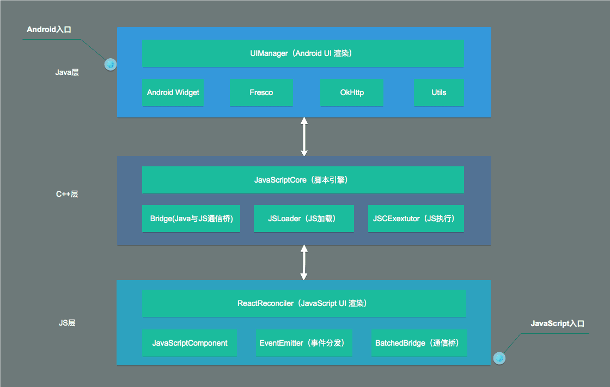

## ReactNative系统框架概述

### ReactNative源码结构

```md
.
├── Libraries (JS层的实现，实现了JS组件的封装与JS队列的封装)
├── ReactCommon（C++层的真正实现，实现了对脚本引擎JSC的封装与通信桥ReactBridge，Android与iOS通用）
└── ReactAndroid （Android部分源码）
    ├── DevExperience.md
    ├── README.md
    ├── build.gradle
    ├── gradle.properties
    ├── libs
    │   └── BUCK
    ├── proguard-rules.pro
    ├── release.gradle
    └── src
        ├── androidTest
        │   ├── AndroidManifest.xml
        │   ├── assets
        │   ├── buck-runner
        │   ├── java
        │   └── js
        ├── main
        │   ├── AndroidManifest.xml
        │   ├── java （Android相关实现）
        │   │   ├── com/facebook
        │   │   │   ├── perftest （测试配置）
        │   │   │   ├── proguard （混淆）
        │   │   │   ├── jni (ReactNativeReactNative的好多机制都是由C、C++实现的，这部分便是用来载入SO库)
        │   │   │   ├── react （ReactNative源码的主要内容）
        │   │   │   ├── systrace （system trace，系统跟踪）
        │   │   │   └── yoga （前端布局引擎）
        │   ├── jni （对Android平台特别封装）
        │   ├── libraries
        │   ├── res
        │   └── third-party
        └── test
            └── java
```

### ReactNative系统框架示意



注：JSCore，即JavaScriptCore，JS解析的核心部分，IOS使用的是内置的JavaScriptCore，Android上使用的是webkit.org官方开源的jsc.so。

### ReactNative源码的主线与支线

- 源码主线：

  1. ReactNative应用启动流程
  2. ReactNative应用UI的绘制与渲染
  3. ReactNative应用通信机制（Java调用JS，JS调用Java）
  4. ReactNative应用线程模型

- 源码支线：

  1. ReactNative运行时的异常以及异常的捕获与处理。
  2. SOLoader加载动态链接库
  3. ReactNative触摸事件处理机制

## ReactNative源码的重要概念

1. ReactContext

    ReactContext继承于ContextWrapper（也就是说它和Android中的Context是一个概念），是整个ReactNative应用的上下文，
    通过getContext()去获得，通过它可以访问ReactNative核心类的实现。

    这个上下文即是指：当前对象在应用中所处的一个环境、一个与系统交互的过程。

    ReactApplicationContext：继承于ReactContext，ReactContext的wrapper类，就像Context与ContextWrapper的关系一样。
    ThemedReactContext：继承于ReactContext，也是ReactContext的wrapper类。

2. ReactInstanceManager

    ReactInstanceManager是ReactNative应用总的管理类，创建ReactContext、CatalystInstance等类，解析ReactPackage生成映射表，并且配合ReactRootView管理View的创建与生命周期等功能。

3. CatalystInstance

    CatalystInstance是ReactNative应用Java层、C++层、JS层通信总管理类，总管Java层、JS层核心Module映射表与回调，三端通信的入口与桥梁。

4. NativeToJsBridge/JsToNativeBridge

    NativeToJsBridge是Java调用JS的桥梁，用来调用JS Module，回调Java。

    JsToNativeBridge是JS调用Java的桥梁，用来调用Java Module。

5. JavaScriptModule/NativeModule

    JavaScriptModule是JS Module，负责JS到Java的映射调用格式声明，由CatalystInstance统一管理。

    NativeModule是ava Module，负责Java到Js的映射调用格式声明，由CatalystInstance统一管理。

    JavaScriptModule：JS暴露给Java调用的API集合，例如：AppRegistry、DeviceEventEmitter等。业务放可以通过继承JavaScriptModule接口类似自定义接口模块，声明 与JS相对应的方法即可。

    NativeModule/UIManagerModule：NativeModule是Java暴露给JS调用的APU集合，例如：ToastModule、DialogModule等，UIManagerModule也是供JS调用的API集 合，它用来创建View。业务放可以通过实现NativeModule来自定义模块，通过getName()将模块名暴露给JS层，通过@ReactMethod注解将API暴露给JS层。

6. JavascriptModuleRegistry

    JavascriptModuleRegistry是JS Module映射表，NativeModuleRegistry是Java Module映射表
