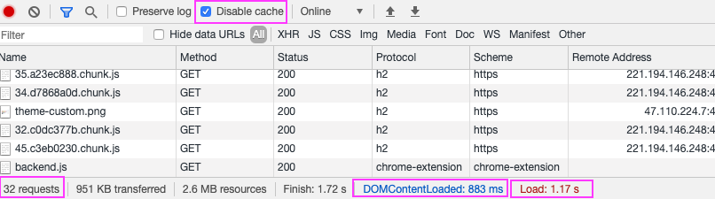

# HTTP缓存与CDN加速

开局放图：如果仔细看这张图，会惊叹于该站点的加载速度。Load完毕只需要**一秒**，而且这不是缓存！

体验地址：[已部署cdn的站点](https://www.vfa25.cn/antd/)。来揭开`HTTP缓存`的面纱吧。

## HTTP缓存

一般提到浏览器缓存，除HTTP缓存，还有：Memory Cache、Disk Cache、Service Worker Cache、Push Cache；
网上有很多相关文章，不再一一枚举。

**`HTTP缓存`三分天下（按优先级排序）：**

1. 强缓存
2. 协商缓存
3. 启发式缓存

优先级较高的是`强缓存`，在命中强缓存失败的情况下，才会走`协商缓存`，如果响应头信息没有缓存相关字段，则会命中`启发式缓存`。

## 强缓存（force cache）

### 强缓存的实现：从expires 到 cache-control
