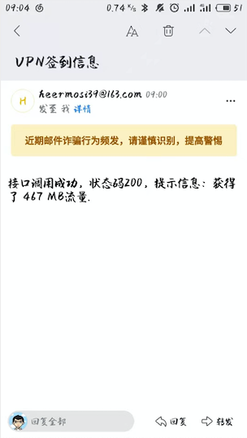

Demo场景：某VPN应用每日签到领取流量。

## 需求提出

实现自动打卡，并发送提示邮件。

## 案例分析

1. 登录接口分析，在登陆成功后服务端响应头，会设置`set-cookie`字段，以维持浏览器端的登录态。
2. 通过获取cookie并缓存，在签到接口配置请求头`cookie`字段，实现签到功能。
    - 模仿请求头。可以将请求头`Accept-Encoding`字段去掉，否则服务端会返回gzip格式。
3. selenium实现截屏。
    - 由于selenium将要移除webdriver.PhantomJS接口，这里使用webdriver.Chrome（[chromedriver下载地址](http://chromedriver.storage.googleapis.com/index.html)），同时需要安装Chrome浏览器。
4. stmp发送通知邮件。
    - 阿里云ECS禁用了基于非SSL/TLS协议的端口号25，可以通过`telnet stmp.163.com 25`查看连接状态。
    这里选用SSL协议，端口号587（465、994都可以）。

## 效果图



## python实现

- 安装python依赖：`pillow`（Image）、`requests`（请求）、`selenium`（截屏）。
- py请求文件

```py
import time
import json

import smtplib
from io import BytesIO
from PIL import Image
from email.mime.text import MIMEText
from email.mime.multipart import MIMEMultipart
from email.mime.image import MIMEImage
from selenium import webdriver
from selenium.webdriver.chrome.options import Options
import requests
from requests.cookies import RequestsCookieJar


class Checkin:
    def __init__(self):
        self.smtp_server = 'smtp.163.com' # smtp服务
        self.smtp_port = 587 # SSl协议下的端口号
        self.user = 'heermosi39@163.com' # 登录账号
        self.pw = 'xxx' # 登录密码
        self.sender = 'heermosi39@163.com'  # 邮件发送账号
        self.receive = 'heermosi39@163.com' # 邮件接收账号
        self.msg = '提示信息' # 邮件内容
        self.send_status = 0

        self.login_url = 'https://chaoxi.website/auth/login'
        self.checkin_url = 'https://chaoxi.website/user/checkin'
        self.login_headers = {'accept': 'application/json, text/javascript, */*; q=0.01', 'accept-language': 'zh-CN,zh;q=0.9', 'cache-control': 'no-cache', 'content-length': '0', 'content-type': 'application/x-www-form-urlencoded; charset=UTF-8', 'origin': 'https://chaoxi.website', 'pragma': 'no-cache',
                              'referer': 'https://chaoxi.website/auth/login', 'sec-fetch-mode': 'cors', 'sec-fetch-site': 'same-origin', 'user-agent': 'Mozilla/5.0 (Macintosh; Intel Mac OS X 10_14_3) AppleWebKit/537.36 (KHTML, like Gecko) Chrome/78.0.3904.108 Safari/537.36', 'x-requested-with': 'XMLHttpRequest'}
        self.checkin_headers = {'accept': 'application/json, text/javascript, */*; q=0.01', 'accept-language': 'zh-CN,zh;q=0.9', 'cache-control': 'no-cache', 'content-length': '0', 'origin': 'https://chaoxi.website', 'pragma': 'no-cache', 'referer': 'https://chaoxi.website/auth/login',
                                'sec-fetch-mode': 'cors', 'sec-fetch-site': 'same-origin', 'user-agent': 'Mozilla/5.0 (Macintosh; Intel Mac OS X 10_14_3) AppleWebKit/537.36 (KHTML, like Gecko) Chrome/78.0.3904.108 Safari/537.36', 'x-requested-with': 'XMLHttpRequest'}


    def generalDriver(self):
        '''
        配置Chrome选项
        '''
        options = Options()
        options.add_argument('--no-sandbox')
        options.add_argument('--headless')
        options.add_argument('--kiosk')
        options.add_argument('--disable-gpu')
        options.add_argument('--disable-dev-shm-usage')
        options.add_argument('disable-infobars')
        options.add_argument('window-size=1366x1800')
        options.add_argument('lang=zh_CN.UTF-8')
        user_agent = 'Mozilla/5.0 (Macintosh; Intel Mac OS X 10_14_5) AppleWebKit/537.36 (KHTML, like Gecko) Chrome/78.0.3904.108 Safari/537.36'
        options.add_argument('user-agent=%s'%user_agent)
        prefs = {
            'profile.default_content_setting_values': {
                'images': 2
            }
        }
        options.add_experimental_option('prefs', prefs)

        # options.binary_location = "/usr/bin/google-chrome"
        # chrome_driver_binary = '/home/xxx/test_py/chromedriver'
        options.binary_location = "/Users/nsky/Desktop/Google Chrome.app/Contents/MacOS/Google Chrome"
        chrome_driver_binary = './chromedriver'
        self.driver = webdriver.Chrome(
            executable_path=chrome_driver_binary, chrome_options=options)

    def loginAndCheckin(self):
        '''
        登录及签到接口调用
        '''
        payload = {'email': self.user, 'passwd': 'xxx', 'code': ''}
        login_res = requests.post(
            url=self.login_url, data=payload, headers=self.login_headers)
        cookie_jar = RequestsCookieJar()
        resd = requests.utils.dict_from_cookiejar(login_res.cookies)

        self.driver.get("https://chaoxi.website/auth/login")
        # cookie写入
        for key in resd:
            self.driver.add_cookie(
                cookie_dict={'name': key,
                             'value': resd[key],
                             'domain': 'chaoxi.website'}
            )
            cookie_jar.set(key, resd[key], domain='chaoxi.website')

        checkin_res = requests.post(
            url=self.checkin_url, headers=self.checkin_headers, cookies=cookie_jar)
        status = checkin_res.status_code
        message = json.loads(checkin_res.text)['msg']
        status_msg = '成功' if status == 200 else '失败'
        self.msg = '接口调用{}，状态码{}，提示信息：{}'.format(status_msg, status, message)

    def screen(self):
        '''
        截屏
        '''
        self.driver.execute_script('window.location.href="https://chaoxi.website/user";')
        self.driver.maximize_window()
        time.sleep(2)
        try:
            picture_url = self.driver.get_screenshot_as_png()
            print('截图成功！！！')
        except BaseException as msg:
            print(msg)
        self.driver.quit()
        return picture_url

    def setMessage(self, pic):
        '''
        拼接邮件的提示内容及截图附件
        '''
        msg = MIMEMultipart(_subtype='mixed')
        msg['Subject'] = 'VPN签到'
        msg['From'] = self.sender
        msg['To'] = self.receive
        text = MIMEText(
            '<html><p>{}<p></html>'.format(self.msg), 'html', 'utf-8')
        msg.attach(text)
        pic = BytesIO(pic).getvalue()
        img = MIMEImage(pic)
        img['Content-Disposition'] = 'attachment; filename="detail.png"'
        msg.attach(img)
        return msg.as_string()

    def sendEmail(self, msg):
        '''
        发送邮件
        '''
        try:
            smtp = smtplib.SMTP_SSL(self.smtp_server, self.smtp_port)
            smtp.ehlo()
            smtp.login(self.user, self.pw)
            self.send_status = smtp.sendmail(self.sender, self.receive, msg)
            smtp.quit()
        except BaseException as msg:
            print(msg)


if __name__ == '__main__':
    print()
    print(time.strftime("%Y-%m-%d %H:%M:%S", time.localtime()))
    try:
        checkin = Checkin()
        checkin.generalDriver()
        checkin.loginAndCheckin()
        frame = checkin.screen()
        message = checkin.setMessage(frame)
        checkin.sendEmail(message)
        print('邮件发送成功')
    except BaseException as msg:
        print(msg)
```

## Linux定时任务

```sh
# 选择编辑器
select-editor
# 输入2。即选择/usr/bin/vim.basic

# 编辑Linux crontab脚本
crontab -e
```

```sh
# Each task to run has to be defined through a single line
# indicating with different fields when the task will be run
# and what command to run for the task
# 
# To define the time you can provide concrete values for
# minute (m), hour (h), day of month (dom), month (mon),
# and day of week (dow) or use '*' in these fields (for 'any').# 
# Notice that tasks will be started based on the cron's system
# daemon's notion of time and timezones.
# 
# Output of the crontab jobs (including errors) is sent through
# email to the user the crontab file belongs to (unless redirected).
# 
# For example, you can run a backup of all your user accounts
# at 5 a.m every week with:
# 0 5 * * 1 tar -zcf /var/backups/home.tgz /home/
# 
# For more information see the manual pages of crontab(5) and cron(8)
# 
# m h  dom mon dow   command

# 意为每年每月每天08:00 执行/home/xx/myfile/checkin.py文件，并将print的控制台打印，以标准输出，追加到/home/xx/myfile/checkin.log文件
00 08 * * * python3 /home/xx/myfile/checkin.py 0 >> /home/xx/myfile/checkin.log
```

## Reference

- [Python3+Selenium 配置Chrome选项](https://www.cnblogs.com/clement-jiao/p/10889234.html)
- [linux解决xhost: unable to open display ""](https://www.cnblogs.com/gaosq/p/8965155.html)
- [Linux crontab命令：循环执行定时任务（详解版）](http://c.biancheng.net/view/1092.html)
- [Shell 输入/输出重定向](https://www.runoob.com/linux/linux-shell-io-redirections.html)
- [Python Django MySQL，时区、日期、时间戳（USE_TZ=True时的时间存储问题）](https://www.cnblogs.com/shilxfly/p/9436981.html)