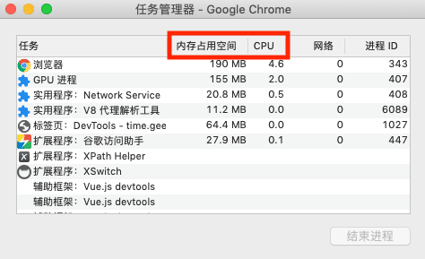

## 进程和线程的区别

- 进程好比一个工厂，工厂有它独立的资源；即**操作系统分配的独立的一块内存（存放代码、数据、文件、主线程等）**，
当一个进程关闭之后，操作系统也会回收进程所占用的内存。
- 工厂之间相互独立；即**进程之间相互独立（但可以通过IPC`Inter-Process Communication`机制进行通信）**。
- 线程是工厂中的工人，多个工人协作完成任务；即**多个线程在进程中协作完成任务**，进程中的任意一线程执行出错，都会导致整个进程的崩溃。
- 工厂内有一个或多个工人；即**一个进程由一个或多个线程组成（故、`单线程与多线程`，都是指在一个进程内的单和多）**。
- 工人之间共享空间；即**同一进程下的各个线程之间共享程序的内存空间（包括代码、数据、堆等）**。

那么再来看规范的定义：

- **进程（Process）是CPU资源分配的最小单位（是能拥有资源和独立运行的最小单位）。**
- **线程（thread）是CPU调度的最小单位（线程是依附于进程的基础上的一次程序运行单位，而进程中使用多线程并行处理能提升运算效率）。**

## 现代浏览器的多进程架构

1. 浏览器进程（Browser）。仅且一个。浏览器的主进程（负责协调、主控）。作用有：
    - 负责浏览器界面显示、用户交互。如前进，后退等；
    - 负责其他进程（如标签页）管理（创建和销毁）；
    - 将Renderer进程得到的内存中的Bitmap，绘制到用户界面上；
    - 网络资源的管理，下载；
    - 提供文件存储等功能。
2. GPU 进程。仅且一个。用于3D绘制。
3. 网络进程（NetWork）。仅且一个。直至最近，才从Browser进程中独立出来的。作用有：
    - 面向渲染进程和浏览器进程等提供网络资源下载。
4. 渲染进程（Renderer）。默认为每个Tab标签创建一个渲染进程（且会在sandbox模式下，以防止恶意代码利用浏览器漏洞对系统进行攻击）。作用有：
    - 页面渲染（排版引擎 Blink），脚本执行、事件处理（JS引擎V8）。
5. 插件进程。每种类型的插件对应一个进程（部分系统支持sandbox），仅当使用该插件时才创建。
