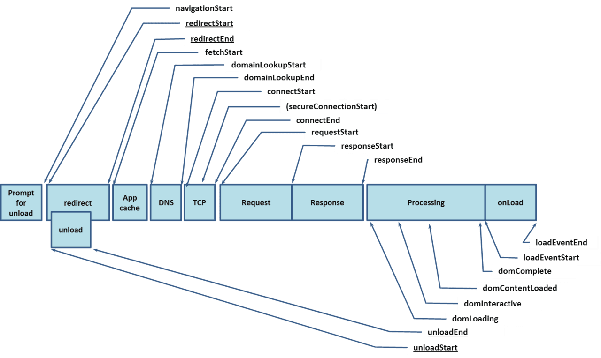
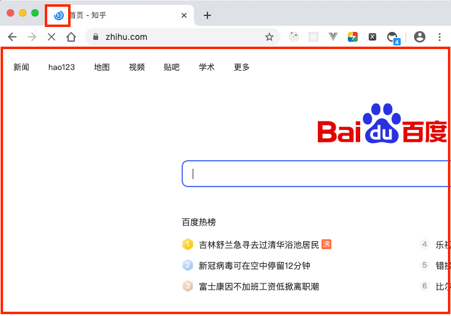
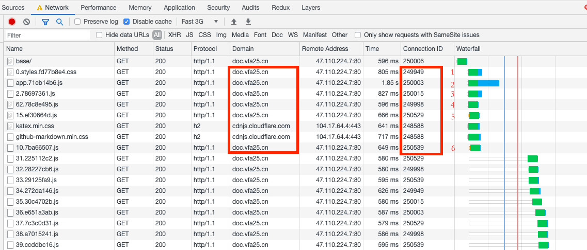
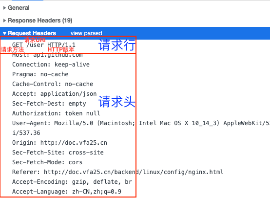
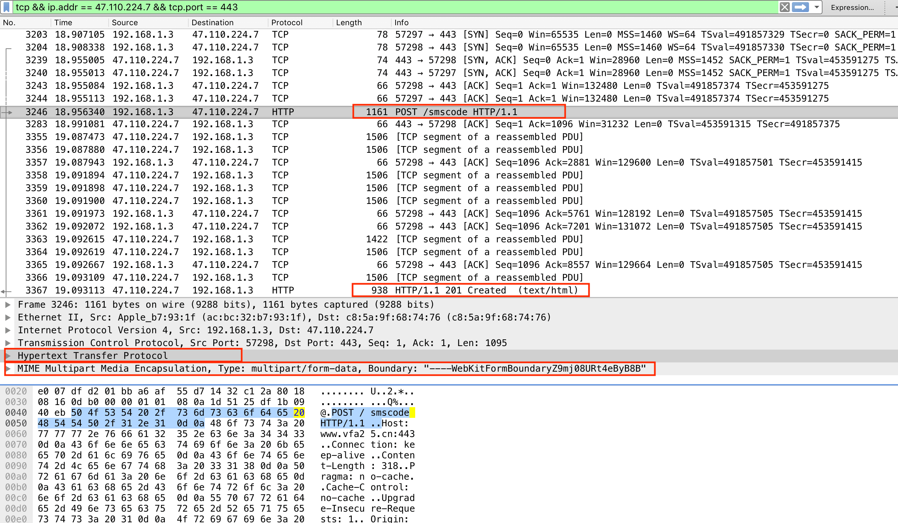
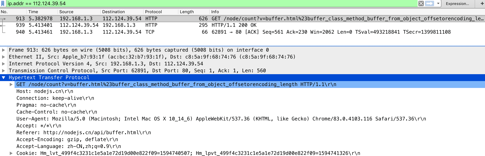
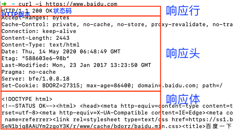
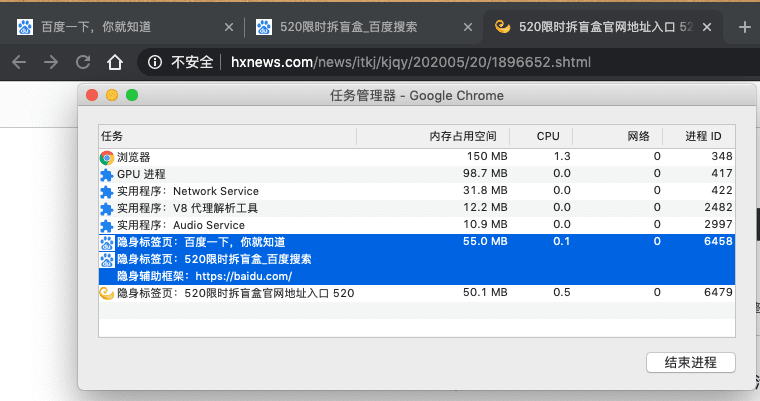
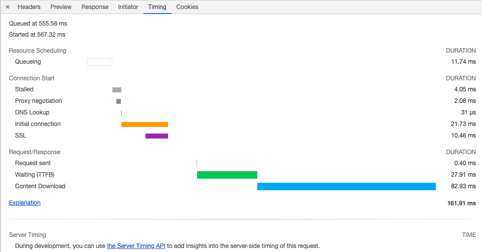

## 导航流程

>本篇仅关注前端向，[☞本题的原始出处请跳转](http://fex.baidu.com/blog/2014/05/what-happen/)


<center>关键事件节点API——window.performance.timing</center>

### 1. 解析地址栏

- <font color=red>Browser浏览器进程（主控进程）</font>处理用户输入，开始解析URL，组装协议。
- 在导航开始之前，可以通过[`beforeunload`](https://developer.mozilla.org/zh-CN/docs/Web/Events/beforeunload)事件取消导航，让浏览器不再执行任何后续工作。

  
- **导航（即用户发出URL请求到页面开始解析的整个过程）** 开始（`navigationStart`）；
  

  - 在表现上，标签页的图标便进入了Loading状态。
  - 页面显示依然是之前打开的页面内容；因为要到`提交文档`阶段，<font color=red>Browser进程</font>才会移除旧的页面内容。
- <font color=red>Browser进程</font>随即通过IPC（Inter-Process Communication）将该URL发给<font color=red>NetWork网络进程</font>；
- `Redirect`跳转节点（`redirectStart`、`redirectEnd`），即若资源被`301永久性转移`或`302暂时性转移`（***注意：redirectStart、redirectEnd的时间节点是收到服务端的响应请求后，被Redirect后的第二次发起URL请求时候，若未曾重定向则值均为0***）。

### 2. 查找缓存（App cache）

- 在真正发起网络请求之前，<font color=red>NetWork进程</font>会查找[网络-浏览器缓存](../internet/http-cache.html#http缓存)是否缓存了该资源。如果有缓存资源，那么直接返回资源给<font color=red>Browser进程</font>。
- 若缓存中没有找到资源，那么直接进入网络请求流程（`fetchStart`）。

### 3. DNS查询得到IP

通过`DNS（Domain Name System，域名系统）查询`，开始将目标域名解析为IP地址（`domainLookupStart`、`domainLookupEnd`）。参考[DNS递归查询与迭代查询](https://www.cnblogs.com/qingdaofu/p/7399670.html)。

- 优先命中浏览器memory cache，否则使用本机缓存，再没有的话使用hosts（/private/etc/hosts）
- 如果本地没有，就向DNS域名服务器查询，查询到对应的IP
  - 客户端-本地DNS服务端：这部分属于递归查询。递归即客户端只发一次请求，要求对方给出最终结果。
  - 本地DNS服务端-外网：这部分属于迭代查询。迭代即前者发出一次请求，对方如果没有授权回答，它就会返回一个能解答这个查询的其它名称服务器列表，本地DNS服务端会再向返回的列表中发出请求，直到找到最终负责所查域名的名称服务器，从它得到最终结果。

### 4. TCP/IP请求

1. 等待TCP队列

    对同一个域名的请求，Chrome默认最多同时建立6个TCP连接。如果超过，多出的请求会进入队列；否则，会直接建立TCP连接。
    
2. 建立TCP连接

    [网络-数据传输流程](../internet/internet-protocol.html#数据传输流程)（`connectStart`、`connectEnd`）。

### 5. 构建及发送HTTP请求

一旦建立了TCP连接，浏览器就可以和服务器进行通信了。而HTTP中的数据正是在这个通信过程中传输的（`requestStart`）。

- 首先，浏览器构建请求行信息（请求方法、请求地址和协议版本，以CRLF结尾），构建好后，浏览器准备发起网络请求。

  ```md
  GET /index.html HTTP1.1
  ```

- 浏览器除发送请求行命令，还要以请求头（另如POST、还有请求体）形式发送一些其他信息。
  

  这里分别截取了POST请求、和GET请求的抓包。二者均是一次HTTP请求发送了这个整体

  <center>POST请求截图</center>

  <center>GET请求截图</center>

### 6. 处理HTTP相应



首先服务器会返回响应行，而发送完响应头后，服务器就可以继续发送响应体的数据了。

#### 响应头数据解析

<font color=red>NetWork进程</font>解析响应头数据。

1. 重定向状态码

    状态码：301（永久性转移）或302（暂时性转移），<font color=red>NetWork进程</font>从响应头的`Location`字段里的地址，然后再发起新网络请求，一切又从头开始了。
2. 响应数据类型处理

    <font color=red>NetWork进程</font>将解析完毕的响应头信息发给<font color=red>Browser进程</font>，后者通过`Content-Type`字段确认响应体数据类型。
    - 若值为`application/octet-stream`字节流，该请求会被提交给浏览器的下载管理器，同时该URL请求的导航流程结束。
    - 若值为解析类型（如`text/html`、`text/plain`），<font color=red>Browser进程</font>随后向<font color=red>Render渲染进程</font>发起`提交导航（CommitNavigation，或称：提交文档）`的消息（示意后者准备接收响应体数据）。

#### 响应体数据解析

1. 准备渲染进程

    

    渲染进程策略：`process-per-site-instance`
    - 通常情况下，打开新的页面都会使用单独的渲染进程；
    - 但如果从A页面打开B页面（即在同一个`浏览上下文组(browsing context group)`），且A和B都属于**同一站点（same-site，相同的协议名和根域名）**，那么B页面默认会复用A页面的渲染进程。
    如果不希望这个默认规则，可通过设置属性`rel="noopener noreferrer"`。
2. 提交文档

    即<font color=red>Browser进程</font>将<font color=red>NetWork进程</font>接收到的`响应体数据`提交给<font color=red>Render进程</font>，流程如下：
    - <font color=red>Render进程</font>收到`CommitNavigation`后，直接和<font color=red>NetWork进程</font>建立传输数据的`管道`；
    - 等文档数据传输完成后， <font color=red>Render进程</font>返回`确认提交文档`的消息给<font color=red>Browser进程</font>；
    - <font color=red>Browser进程</font>在收到`确认提交文档`的消息后，会移除之前的旧的文档、更新浏览器界面状态，包括：安全状态、地址栏URL、前进后退的历史状态，并置空Web页面。

    

**至此，导航结束，其涵盖了从用户发起URL请求到提交文档给渲染进程的中间所有阶段。**

### 7. 页面渲染

<font color=red>Render进程</font>通过和<font color=red>NetWork进程</font>的数据通道，开始进行页面解析和子资源的加载，并在`window.loading`事件后，通知<font color=red>Browser进程</font>页面加载完成，后者接收到消息后，会停止标签图标上的loading动画。

## DevTools-Network-Timing面板


<center>单个文件的时间线</center>

- **Resource Scheduling**
  - **Queuing**：未立即执行的排队时间
    - 优先级。如CSS、HTML、JS等页面中的核心文件，优先级最高；而图片、视频、音频等优先级较低。通常当后者遇到前者时，就需进入排队状态。
    - TCP连接数限制。同一域名的TCP连接数默认最多6个，若在请求时均被占用，则需进入排队状态。
    - 待网络进程为”前面的HTTP请求“数据分配磁盘空间结束。
- **Connection Start**：进入发起连接的状态
  - **Stalled**：停滞
  - **Proxy negotiation**：代理协商阶段，即代理服务器连接协商所用的时间
  - **DNS Lookup**：DNS查找阶段
  - **Initial connection**：与服务器建立连接的阶段，包括且不仅于建立TCP连接所花费的时间（传输层）。
  - **SSL**：HTTPS协议的SSL握手时间（应用层），以协商加密信息。
- **Request/Response**：连接建立完毕，网络进程准备请求数据，将发送给服务端
  - **Request sent**：将浏览器缓冲区的数据发送出去即可，并不需判断服务器是否接收到了。通常该阶段非常快，时间不到1毫秒。
  - **Waiting(TTFB)**：即`第一字节时间`，是指数据发送出去后，接收服务器第一个字节的数据的等待时间。故TTFB是反映服务端响应速度的重要指标。
  - **Content Download**：即从第一字节到全部响应数据的接收，所用的时间。

## Reference

- [HTML、CSS和JavaScript，是如何变成页面的？（极客时间小册）](https://time.geekbang.org/column/article/118826)
- [How browsers work（汉译）](https://www.cnblogs.com/lhb25/p/how-browsers-work.html)、[How browsers work（英文版）](http://taligarsiel.com/Projects/howbrowserswork1.htm)
- [从输入URL到页面加载的过程？如何由一道题完善自己的前端知识体系！](https://juejin.im/post/5aa5cb846fb9a028e25d2fb1)
- [浏览器的渲染原理简介（CoolShell）](https://coolshell.cn/articles/9666.html)
- [从浏览器多进程到JS单线程，JS运行机制最全面的一次梳理](https://juejin.im/post/5a6547d0f265da3e283a1df7)
- [知己知彼——解锁浏览器背后的运行机制](https://juejin.im/book/5b936540f265da0a9624b04b/section/5bac3a4df265da0aa81c043c)
- [从 V8 中看 JS 性能优化](https://juejin.im/book/5bdc715fe51d454e755f75ef/section/5bdc72cbe51d450540286a9d)
- [说说标准——CSS中非常重要的可视化格式模型(visual formatting model)简介](https://bbs.csdn.net/topics/340204423)
