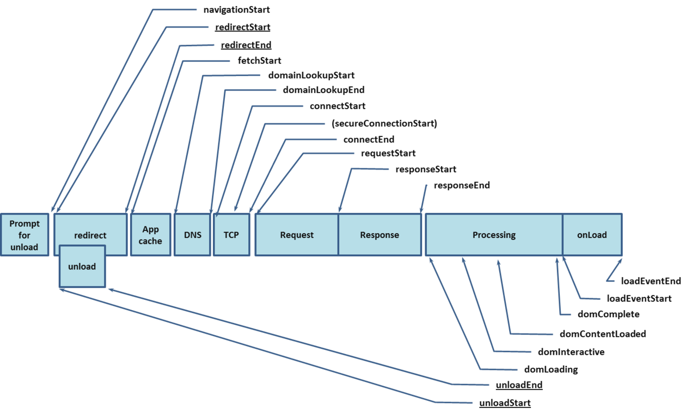
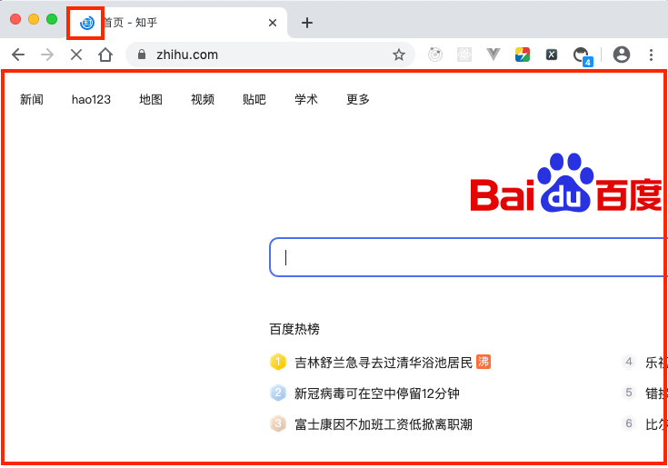
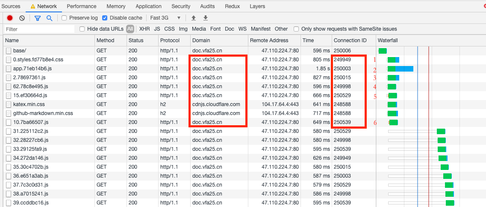
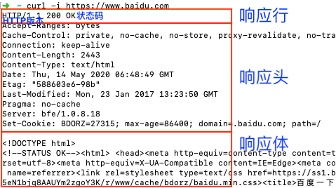

地址栏输入地址回车后，浏览器做了什么？

> 注：图示，`关键事件节点`可通过`window.performance.timing`API查看或打开控制台`Performance -> Event Log`更具象。


1. 解析地址栏
    - <font color=red>Browser主控进程</font>接管，处理用户输入，开始解析URL。
    - 在导航开始之前，会有个[`beforeunload`](https://developer.mozilla.org/zh-CN/docs/Web/Events/beforeunload)事件的过程，作用是可以通过取消导航，让浏览器不再执行任何后续工作。

    
    - **导航（即用户发出URL请求到页面开始解析的整个过程）** 开始（`navigationStart`事件）；
    

        - 在表现上，标签页的图标便进入了Loading状态。
        - 页面显示依然是之前打开的页面内容，因为要到`提交文档`阶段，<font color=red>Browser进程</font>才会移除旧的页面内容。
    - <font color=red>Browser进程</font>随即通过IPC（Inter-Process Communication）将该URL转发给<font color=red>NetWork网络进程</font>；
    - 可能的`Redirect`跳转（`redirectStart`、`redirectEnd`事件），即若资源被`301永久性转移`、`302暂时性转移`（***注意，这个时间点应是被重定向之后的第二次发起请求时候，具体在第⑥环节`处理HTTP响应`详述***）。
2. 查找缓存（App cache）

    - 在真正发起网络请求之前，<font color=red>NetWork进程</font>会查找[浏览器缓存（本站跳转）](../internet/http-cache.html#http缓存)是否缓存了该资源。如果有缓存资源，那么直接返回资源给<font color=red>Browser进程</font>。
    - 若缓存中没有找到资源，那么直接进入网络请求流程（`fetchStart`事件）。
3. DNS查询得到IP

    通过`DNS（Domain Name System，域名系统）查询`，开始将目标域名解析为IP地址（`domainLookupStart`、`domainLookupEnd`事件）。
    - 优先命中浏览器memory cache，否则使用本机缓存，再没有的话使用hosts（/private/etc/hosts）
    - 如果本地没有，就向DNS域名服务器查询，查询到对应的IP

    参考[DNS递归查询与迭代查询](https://www.cnblogs.com/qingdaofu/p/7399670.html)
4. TCP/IP请求
    1. 等待TCP队列

    对同一个域名的请求，Chrome默认最多同时建立6个TCP连接。如果超过，多出的请求会进入队列；否则，会直接建立TCP连接。
    
    2. 建立TCP连接

    [数据传输流程（本站跳转）](../internet/internet-protocol.html#数据传输流程)（`connectStart`、`connectEnd`事件）。
5. 构建及发送HTTP请求

    一旦建立了TCP连接，浏览器就可以和服务器进行通信了。而HTTP中的数据正是在这个通信过程中传输的（`requestStart`事件）。
    - 首先，浏览器构建请求行信息，构建好后，浏览器准备发起网络请求。

    ```md
    GET /index.html HTTP1.1
    ```

    - 在浏览器发送请求行命令之后，还要以请求头（另如POST、还有请求体）形式发送一些其他信息。
    

6. 处理HTTP相应

    

    - 首先服务器会返回响应行，而发送完响应头后，服务器就可以继续发送响应体的数据了。
    - **响应头数据解析**： <font color=red>NetWork进程</font>解析响应头数据。
        - **重定向状态码**

        状态码：301（永久性转移）或302（暂时性转移），<font color=red>NetWork进程</font>从响应头的`Location`字段里的地址，然后再发起新网络请求，一切又从头开始了。
        - **响应数据继续处理**

        <font color=red>NetWork进程</font>并将数据转发给<font color=red>浏览器进程</font>，后者随后`CommitNavigation`到<font color=red>渲染进程</font>。
    - **响应体数据解析**：<font color=red>渲染进程</font>收到`CommitNavigation`后，直接和<font color=red>网络进程</font>建立数据管道，并向<font color=red>浏览器进程</font>确认`提交文档`，后者随即`确认文档被提交`并同时开始移除之前旧的文档后更新页面状态。随后，<font color=red>渲染进程</font>通过和<font color=red>网络进程</font>的数据通道，开始进行页面解析和子资源的加载，并在`loading`事件后，通知<font color=red>浏览器进程</font>页面加载完成。
