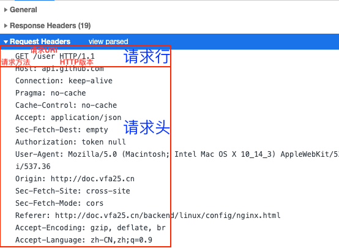

地址栏输入地址回车后，浏览器做了什么？

> 注：图示，`关键事件节点`可通过`window.performance.timing`API查看或打开控制台`Performance -> Event Log`更具象。


1. 解析地址栏
    - Browser主控进程接管，开始解析URL，导航开始（`navigationStart`事件）；
    - Redirect跳转（`redirectStart`、`redirectEnd`事件），即若资源被301永久重定向，随即跳转。
2. 构建请求

    - 网络进程（NetWork）介入，通过网络下载资源（`fetchStart`事件）。
    - 首先，浏览器构建请求行信息，构建好后，浏览器准备发起网络请求。

    ```md
    GET /index.html HTTP1.1
    ```

3. 查找缓存（App cache）

    在真正发起网络请求之前，浏览器会先在[浏览器缓存（本站跳转）](../internet/http-cache.html#http缓存)中查询是否有要请求的文件。
    当然，如果缓存查找失败，就开始网络请求了。
4. DNS查询得到IP

    通过`DNS（Domain Name System，域名系统）查询`，开始将目标域名解析为IP地址（`domainLookupStart`、`domainLookupEnd`事件）。
    - 优先命中浏览器memory cache，否则使用本机缓存，再没有的话使用hosts（/private/etc/hosts）
    - 如果本地没有，就向DNS域名服务器查询，查询到对应的IP

    参考[DNS递归查询与迭代查询](https://www.cnblogs.com/qingdaofu/p/7399670.html)
5. TCP/IP请求
    1. 等待TCP队列

    对同一个域名的请求，Chrome默认最多同时建立6个TCP连接。如果超过，多出的请求会进入队列；否则，会直接建立TCP连接。
    
    2. 建立TCP连接

    [数据传输流程（本站跳转）](../internet/internet-protocol.html#数据传输流程)，此处不再赘述（`connectStart`、`connectEnd`事件）。
6. 发送HTTP请求

    一旦建立了TCP连接，浏览器就可以和服务器进行通信了。而HTTP中的数据正是在这个通信过程中传输的（`requestStart`事件）。
    

    首先浏览器会向服务器发送请求行，它包括了请求方法、请求 URI（Uniform Resource Identifier）和 HTTP 版本协议。发送请求行，就是告诉服务器浏览器需要什么资源，最常用的请求方法是 Get。比如，直接在浏览器地址栏键入极客时间的域名（time.geekbang.org），这就是告诉服务器要 Get 它的首页资源。另外一个常用的请求方法是 POST，它用于发送一些数据给服务器，比如登录一个网站，就需要通过 POST 方法把用户信息发送给服务器。如果使用 POST 方法，那么浏览器还要准备数据给服务器，这里准备的数据是通过请求体来发送。在浏览器发送请求行命令之后，还要以请求头形式发送其他一些信息，把浏览器的一些基础信息告诉服务器。比如包含了浏览器所使用的操作系统、浏览器内核等信息，以及当前请求的域名信息、浏览器端的 Cookie 信息，等等。服务器端处理 HTTP 请求流程
