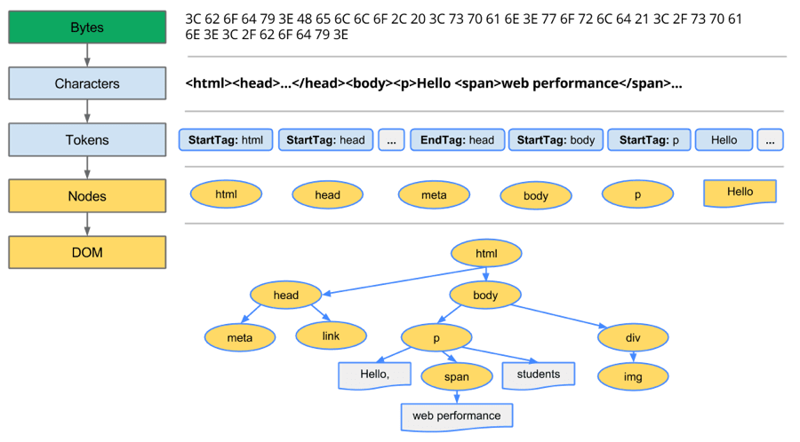
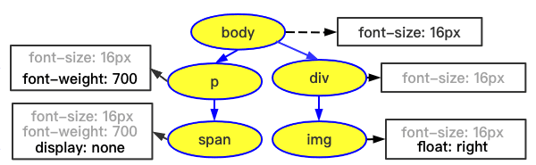
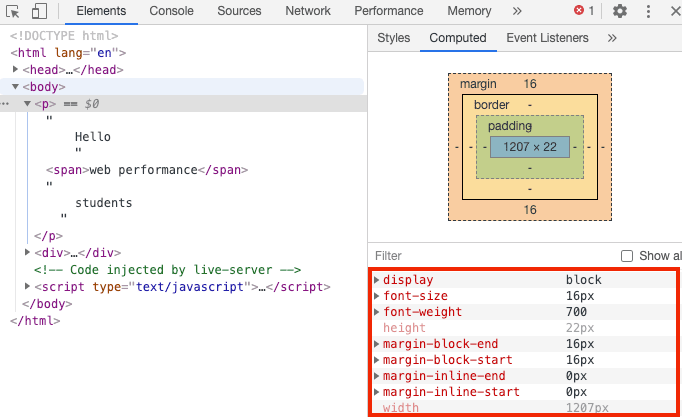

## 浏览器内核渲染引擎简介

- 浏览器内核可以分成两部分：渲染引擎（`Layout Engine`或者`Rendering Engine`）和`JS引擎`；随着`JS引擎`越来越独立，`内核`也成了`渲染引擎`的代称。
- 渲染引擎包括：HTML解释器、CSS解释器、布局、网络、存储、图形、音视频、图片解码器等。

- 现代浏览器内核一般是这四种：Trident（IE）、Gecko（火狐）、Blink（Chrome、Opera）、Webkit（Safari）。
- Chrome内核`Blink`是基于`Webkit`衍生而来的。

## 浏览器渲染过程解析

浏览器器内核拿到内容后，渲染大概可以划分成以下几个步骤：
**构建DOM树、样式计算、布局阶段、分层、绘制、分块、光栅化和合成**。

<details>
<summary>以该Demo为例</summary>

```html
<!DOCTYPE html>
<html lang="en">
<head>
  <meta charset="UTF-8">
  <meta name="viewport" content="width=device-width, initial-scale=1.0">
  <title>Document</title>
  <link rel="stylesheet" href="theme.css">
  <style>
    body { font-size: 1em }
    p { font-weight: bold }
    span { color: red }
    p span { display: none }
    img { float: right }
  </style>
</head>
<body>
  <p>
    Hello.
    <span>web performance</span>
    students
  </p>
  <div>
    
  </div>
</body>
</html>
```

</details>

### 构建DOM树

解析HTML到构建出DOM树过程，简述如下：`Bytes → characters → tokens → nodes → DOM`。



### 样式计算（Recalculate Style）

1. 把CSS转换为浏览器理解的结构——styleSheets

    CSS样式来源主要有三种：

    - 外链：通过`link`引用的外部CSS文件
    - 行内：元素的`style`属性内嵌的 CSS
    - 内嵌：`<style>`标签内的 CSS

    通过Chrome控制台中查看其结构：`document.styleSheets`。

    

2. 转换样式表中的属性值，使其标准化

    ```css
    body { font-size: 1em }  /* body {font-size: 16px} */
    p { font-weight: bold }  /* p {font-weight: 700} */
    span { color: red }      /* span {color: rgb(255, 0, 0)} */
    p span { display: none } /* p span {display: none} */
    img { float: right }     /* img {float: right} */
    ```

3. 计算出`DOM树`中每个节点的具体样式

    

- 样式计算阶段的目的：计算出DOM节点中每个元素的具体样式，并遵守`CSS`的**继承**和**层叠**两个规则。
- 该阶段最终输出的内容是每个DOM节点的样式，并被保存在`ComputedStyle`结构内；打开Chrome的“开发者工具”，如下图所示（图示红框中即`/html/body/p`标签的`ComputedStyle`的值）：

    
