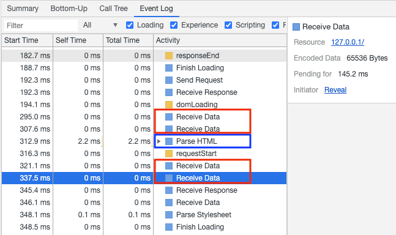
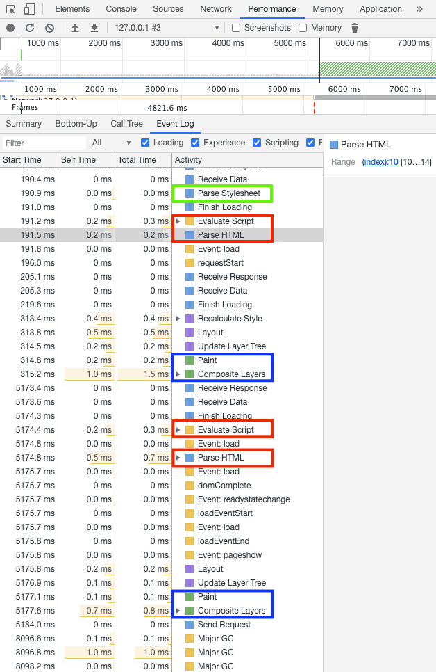

## Demo

这是用于测试的html文件

```html
<!DOCTYPE html>
<html lang="en">
<head>
    <meta charset="UTF-8">
    <meta name="viewport" content="width=device-width, initial-scale=1.0">
    <title>Document</title>
    <link rel="stylesheet" href="test.css">
</head>
<script>
  console.log(2)
</script>
<body>
  <p>
    Hello
    <span>web performance</span>
    <script src="./test.js?defer=true"></script>
    students
  </p>
  <div>
    
  </div>
</body>
</html>
```

```css
/* test.css */
body { font-size: 1em }
p { font-weight: bold }
span { color: red }
p span { display: none }
img { float: right }
```

<details>
<summary>本地启动node服务，监听9999端口</summary>

```js
var http = require('http');
var URL = require('url');
var fs = require('fs');

var server = http.createServer(function (req, res) {
  if (req.method != 'GET') {
    return res.end('send me a get request\n');
  } else {
    var url = URL.parse(req.url, true);
    var params = url.query;
    console.log(url);
    if (url.pathname === '/index.html' || url.pathname === '/') {
      res.writeHead(200, {'Content-Type': 'text/html'});
      fs.createReadStream('index.html').pipe(res);
    } else if (url.pathname === '/test.css') {
      res.writeHead(200, {'Content-Type': 'text/css'});
      if (params.defer) {
        setTimeout(function(){fs.createReadStream('test.css').pipe(res)}, 5000);
      } else {
        fs.createReadStream('test.css').pipe(res);
      }
    } else if (url.pathname === '/test.js') {
      res.writeHead(200, {'Content-Type': 'application/javascript'});
      if (params.defer) {
        setTimeout(function(){fs.createReadStream('test.js').pipe(res)}, 5000);
      } else {
        fs.createReadStream('test.js').pipe(res);
      }
    } else if (url.pathname === '/test.png') {
      res.writeHead(200, {'Content-Type': 'image/png'});
      fs.createReadStream('test.png').pipe(res);
    }
  }
});
server.listen(9999);
console.log('sever start');
```

</details>

## 现象

打开`http://127.0.0.1:9999/`，会在0.3s后显示`Hello`，并在5.2s后才完全显示`Hello students`。

## 结论

1. 当从服务器接收HTML页面的第一批数据时，`HTML解释器`就开始工作了（图示为html大文件测试）。

    

2. 在`HTML解释器`解析过程（即DOM树构建）中

    

    - CSS
      - 如果遇到了CSS（内嵌），那么`DOM解析`将不受影响并继续往下；CSS解析交由`CSS解释器`完成。
          - 但是，在CSS解析完成前，页面无法呈现（<font color="blue">图示蓝色</font>时才会呈现页面）；
          - 同时，`HTML解释器`的继续解析、在解析到JS脚本时，如果此时CSS被阻塞，那么该JS脚本的**执行**会被阻塞（要等待样式计算结果，出发点即JS代码中可能会访问某个DOM节点的样式）。
      - 如果遇到了CSS（外链），那么`DOM解析`将不受影响并继续；但是，需要等待这个CSS文件被下载并解析完成后，才能呈现页面。
    - JS
      - 如果遇到了JS脚本（内嵌），会暂停`DOM解析`，在**执行**完JS脚本（由`JS引擎`完成）之后，再继续往下`解析DOM`（<font color="red">图示第一处红色</font>）。
      - 如果遇到了JS脚本（外链），会暂停`DOM解析`，并下载该JS文件，在**下载并执行**完成后，再继续往下`解析DOM`（<font color="red">图示第二处红色</font>。在本例中，此时页面已经有了部分呈现）。
      - 对于script标签的`defer`与`async`异步属性
        - `async`是异步执行，异步下载完毕后就会执行，不确保执行顺序，一定在onload前，但不确定在DOMContentLoaded事件的前或后。
        - `defer`是延迟执行，类似于移到body标签的最后执行，在词法上可保证执行顺序（虽然按规范应该是在DOMContentLoaded事件前，但实际上不同浏览器的优化效果不一样，也有可能在它后面）
    - IMG
      - 直接异步下载，不会阻塞解析，下载完毕后直接用图片替换原有src的地方。

- 注：不同浏览器有各自的预请求优化（即提前下载外链，而非解析到外链标签所在行时），但并不会改变主线程对dom树的解析过程。

## Reference

- [从输入URL到页面加载的过程？如何由一道题完善自己的前端知识体系！](https://juejin.im/post/5aa5cb846fb9a028e25d2fb1)