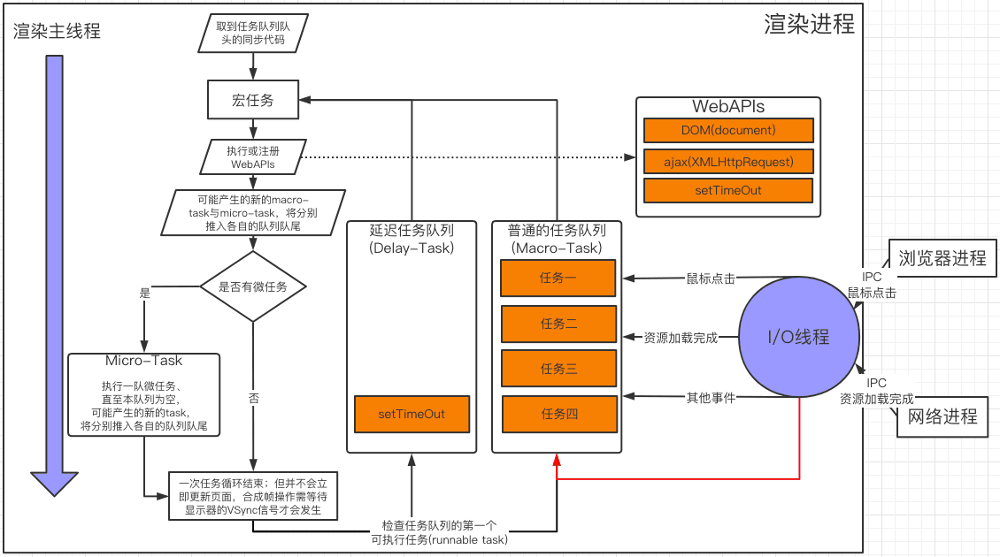
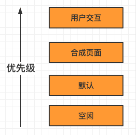
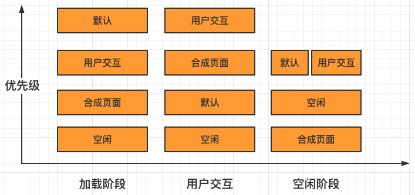
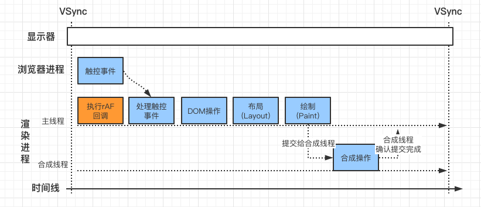

**浏览器页面是由任务队列和事件循环系统来驱动的。**

## 事件循环和任务队列



- 背景：为了能在主线程执行过程中，接收并处理其他线程发送过来新的任务。`渲染进程`中所有运行在`主线程`上的任务都需要先添加到`任务队列`，然后`事件循环系统`再按照顺序执行任务队列中的任务。
- 成员
  - 渲染主线程
  - IO线程
  - 任务队列
    - 功能：用于存放要执行的任务。
    - 特性：
      - 任务队列是`set`而不是`queues`，因为事件循环处理模型的第一步从选定的队列中获取第一个可运行任务，而不是使第一个任务出队。
      - 一个事件循环有一个或多个任务队列。一个任务队列是一组的任务。
      - `微任务队列(microtask queue)`不是一个`任务队列(task queue)`。
- 执行流程
  - 如果其他进程向`渲染主线程`跨进程通信，则需先通过IPC把任务发送给渲染进程的`IO线程`；
  - `IO线程`接收到任务之后，会将这些任务组装成任务添加进`任务队列`尾部；
  - `渲染主线程`会循环地从`任务队列`读取第一个可执行的任务。

[WHATWG 规范](https://html.spec.whatwg.org/multipage/webappapis.html#event-loop-processing-model)中对事件循环机制的定义：

1. 先从多个任务队列中选出一个最老的可执行任务（即`oldestTask`），并将后者从前者中删除；
2. 然后事件循环系统将这个`oldestTask`设置为`当前正在执行的任务(currently running task)`；
3. 并记录任务开始执行的时间`taskStartTime`；
4. 执行`oldestTask`任务；
5. 执行完成后，事件循环系统将`当前正在执行的任务`设置为`null`；
6. 执行微任务队列(`MicroTasks`)；
7. 最后统计执行完成的时长等信息；
8. 循环上述过程（注：此时并不会更新渲染，更新渲染是显示器的`垂直同步信号`驱动的，下文详述）。

### 任务队列中的任务类型

任务队列中的任务类型：

- 内部任务类型：[Chromium的task_type官方源码](https://cs.chromium.org/chromium/src/third_party/blink/public/platform/task_type.h)；包括如输入事件（鼠标滚动、点击、移动）、微任务、文件读写、WebSocket、JS定时器等。

    <details>
    <summary>task_type.h</summary>

    ```c
    // Copyright 2017 The Chromium Authors. All rights reserved.
    // Use of this source code is governed by a BSD-style license that can be
    // found in the LICENSE file.

    #ifndef THIRD_PARTY_BLINK_PUBLIC_PLATFORM_TASK_TYPE_H_
    #define THIRD_PARTY_BLINK_PUBLIC_PLATFORM_TASK_TYPE_H_

    namespace blink {

    // A list of task sources known to Blink according to the spec.
    // This enum is used for a histogram and it should not be re-numbered.
    //
    // For the task type usage guideline, see https://bit.ly/2vMAsQ4
    //
    // When a new task type is created:
    // * use kCount value as a new value,
    // * update tools/metrics/histograms/enums.xml,
    // * update TaskTypes.md
    enum class TaskType : unsigned char {
      ///////////////////////////////////////
      // Speced tasks should use one of the following task types
      ///////////////////////////////////////

      // Speced tasks and related internal tasks should be posted to one of
      // the following task runners. These task runners may be throttled.

      // This value is used as a default value in cases where TaskType
      // isn't supported yet. Don't use outside platform/scheduler code.
      kDeprecatedNone = 0,

      // https://html.spec.whatwg.org/multipage/webappapis.html#generic-task-sources
      //
      // This task source is used for features that react to DOM manipulations, such
      // as things that happen in a non-blocking fashion when an element is inserted
      // into the document.
      kDOMManipulation = 1,
      // This task source is used for features that react to user interaction, for
      // example keyboard or mouse input. Events sent in response to user input
      // (e.g. click events) must be fired using tasks queued with the user
      // interaction task source.
      kUserInteraction = 2,
      // TODO(altimin) Fix the networking task source related namings once it is
      // clear how
      // all loading tasks are annotated.
      // This task source is used for features that trigger in response to network
      // activity.
      kNetworking = 3,
      // This is a part of Networking task source used to annotate tasks which are
      // posted from the loading stack (i.e. WebURLLoader).
      kNetworkingWithURLLoaderAnnotation = 50,
      // This task source is used for control messages between kNetworking tasks.
      kNetworkingControl = 4,
      // This task source is used to queue calls to history.back() and similar APIs.
      kHistoryTraversal = 5,

      // https://html.spec.whatwg.org/multipage/embedded-content.html#the-embed-element
      // This task source is used for the embed element setup steps.
      kEmbed = 6,

      // https://html.spec.whatwg.org/multipage/embedded-content.html#media-elements
      // This task source is used for all tasks queued in the [Media elements]
      // section and subsections of the spec unless explicitly specified otherwise.
      kMediaElementEvent = 7,

      // https://html.spec.whatwg.org/multipage/scripting.html#the-canvas-element
      // This task source is used to invoke the result callback of
      // HTMLCanvasElement.toBlob().
      kCanvasBlobSerialization = 8,

      // https://html.spec.whatwg.org/multipage/webappapis.html#event-loop-processing-model
      // This task source is used when an algorithm requires a microtask to be
      // queued.
      kMicrotask = 9,

      // https://html.spec.whatwg.org/multipage/webappapis.html#timers
      // For tasks queued by setInterval() and similar APIs. A different type is
      // used depending on whether the timeout is zero or non-zero. Tasks with
      // a zero timeout and a nesting level <= 5 will be associated with task
      // queues that are not throttlable. This complies with the spec since it
      // does not reduce the timeout to less than zero or bypass the timeout
      // extension triggered on nesting level >= 5.
      kJavascriptTimerDelayed = 10,
      kJavascriptTimerImmediate = 72,

      // https://html.spec.whatwg.org/multipage/comms.html#sse-processing-model
      // This task source is used for any tasks that are queued by EventSource
      // objects.
      kRemoteEvent = 11,

      // https://html.spec.whatwg.org/multipage/comms.html#feedback-from-the-protocol
      // The task source for all tasks queued in the [WebSocket] section of the
      // spec.
      kWebSocket = 12,

      // https://html.spec.whatwg.org/multipage/comms.html#web-messaging
      // This task source is used for the tasks in cross-document messaging.
      kPostedMessage = 13,

      // https://html.spec.whatwg.org/multipage/comms.html#message-ports
      kUnshippedPortMessage = 14,

      // https://www.w3.org/TR/FileAPI/#blobreader-task-source
      // This task source is used for all tasks queued in the FileAPI spec to read
      // byte sequences associated with Blob and File objects.
      kFileReading = 15,

      // https://www.w3.org/TR/IndexedDB/#request-api
      kDatabaseAccess = 16,

      // https://w3c.github.io/presentation-api/#common-idioms
      // This task source is used for all tasks in the Presentation API spec.
      kPresentation = 17,

      // https://www.w3.org/TR/2016/WD-generic-sensor-20160830/#sensor-task-source
      // This task source is used for all tasks in the Sensor API spec.
      kSensor = 18,

      // https://w3c.github.io/performance-timeline/#performance-timeline
      kPerformanceTimeline = 19,

      // https://www.khronos.org/registry/webgl/specs/latest/1.0/#5.15
      // This task source is used for all tasks in the WebGL spec.
      kWebGL = 20,

      // https://www.w3.org/TR/requestidlecallback/#start-an-event-loop-s-idle-period
      kIdleTask = 21,

      // Use MiscPlatformAPI for a task that is defined in the spec but is not yet
      // associated with any specific task runner in the spec. MiscPlatformAPI is
      // not encouraged for stable and matured APIs. The spec should define the task
      // runner explicitly.
      // The task runner may be throttled.
      kMiscPlatformAPI = 22,

      // Tasks used for DedicatedWorker's requestAnimationFrame.
      kWorkerAnimation = 51,

      // Obsolete.
      // kExperimentalWebSchedulingUserInteraction = 53,
      // kExperimentalWebSchedulingBestEffort = 54,

      // https://drafts.csswg.org/css-font-loading/#task-source
      kFontLoading = 56,

      // https://w3c.github.io/manifest/#dfn-application-life-cycle-task-source
      kApplicationLifeCycle = 57,

      // https://wicg.github.io/background-fetch/#infrastructure
      kBackgroundFetch = 58,

      // https://www.w3.org/TR/permissions/
      kPermission = 59,

      // https://w3c.github.io/ServiceWorker/#dfn-client-message-queue
      kServiceWorkerClientMessage = 60,

      // https://wicg.github.io/web-locks/#web-locks-tasks-source
      kWebLocks = 66,

      ///////////////////////////////////////
      // Not-speced tasks should use one of the following task types
      ///////////////////////////////////////

      // The default task type. The task may be throttled or paused.
      kInternalDefault = 23,

      // Tasks used for all tasks associated with loading page content.
      kInternalLoading = 24,

      // Tasks for tests or mock objects.
      kInternalTest = 26,

      // Tasks that are posting back the result from the WebCrypto task runner to
      // the Blink thread that initiated the call and holds the Promise. Tasks with
      // this type are posted by:
      // * //components/webcrypto
      kInternalWebCrypto = 27,

      // Tasks to execute media-related things like logging or playback. Tasks with
      // this type are mainly posted by:
      // * //content/renderer/media
      // * //media
      kInternalMedia = 29,

      // Tasks to execute things for real-time media processing like recording. If a
      // task touches MediaStreamTracks, associated sources/sinks, and Web Audio,
      // this task type should be used.
      // Tasks with this type are mainly posted by:
      // * //content/renderer/media
      // * //media
      // * blink/renderer/modules/webaudio
      // * blink/public/platform/audio
      kInternalMediaRealTime = 30,

      // Tasks related to user interaction like clicking or inputting texts.
      kInternalUserInteraction = 32,

      // Tasks related to the inspector.
      kInternalInspector = 33,

      // Obsolete.
      // kInternalWorker = 36,

      // Translation task that freezes when the frame is not visible.
      kInternalTranslation = 55,

      // Tasks used at IntersectionObserver.
      kInternalIntersectionObserver = 44,

      // Task used for ContentCapture.
      kInternalContentCapture = 61,

      // Navigation tasks and tasks which have to run in order with them, including
      // legacy IPCs and channel associated interfaces.
      // Note that the ordering between tasks related to different frames is not
      // always guaranteed - tasks belonging to different frames can be reordered
      // when one of the frames is frozen.
      // Note: all AssociatedRemotes/AssociatedReceivers should use this task type.
      kInternalNavigationAssociated = 63,

      // Tasks which should run when the frame is frozen, but otherwise should run
      // in order with other legacy IPC and channel-associated interfaces.
      // Only tasks related to unfreezing itself should run here, the majority of
      // the tasks
      // should use kInternalNavigationAssociated instead.
      kInternalNavigationAssociatedUnfreezable = 64,

      // Task used to split a script loading task for cooperative scheduling
      kInternalContinueScriptLoading = 65,

      // Experimental tasks types used for main thread scheduling postTask API
      // (https://github.com/WICG/main-thread-scheduling).
      // These task types should not be passed directly to
      // FrameScheduler::GetTaskRunner(); they are used indirectly by
      // WebSchedulingTaskQueues.
      kExperimentalWebScheduling = 67,

      // Tasks used to control frame lifecycle - they should run even when the frame
      // is frozen.
      kInternalFrameLifecycleControl = 68,

      // Tasks used for find-in-page.
      kInternalFindInPage = 70,

      // Tasks that come in on the HighPriorityLocalFrame interface.
      kInternalHighPriorityLocalFrame = 71,

      ///////////////////////////////////////
      // The following task types are only for thread-local queues.
      ///////////////////////////////////////

      // The following task types are internal-use only, escpecially for annotations
      // like UMA of per-thread task queues. Do not specify these task types when to
      // get a task queue/runner.

      kMainThreadTaskQueueV8 = 37,
      kMainThreadTaskQueueCompositor = 38,
      kMainThreadTaskQueueDefault = 39,
      kMainThreadTaskQueueInput = 40,
      kMainThreadTaskQueueIdle = 41,
      // Removed:
      // kMainThreadTaskQueueIPC = 42,
      kMainThreadTaskQueueControl = 43,
      // Removed:
      // kMainThreadTaskQueueCleanup = 52,
      kMainThreadTaskQueueMemoryPurge = 62,
      kMainThreadTaskQueueNonWaking = 69,
      kCompositorThreadTaskQueueDefault = 45,
      kCompositorThreadTaskQueueInput = 49,
      kWorkerThreadTaskQueueDefault = 46,
      kWorkerThreadTaskQueueV8 = 47,
      kWorkerThreadTaskQueueCompositor = 48,

      kCount = 73,
    };

    }  // namespace blink

    #endif  // THIRD_PARTY_BLINK_PUBLIC_PLATFORM_TASK_TYPE_H_
    ```

    </details>

- 页面相关的事件；包括如JS执行、解析DOM、样式计算、布局计算、CSS动画等。

## Chromium是如何解决队头阻塞的

在最理想的情况下，希望能够快速跟踪高优先级任务。

1. 那么某个单个任务的优先级需要被定义

    以**交互阶段**为例，下面几种任务都应该视为高优先级的任务：

    - 通过鼠标触发的点击任务、滚动页面任务；
    - 通过手势触发的页面缩放任务；
    - 通过CSS、JS等操作触发的动画特效等任务。

    然而，这并不是仅一个优先队列就能够完美解决的，因为会随之带来第二个问题。

2. 不仅需要考虑以上单个任务的优先级，还需要让一些相同类型的任务保持其相对执行顺序。因此需要引入——**根据不同类型的任务创建不同优先级的消息队列**，即共存的多个消息队列。

    - **用户交互**：创建输入事件的消息队列，用来存放输入事件。
    - **合成页面**：创建合成任务的消息队列，用来存放合成事件。
    - **默认**：创建默认消息队列，用来存放如资源加载、页面解析、JS脚本执行和定时器回调等事件。
    - **空闲**：创建一个空闲消息队列，用来存放V8的垃圾自动回收、`window.requestIdleCallback`的回调任务等实时性不高的事件。

    

    但是这种静态优先级策略会带来新的问题。比如在页面加载阶段，若优先执行用户交互和合成页面，会将页面的解析速度拖慢。因此引入如下的解决之道。
3. **动态调度策略**。

    
    <center>动态调度策略</center>

## Chromium是如何保证不卡顿或丢帧的

- 已知显示器展示图片流程

  1. 浏览器的`浏览器进程`在显示合成图片后，会将该新生成的图片提交到`显卡`（包括GPU、显存等）的`后缓冲区`。
  2. 提交完成之后，GPU会将`后缓冲区`和`前缓冲区`互换位置；即前缓冲区变成了后缓冲区，后缓冲区变成了前缓冲区，保证了显示器每次都能读取到GPU中最新的图片。
  3. 显示器按照一定的频率（通常为60Hz，即1/60秒）来读取显卡的`前缓冲区`，并将前缓冲区中的图像显示在显示器上。

- 产生疑问
  - 若渲染进程生成的帧速率比屏幕的刷新频率慢，页面如动画会造成卡顿；
  - 若渲染进程生成的帧速率比屏幕的刷新频率快，GPU所渲染的图像并非全都被显示出来，这就会造成丢帧现象；
  - 就算渲染进程生成的帧速率和屏幕的刷新频率一样，由于它们是两个不同的系统，也很难同步起来，造成不连贯现象。
- 解决之道
  - 当显示器将一帧画面绘制完成后，并在准备读取下一帧之前，显示器会发出一个 **垂直同步信号(vertical synchronization)** 给GPU，简称 VSync。
  - 具体的讲，当GPU接收到VSync信号后，会将VSync信号同步给浏览器进程，浏览器进程再将其同步到对应的渲染进程，渲染进程接收到VSync信号之后，就可以准备绘制新的一帧了。详细可参考[Improved vsync scheduling for Chrome on Android](https://docs.google.com/document/d/16822du6DLKDZ1vQVNWI3gDVYoSqCSezgEmWZ0arvkP8/edit)。



### 空闲时间

之所以重点强调`空闲时间`，是因为ReactFiber就是借助了该规则的API`window.requestIdleCallback`。

- What

  - 若从用户发出消息到完成合成操作花费的时间很少，少于16ms（即1/60s），那么从合成结束到下个VSync周期内，就是空闲时间阶段。
  - 这个阶段可以进行诸如V8的垃圾回收，或者通过[window.requestIdleCallback（MDN）](https://developer.mozilla.org/zh-CN/docs/Web/API/Window/requestIdleCallback)设置的回调任务的调用。

- How充分利用空闲回调。参考自[Background Tasks API（MDN）](https://developer.mozilla.org/zh-CN/docs/Web/API/Background_Tasks_API)
  - 对非高优先级的任务使用空闲回调。
  - 空闲回调应尽可能不超支分配到的时间。
  - 避免在空闲回调中改变DOM。空闲回调执行的时候，当前帧已经结束绘制了，所有布局的更新和计算也已经完成。如果你做的改变影响了布局，你可能会强制停止浏览器并重新计算，而从另一方面来看，这是不必要的。如果你的回调需要改变DOM，它应该使用`window.requestAnimationFrame()`来调度它，该API为`宏任务`，其回调会在**每一帧的开始执行**。
  - 避免运行时间无法预测的任务。

## 宏任务和微任务

- 背景：为了兼顾`效率`（如监听DOM变化的一次触发异步调用）和`实时性`（如防止系统级的宏任务干扰），引入了微任务。
- 区分：通常`任务队列`中的任务称为`宏任务`，每个`宏任务`中都关联了一个`微任务队列`。

### 宏任务

任务队列中的任务称为`宏任务`。并且都是在主线程上执行的，包括：

- 页面渲染事件（如解析DOM、计算布局、绘制）；
- 用户交互事件（如鼠标点击、滚动页面、放大缩小等）；
- JS脚本执行事件；
- 网络请求完成、文件读写完成等各种I/O的完成事件。

### 微任务

微任务就是一个需要异步执行的函数。执行时机是在主函数执行结束之后、当前宏任务结束之前。

在创建全局执行上下文的同时，V8引擎也会在内部创建一个**微任务队列**。即每个宏任务都会创建自己的微任务队列。

- 微任务产生的时机

  产生微任务主要有两种方式。

  1. 使用`MutationObserver`监听DOM节点的变化；
  2. 使用`Promise`，且当转为固定态（resolve或reject）。

- 执行微任务队列的时机

  在JS引擎准备退出全局执行上下文并清空调用栈的时候，会检查全局执行上下文中的微任务队列、该时间点即**检查点(a microtask checkpoint)**，然后按照顺序执行队列中的微任务。
  
  如果在执行微任务的过程中，产生了新的微任务，同样会将该微任务添加到微任务队列中，直到后者为空。此时，当前宏任务才算执行结束。

## Reference

- [消息队列和事件循环：页面是怎么“活”起来的？（极客时间小册）](https://time.geekbang.org/column/article/132931)
- [Chromium 是如何解决队头阻塞问题的？（极客时间小册）](https://time.geekbang.org/column/article/169468)
- [WHATWG 规范：event-loop-processing-model](https://html.spec.whatwg.org/multipage/webappapis.html#event-loop-processing-model)
- [从浏览器多进程到JS单线程，JS运行机制最全面的一次梳理](https://juejin.im/post/6844903553795014663#heading-21)
