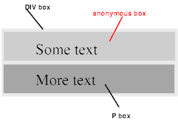

对于渲染概念，那么实际上`DOM`树中的元素是按什么渲染规则渲染的？

即： `可视化格式模型（visual formatting model）`，如官网所说：它规定了`how user agents process the document tree for visual media`。

在可视化格式模型中，每一个元素都会根据盒子模型产生0个或多个`box`，而这些`box`的布局受以下因素的影响：

- `box`尺寸和类型（类型是指`display`特性所决定的元素类型，如：`div`是块级元素，`span`是行内元素）；
- 定位体系（常规流、浮动和绝对定位）；
- `box`的相互作用（比如，一个块元素包含两个互为兄弟节点的浮动元素，后面那个浮动元素的布局，会受前面元素以及它包含块的影响）；
- 外部信息（比如，窗口大小会影响`width:auto;`、图片的固有尺寸会影响行内替换元素的尺寸等）。

## 包含块（Containing Block）

`box`的定位和尺寸的计算，都取决于一个矩形的边界，即`包含块（containing block）`。

一般来说，（元素）生成的`box`会成为它子孙元素的`包含块`。

::: details 包含块Demo
包含块是一个相对的概念。如下例：

```html
<div>
  <table>
    <tr>
      <td>hi</td>
    </tr>
  </table>
</div>
```

以上面的代码做例子，`div`和`table`都是包含块。`div`是`table`的包含块，同时`table`又是`ts`的包含块。

“一个`box`的包含块”，指的是“该`box`所存在的那个包含块”，并不是它建造的包含块。

比如，上述代码中，`table`的包含块，说的是`div`建造的包含块，而不是`table`自身建造的包含块。`table`建造的包含块，可以称作`ts`的包含块。
:::

但是，并不是说元素的包含块就是它的父元素，而是与它的祖先元素的样式等有关系。譬如：

- 根元素（在`(X)HTML`中是`html`）是最顶端的元素，它没有父节点，它的包含块就是`初始包含块（initial containing block）`。
- `static`和`relative`元素的包含块由它最近的`块级（block）`、`单元格（table cell）`或者`行内块（inline-block）`祖先元素的内容框（即盒子模型的`content`）创建。
- `fixed`元素的包含块是当前可视窗口。
- `absolute`元素的包含块由离它最近的`position`属性为`absolute`、`relative`或者`fixed`的祖先元素创建。
  - 如果其祖先元素是行内元素，则包含块取决于其祖先元素的`direction`特性（如值为`ltr`，则顶、左边为第一个元素；如值为`rtl`，则顶、右边为第一个元素）；
  - 如果祖先元素不是行内元素，那么包含块的区域应该是祖先元素的内边距（`content`）边界。

## 控制框（Controlling Box）

块级元素和块框，行内元素和行框的相关概念。

### 块级元素和块框

- 定义
  - `块级元素（Block-level elements）`：块级元素是源文档中那些在视觉上被格式化为块的元素（如：段落）。某些`display`特性的取值会产生块级元素：block、list-item、table。
  - `块级框（block-level box）`：通常（即除了`table`），`块级元素`会生成一个`块级框`，它也是个`块包含框（block container box）`，用来包含子`box`和生成的内容。
  - `块框（block box）`：`块级框（block-level box）`如果也是个`块容器（block containers）`，那么称之为`块框`。
- 块框特性
  - `块框`会占据一整行。
  - `块框`里面（注：指直接包含）要么只包含`块框`，要么只包含`行内框`，不能同时存在。如果`块框`内部有块级元素也有行内元素，那么行内元素会被`匿名块框`包围。

> 注：`块级框`、`块包含框`和`块框`可以含糊缩写为`块（block）`。

:::details 匿名块框Demo

```html
<div>
Some text
<p>More text</p>
</div>
```

`div`生成了一个`块框`（亦是`块包含框`），包含了另一个`块框p`以及`文本内容Some text`，此时`文本内容Some text`会被强制加到一个`匿名块框`里面，并被`div`生成的`块框`包含。


:::

换句话说：

- **如果一个`块框`在其中包含另外一个`块框`，那么我们强迫它只能包含`块框`。比如Demo中，文本内容的包含块是`匿名块框`（而不是`匿名行内框`）。**
- 如果一个`行内框`包含一个`块框（block box）`，那么这个`行内框（inline box）`（和与它处于同一`行框`内的`祖先行内框`）会围绕着`块框`被截断。断点之前和之后的`行框（line boxes）`会被封闭到匿名的框里，并且，这个`块框`会成为这些匿名框的兄弟框。

> 注：`行框（line boxes）`仅与`IFC`相关（请看[下文](#ifc-inline-formatting-context)），和`行内框（inline box）`是两个不同的概念。

### 行内元素和行内框

- 定义
  - 行内元素：是源文档中那些不形成新的内容块的元素；内容在行内分布（如，段落内着重的文本，行内图形等等）。某些`display`特性的值形成行内元素：inline、inline-table。
  - 行内框：行内级别元素生成行内框。
- 行内框特性
  - 一个行内元素生成一个行内框；
  - 行内元素能排在一行，允许左右有其它元素。
  - 空格内容会根据`white-space`特性被压缩，不会创建任何匿名行内框。

:::tip 匿名行内框Demo

```html
<p>Some <em>emphasized</em> text</p>
```

`p`元素生成一个`块框`，其内有行内元素（`<em>`）产生的`行内框`，以及块级元素（`p`）为文本（“Some”和“text”）产生的`匿名行内框`。
:::

### `display`特性

`display`的值也可以影响不同框的生成：

- `block`，使一个元素生成一个块框。
- `inline`，使一个元素产生一个或多个的行内框。
- `inline-block`，使一个元素生成一个行内级块框，行内级块框的内部按照`块框`格式化，而自身按照`行内框`来格式化（这也是为什么会产生`BFC`）。
- `none`，不生成框，不在格式化结构中。对应的`visibility: hidden`则会产生一个不可见的框。

## BFC（Block Formatting Context）

### 格式化上下文（FC）

在常规流中的框（boxes，元素形成的矩形区域），都属于一个`格式化上下文（FC）`中，可能是块的，也可能是行内的，但不可能同时是行内的又是块的。

:::tip What
FC像是一个大箱子，里面装有很多元素，箱子可以隔开里面的元素和外面的元素。

所以外部并不会影响FC内部的渲染。内部的规则可以是：如何定位，宽高计算，margin折叠等...
:::

`块框`参与`块格式化上下文`，`行内框`参与`行内格式化上下文`。

并非所有的框都会产生`FC`，而是符合特定条件才会产生，只有产生了对应的`FC`后才会应用对应渲染规则。

### BFC规则

- 每一个元素左外边与包含块的左边相接触（对于从右到左的格式化，右外边接触右边）。即使存在浮动也是如此（所以浮动元素正常会直接贴近它的包含块的左边，与普通元素重合），除非这个元素也创建了一个新的`BFC`。
- 内部box在垂直方向，一个接一个的放置，它们的起点是一个`包含块`的顶部；
- box的垂直距离由`margin`决定，属于同一个`BFC`的两个box间的`margin`会`折叠(collapse)`；
- `BFC`区域不会与`float box`重叠（可用于排版）；
- `BFC`就是页面上的一个隔离的独立容器，容器里面的子元素不会影响到外面的元素（可用于阻止父子元素的`margin`折叠）。反之亦如此。
- 计算`BFC`的高度时，浮动元素也参与计算（可以包含浮动元素，且不会浮动坍塌）。

### 如何触发BFC

1. 根元素；
2. float属性不为none；
3. position为absolute或fixed；
4. 不是`块框`的`块包含框`：display为inline-block、inline-flex、table、table-cell、table-caption；
5. overflow不为visible；

注：`display: table`本身不产生`BFC`，但是它会产生匿名框， 其中包含`display: table-cell`的框会产生`BFC`。

## IFC（Inline Formatting Context）

`IFC`即`行内框`产生的格式上下文。

### IFC规则

- 框一个接一个地水平排列，起点是包含块的顶部；
- 水平方向上的margin、border和padding在框之间得到保留；
- 框在垂直方向上可以以不同的方式对齐：它们的顶部或底部对齐，或根据其中文字的基线对齐

### 行框

- 包含那些框的长方形区域，会形成一行，叫做`行框`。

    :::tip Demo

    ```html
    <p style="background-color:silver;font-size:30px;width:900px;">
        TEXT1
        <span style="border:3px solid blue;line-height:10px;">text in span</span>
        great1
        <span style="border:3px solid red;">thx a lot</span>
        bee
        <strong style="border:3px solid green;">give me 5!</strong>
        Aloha!
    </p>
    ```

    以上代码中，无换行符及空格，共形成了7个`行内框`，并被1个`行框`包裹。
    :::

- 行框的宽度由它的`包含块`和其中的浮动元素决定，高度的确定由行高度计算规则决定。

### 行框的规则

- `行内框`在`行框`中垂直方向上的对齐
  - `行框`的高度总是足够容纳所包含的所有框。不过，它可能高于它包含的最高的框（例如，有图片时基线对齐）；
  - 垂直方向上的对齐决定于`vertical-align`特性，且默认值为基线（`baseline`）对齐。
- `行内框`在`行框`中水平方向上的对齐
  - 当一行中`行内框`宽度的总和小于包含它们的`行框`的宽，它们在水平方向上的对齐，取决于 `text-align` 特性；

    :::tip Demo

    ```html
    <p style="background-color:silver;width:500px;overflow:hidden;text-align:center;">
      <span style="border:1px solid blue;font-size:50px;float:left;">FLOAT</span>
      <em style="border:1px solid yellow;font-size:30px;">great1</em>
      <span style="border:1px solid yellow;">good</span>
    </p>
    ```

    

    可见，对齐的时候是根据行框的宽度，居中对齐。
    :::

- `行内框`可能被分割
  - 如果几个`行内框`在水平方向无法放入一个`行框`内，它们可以分配在两个或多个垂直堆叠的`行框`中；
  - `行框`在堆叠时没有垂直方向上的分割且永不重叠（例如，一个段落就是行框在垂直方向上的堆叠）。
- `行框`的范围
  - 通常，`行框`的左边接触到其`包含块`的左边，右边接触到其`包含块`的右边。
  - `行框`的宽度：尽管在相同的行内格式化上下文中的`行框`通常拥有相同的宽度（等于`包含块`的宽度），不过会被**浮动元素影响而缩短可用宽度**，在宽度上发生变化（比如，文字环绕效果，行框宽度就是`包含块`减去浮动元素的margin宽度）。
  - `行框`的高度：同一行内格式化上下文中的行框通常高度不一样（如，一行包含了一个高的图形，而其它行只包含文本）
- 空的`行内框`应该被忽略
  - 不包含文本，保留空白符，margin/padding/border非0的`行内元素`，以及其他常规流中的内容(比如，图片，inline blocks和inline tables)，并且不是以换行结束的`行框`，必须被当作零高度`行框`对待。

### IFC总结

- `行内元素`总是会应用并遵循`IFC`渲染规则（譬如`text-align`可以用来居中等）；
- `块框`内部，如果只有`行内元素`，会产生`匿名行框`包围，而该`行框`内部就应用`IFC`渲染规则；
- `行内框`内部，如果只有`行内元素`，同样应用`IFC`渲染规则；
- 另外，类似`inline-block`这种不是`块框`的`块包含框`，会在元素外层适用于IFC（如`text-align`水平居中，是有效的），而内部则按照BFC规则渲染。

## Reference

- [【分享】说说标准——CSS中非常重要的可视化格式模型(visual formatting model)简介](https://bbs.csdn.net/topics/340204423)
- [CSS2.1——9 Visual formatting model](https://www.w3.org/TR/CSS2/visuren.html#q9.0)
- [从输入URL到页面加载的过程？如何由一道题完善自己的前端知识体系！](https://segmentfault.com/a/1190000013662126)
- [CSS3-术语表](https://www.w3.org/TR/css-display-3/#glossary)
- [《css世界》- 详细重点笔记与技巧](https://segmentfault.com/a/1190000017069985)
