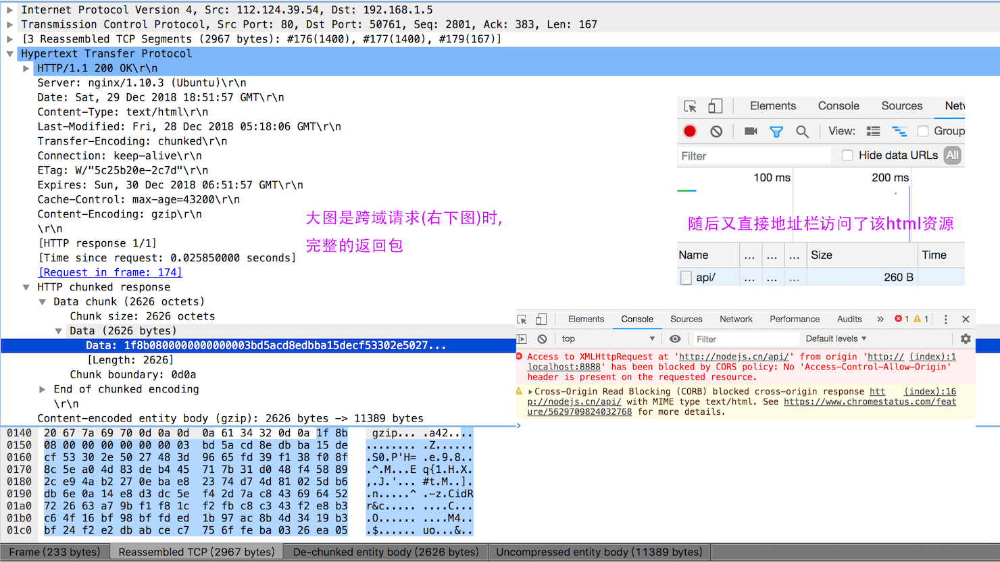

# 跨域

本篇只重点关注Ajax跨域、Cookie跨域，CORS解决。

前端开发最常用的就是Nginx配置正向代理，[这儿是一个Cookie跨域Node反向代理例子，仅学习用](http://case.vfa25.cn/cors/)。

## Reference

[ajax跨域，这应该是最全的解决方案了](https://segmentfault.com/a/1190000012469713#articleHeader10)

## 由来

在浏览器`同源策略`下，会有如下限制：

- Cookie、LocalStorage 和 IndexDB 无法读取。
- DOM 无法获得。
- AJAX 请求不能发送。

具体到“同源策略”：

- 协议相同
- 域名相同
- 端口相同

目的，是为了保证用户信息的安全，防止恶意的网站窃取数据。

[浏览器同源政策及其规避方法](http://www.ruanyifeng.com/blog/2016/04/same-origin-policy.html)

## 什么是跨域

### CORS请求原理

CORS是一个W3C标准，全称是"跨域资源共享"（Cross-origin resource sharing）。它允许浏览器向跨源服务器，发出XMLHttpRequest请求，从而克服了AJAX只能同源使用的限制。

关于CORS，[跨域资源共享 CORS 详解](http://www.ruanyifeng.com/blog/2016/04/cors.html)

整个CORS通信过程，都是浏览器自动完成，不需要用户参与。对于开发者来说，CORS通信与同源的AJAX通信没有差别，代码完全一样。浏览器一旦发现AJAX请求跨源，就会自动添加一些附加的头信息，有时还会多出一次附加的请求，但用户不会有感觉。

因此，实现CORS通信的关键是服务器。只要服务器实现了CORS接口，就可以跨源通信。

### 如何判断是否是简单请求

浏览器将CORS请求分成两类：`简单请求（simple request）`和`非简单请求（not-so-simple request）`。

必须同时满足以下两大条件，就属于简单请求。

- 请求方法是以下三种方法之一：
  - HEAD
  - GET
  - POST
- HTTP的头信息不超出以下几种字段：
  - Accept
  - Accept-Language
  - Content-Language
  - Last-Event-ID
  - Content-Type（只限于三个值application/x-www-form-urlencoded、 multipart/form-data、text/plain）

凡是不同时满足上面两个条件，就属于非简单请求。文档查看[CORS-safelisted request-header](https://fetch.spec.whatwg.org/#cors-safelisted-request-header)。

## 同源策略的表象

这是之前用`Wireshark`抓包跨域时的截图，很明显，资源包已完整返回，同源策略仅仅是浏览器的安全策略。

***由于浏览器及其版本的不同，有时候`Options预请求`可能看不到，而是直接状态码显示`(failed)`***

由上文知，跨域请求被限制通常有`请求方法`，`头信息`，`Origin源`的原因，可以根据错误信息具体分析

## 如何解决跨域

常用的方法如`JSONP`，`CORS`、`后端接口转发，即反向代理`，`天然跨域的标签，如img、script`，这里仅介绍`CORS`字段，具体配置转场`/Server/Nginx模块`。

- Access-Control-Allow-Origin

  在发起跨域请求时，浏览器会为请求添加`Origin`字段，来表示请求来自哪个源（协议 + 域名 + 端口）。

  所以跨域请求，该字段是必须的。它的值要么是请求时Origin字段的值，要么是一个*，表示接受任意域名的请求。
- Access-Control-Allow-Credentials

  该字段可选。它的值是一个布尔值，表示是否允许发送Cookie。
  
  默认情况下，Cookie不包括在CORS请求之中。设为true，即表示服务器明确许可，Cookie可以包含在请求中，一起发给服务器。这个值也只能设为true，如果服务器不要浏览器发送Cookie，删除该字段即可。

  在该字段设置为`true`时，Access-Control-Allow-Origin不可为`*`。且`XMLHttpRequest.withCredentials`要设置为true。

- Access-Control-Expose-Headers

  该字段可选。CORS请求时，XMLHttpRequest对象的getResponseHeader()方法只能拿到6个基本字段：Cache-Control、Content-Language、Content-Type、Expires、Last-Modified、Pragma。如果想拿到其他字段，就必须在Access-Control-Expose-Headers里面指定。
- Access-Control-Allow-Methods

  该字段必需，它的值是逗号分隔的一个字符串，表明服务器支持的所有跨域请求的方法，如：PUT、DELETE等等。注意，返回的是所有支持的方法，而不单是浏览器请求的那个方法。这是为了避免多次"预检"请求。

- Access-Control-Max-Age

  预请求优化。该字段可选，用来指定本次预检请求的有效期，单位为秒。在此期间，不用发出另一条预检请求。

### CORS相比于JSONP

CORS与JSONP的使用目的相同，但是比JSONP更强大。

JSONP只支持GET请求，CORS支持所有类型的HTTP请求。JSONP的优势在于支持老式浏览器，以及可以向不支持CORS的网站请求数据。
