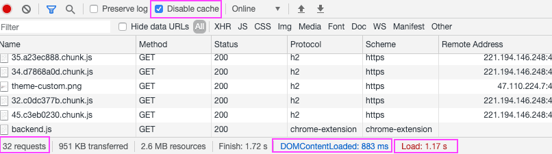
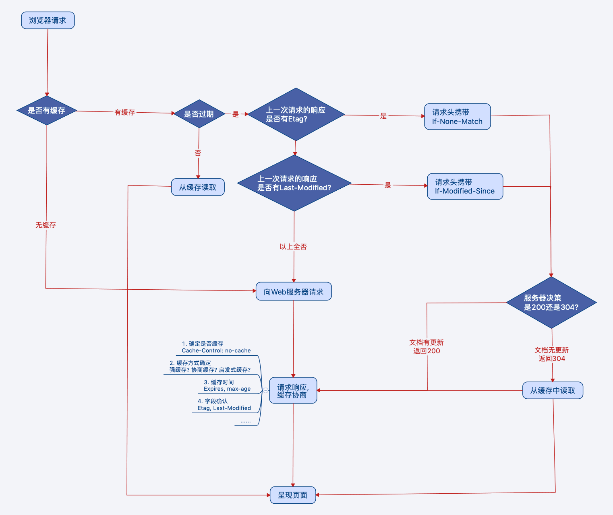
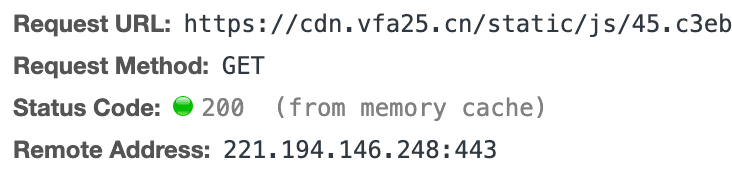
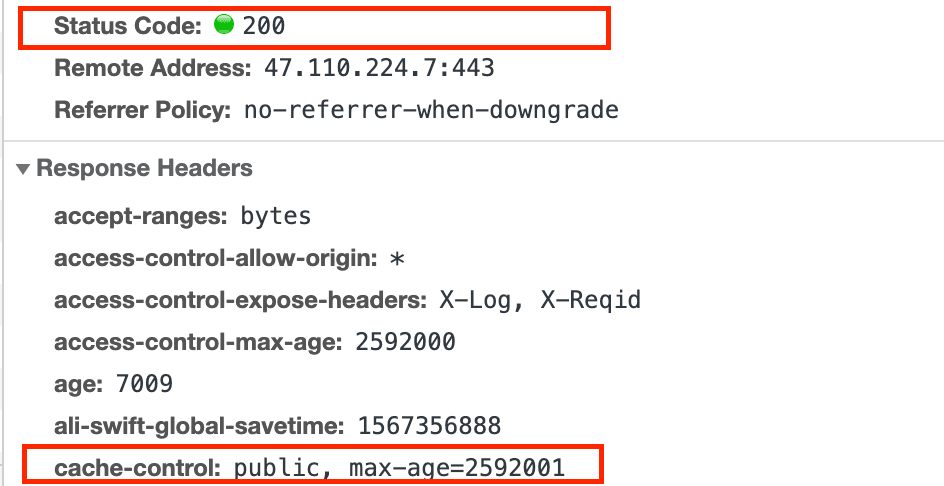
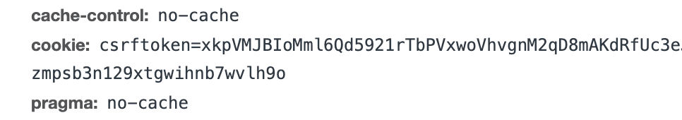
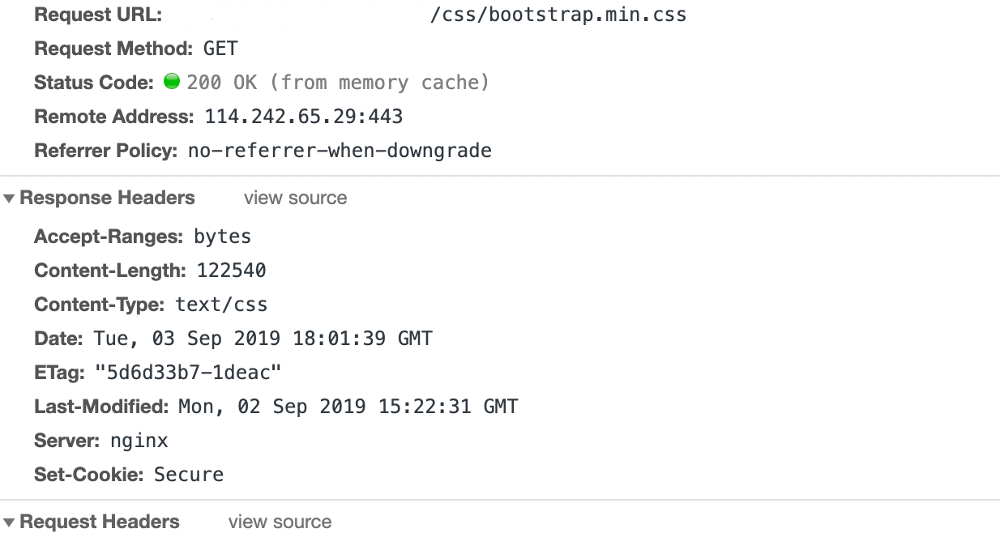
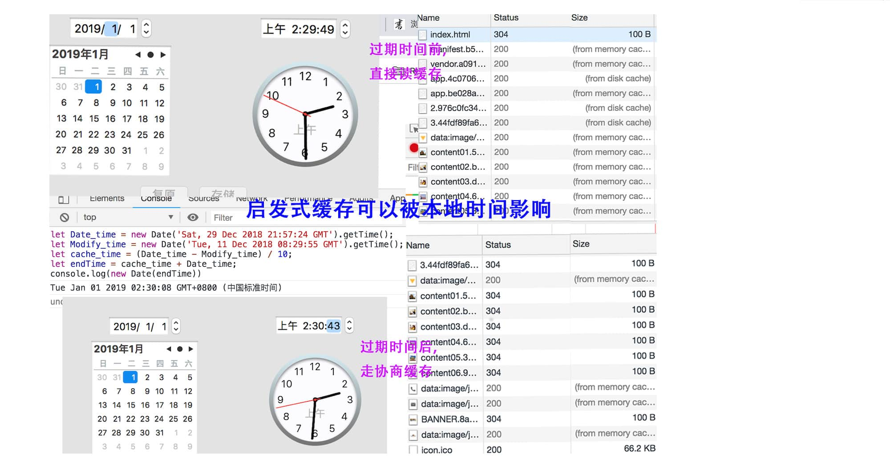

# HTTP缓存与CDN加速

开局放图：看这张图，会惊叹于该站点的加载速度。Load完毕只需要**一秒**，而且这不是浏览器缓存！

体验地址：[已部署cdn的站点](https://www.vfa25.cn/antd/)。来揭开`HTTP缓存`的面纱吧。

> 注：`CDN缓存`即`服务器缓存`，目前设置为`30天`，即30天内所在分区有其他用户访问时，进行缓存。



## HTTP缓存

### 写在前面的话

本章节一切与HTTP有关的, 都是指specification(规范)层面, 而不是implementation(对规范的实现)!

### 开始吧

**清一下缓存就好了？**————一般提到浏览器缓存，除④HTTP缓存（其实它在浏览器的表象也是缓存在memory或disk，只是除此之外可以缓存在`缓存服务器`），另外还有：①Service Worker Cache、②Memory Cache、③Disk Cache、⑤Push Cache；网上有很多相关文章，其他几种不再一一细数。

**前端为什么要了解缓存**————RFC2616[47种http报文首部字段](https://www.w3.org/Protocols/rfc2616/rfc2616-sec14.html)中，与缓存相关的有`12`个。

**`HTTP缓存`三分天下（按优先级排序）：**

1. 强缓存
2. 协商缓存
3. 启发式缓存

优先级较高的是`强缓存`，在命中强缓存失败的情况下，才会走`协商缓存`，如果响应头信息没有缓存相关字段，则会命中`启发式缓存`。



## 强缓存

浏览器强缓存：图1、图2



代理服务器强缓存：图3


上述三个图都是强缓存；图1、2比较好理解，图3是因为cache 服务器并未过期（cdn就是这么任性）。

强缓存仅且通过设置两种响应头实现：`Expires`和`Cache-Control`。

表示在缓存期间不需要请求，http状态码仅且为200。

不过在浏览器中具体存memory还是disk，大概是：

- 对于大文件来说，大概率是不存储在内存中的，反之优先。
- 当前系统内存使用率高的话，文件优先存储进硬盘。

### 强缓存的实现：从Expires 到 Cache-Control

- Expires（HTTP1.0）

```md
expires: Fri, 29 Apr 2022 06:05:39 GMT
```

Expires的格式是个时间戳，表示资源将在该时间后过期；Expires的特点（或称痛点）就是过分依赖于本地时间，如果客户端的时间与服务端不同步，它将失效或永不过期。

目前，Expires存在的意义仅是向下兼容。

- Cache-control：Expires的完全替代（HTTP1.1）

```md
cache-control: public, max-age=2592001, s-maxage=31536000
```

Cache-control的格式是个时间段，优先级高于Expires，并且作为后者的`完全替代`；由于是客户端本地时间的计算，完美地规避了时间戳带来的潜在问题。

| 指 令           | 作用                        |
|----------------|----------------------------|
| max-age        | 最常用，表示在浏览器的过期时间   |
| s-maxage       | 在为public时有效且仅在缓存（代理）服务器生效，如cache CDN；生效时会覆盖max-age |
| public         | 和楼下对立；既可以被浏览器缓存，也可以被代理服务器缓存 |
| private        | 和楼上对立；只能被浏览器缓存，是默认值|
| no-cache       | 资源被缓存，但是立即失效，下次请求将直接走协商缓存 |
| no-store       | 不使用任何缓存策略，甚至绕开缓存服务器，直接请求源服务器 |

- Pragma：详见[第14.32 Pragma](https://www.w3.org/Protocols/rfc2616/rfc2616-sec14.html)

这个通用首部字段虽然不是专门的缓存控制，但是它在为`no-cache`时，可以绕开浏览器强缓存（通常向下兼容http1.0）；
图示为Chrome强制刷新时的请求头部示意：



## 协商缓存

协商缓存状态码图示


### 协商缓存的实现：从 Last-Modified 到 Etag

- If-Modified-Since/Last-Modified（HTTP1.0）

  1. 客户端首次请求：`Last-Modified`是一个时间戳，如果服务端启用了协商缓存，响应头会有`last-modified`字段。

  ```md
  last-modified: Thu, 29 Aug 2019 07:22:54 GMT
  ```

  2. 客户端再次发起请求：请求头会有`if-modified-since`字段，值为前者的时间戳。

  ```md
  if-modified-since: Thu, 29 Aug 2019 07:22:54 GMT
  ```

  3. 服务端决策

  服务器收到该时间戳后，会对比其与资源在服务器的最后修改时间是否一致，判断资源是否发生变化。
  
  如果发生了变化，返回`200状态码`，并在响应头中添加新的`Last-Modified`值；

  否则，返回如上图的`304状态码`，响应头不会再添加`Last-Modified`字段。

  **特点**：

  - 表明服务端的文件的最后改变时间
  - 它有一个缺陷就是只能精确到1s
  - 还有就是有的服务端的文件会周期性的改变，导致缓存失效
  
  即，某些时候服务器不能正确感知文件的变化。

- 更精确的If-None-Match/E-tag：If-Modified-Since/Last-Modified的补充（HTTP1.1）

  ```md
  // 机制同If-Modified-Since/Last-Modified
  // 首次请求，响应头信息字段
  etag: "FqSlPBnMV3KCimpZFilMALEypNt5.gz"
  // 再次请求，请求头信息字段
  if-none-match: "FqSlPBnMV3KCimpZFilMALEypNt5.gz"
  ```

  **特点**：

  - 是一种指纹机制，代表文件相关指纹
  - 只有文件变才会变，也只要文件变才会变
  - 也没有精确时间的说法，只要文件一变，立马E-tag就不一样了

## 启发式缓存（heuristic）

这个比较特殊，它更像强缓存；

在没有诸如`Expires`、`Cache-Control: max-age`、 `Cache-Control: s-maxage`等字段时，为什么浏览器也会缓存。



这就是所谓的`启发式缓存`，过期时间通常被认为是`Date（创建报文的日期时间）和 Last-Modified 之间的时间差值, 取其值的10%作为缓存时间周期`；详见[13.2.4 Expiration Calculations](https://tools.ietf.org/html/rfc2616#section-13.2.4)。

之前也专门测试过过期时间



## CDN缓存

CDN的概念指路本章节末尾的Reference：CDN与缓存的归纳理解。

这里记录下使用[七牛云CDN](https://developer.qiniu.com/)感受：

为了优化[个人站点](https://www.vfa25.cn/antd/#/home)的加载速度。`webpack拆分commonChunk`→`gzip压缩`→`限制单文件大小，并借助HTTP2的多工Multiplexing`→`尝试HTTP2的推送`，但渲染速度仍不理想，loading事件触发时间在10秒+。

Cache CDN

- 优点：loading触发时间降到1.5s左右（首次在5秒左右）。
- 缺点：尽管CDN有`回源策略`，但当源服务器资源更新，CDN节点上数据并没有及时更新，即便浏览器`Ctrl+F5`强制刷新，也会因为CDN边缘节点没有同步最新而访问旧资源（此时状态码200，好容易误以为请求的源服务器吖）。话说回来这也是CDN的特点，要是频繁刷新预取，就莫啥太大意义了。

## Reference

- [浏览器缓存机制介绍与缓存策略剖析](https://juejin.im/book/5b936540f265da0a9624b04b/section/5b9ba651f265da0ac726e5de)
- [单独拎出来的缓存问题，http的缓存](https://juejin.im/post/5aa5cb846fb9a028e25d2fb1#heading-30)
- [HTTP1.1——rfc2616](https://tools.ietf.org/html/rfc2616)
- [HTTP1.0——rfc1945](https://tools.ietf.org/html/rfc1945)
- [CDN与缓存的归纳理解](https://www.cnblogs.com/shamo89/p/9234705.html)
