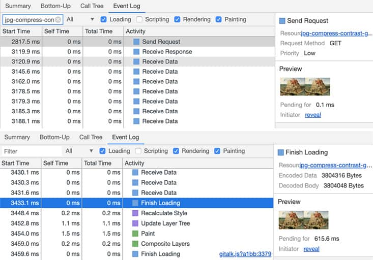
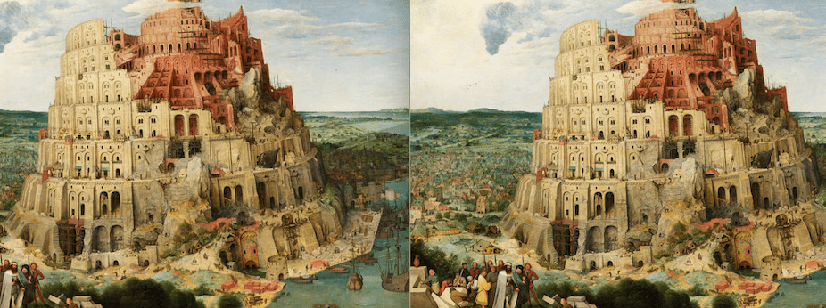
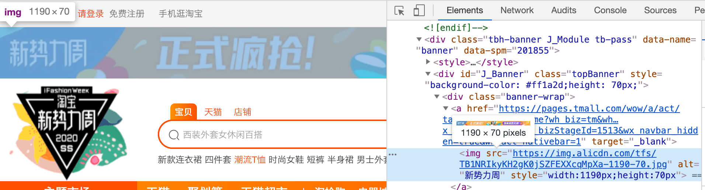
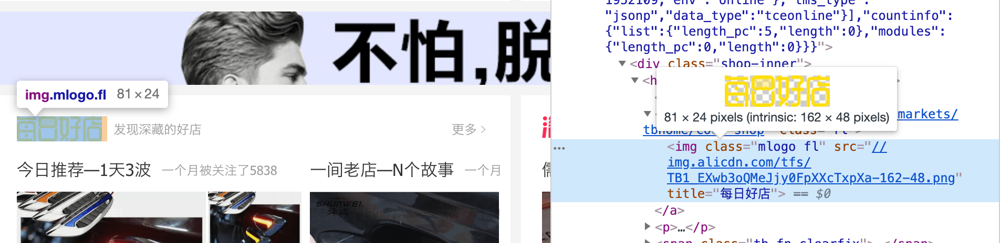
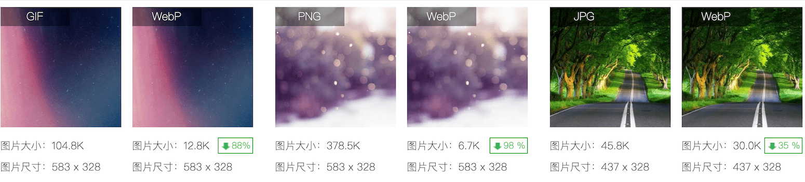
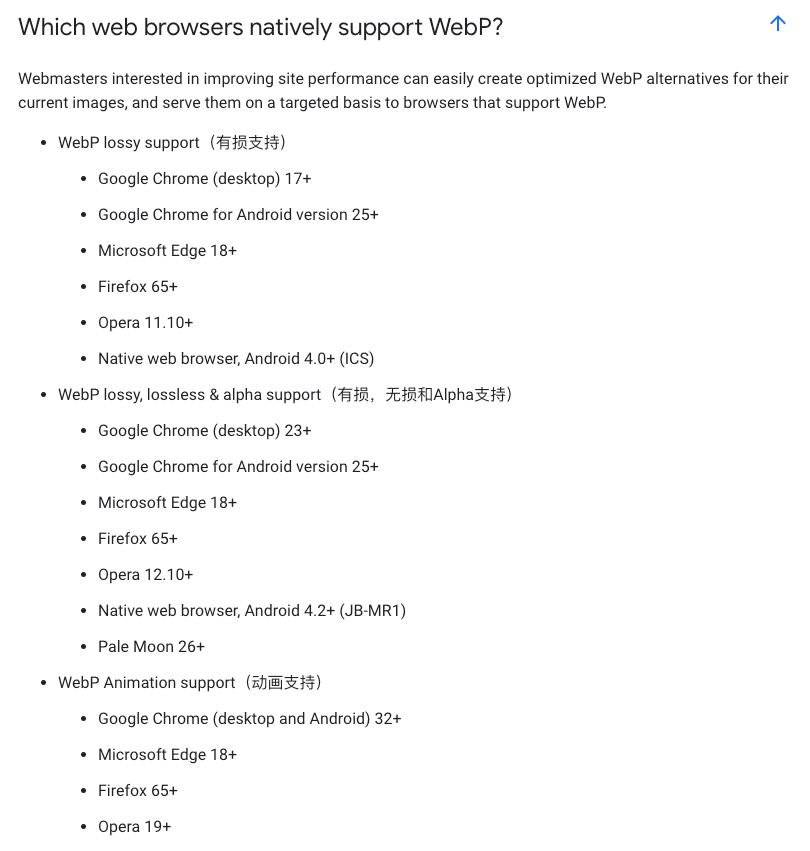
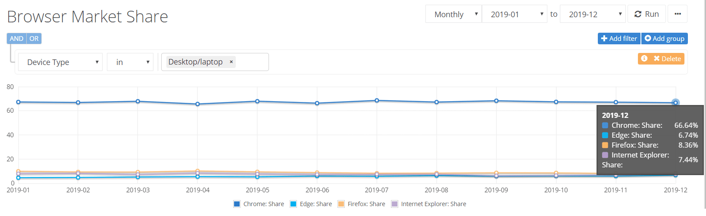
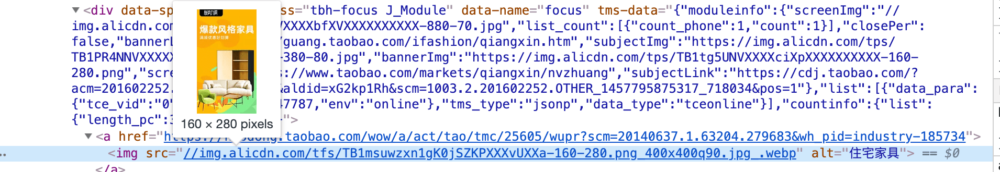

## 我们为什么要考虑图片

图示，是一个图片的请求过程


- 图片的加载和解析

  在DOM树构建时，若解析到img标签，则开启一个http请求线程开始进行异步下载，过程中不会阻塞DOM解析，且在图片下载完毕后直接用图片替换原有src的位置。所以，图片优化应重点关注**加载**。
- 优化图片加载的方向
  - 减少请求次数。在`http2`的多路复用前，每个请求会占用一个TCP连接，而Chrome默认同一目标地址下最多为6个TCP连接数。
  - 减少图片大小。减少流量消耗，增加用户体验。

## 二进制位数与色彩的关系

在计算机中，像素用二进制数来表示。

一个二进制位表示两种颜色（0|1 对应黑|白），如果一种图片格式对应的二进制位数有 n 个，那么它就可以呈现 2^n 种颜色。

## JPEG

(Joint Photographic Experts Group)联合图像专家小组。

**关键字：有损压缩、体积小、加载快、不支持透明。**

- 介绍：栅格图形，常用文件扩展名有.jpg、.jpeg、.jpe。
- 工具推荐：[jpegtran](https://www.npmjs.com/package/jpegtran)
- **JPEG的优点**

    JPEG最大的特点是`有损压缩`。在轻巧的同时，仍不失是一种高质量的压缩方式：当把图片体积压缩至原有体积的 50%以下时，JPEG仍然可以保持住60%的品质。JPEG支持24位彩色图像。

    图示为压缩至原有体积54%（91kb/170kb）时的对比图
    
- **适用场景**

    JPEG适用于呈现颜色丰富的图片，如：照片、大背景图、轮播图、通栏banner图；结构不规则的图形。
    兼顾了高质量与较小体积。

    图示为淘宝首页-banner图
    
- **JPEG的缺陷**

    线条图形、文字和图标图形，这类线条感较强、颜色对比强烈的图像时，人为压缩导致的图片模糊会非常明显。

    图示为压缩至原有体积25%（19kb/81kb）时的对比图
    

> 注：配图中，JPEG压缩使用[mozjpeg](https://github.com/imagemin/imagemin-mozjpeg)，参数均为quality=65

## PNG-8 与 PNG-24

(Portable Network Graphics)便携式网络图形。支持索引、灰度、RGB三种颜色方案及Alpha通道等特性。

**关键字：无损压缩、质量高、体积大、支持透明。**

- 介绍：栅格图形，PNG最初是作为替代GIF来设计的，能够显示256色，文件比JPEG和GIF大，但是PNG非常好的保留了图像质量。支持Alpha通道的半透明和透明特性。最高支持24位彩色图像（PNG-24）和8位灰度图像（PNG-8），至于这二者的选择，均衡文件体积大小和质量呈现即可。
- 工具推荐：[node-pngquant-native](https://www.npmjs.com/package/node-pngquant-native)
- **PNG的优点**

    PNG是一种无损压缩的高保真的图片格式。具有比JPEG更强的色彩表现力，对线条的处理更加细腻，对透明度有良好的支持。
- **适用场景**

    PNG适用于处理线条和颜色对比度较大的图片，如：纯色、透明、半透明、线条绘图、图标；边缘清晰、有大块相同颜色区域；颜色简单但对比强烈。

    图示为淘宝首页-较小的Logo
    
- **PNG的缺陷**

    由于是无损存储，唯一的缺点就是体积太大。

## GIF

- 工具推荐：[gifsicle](http://www.lcdf.org/gifsicle/)

## WebP

是一种现代图像格式，`旨在加快图片加载速度`的图片格式，支持有损压缩和无损压缩。

**关键字：全能到近乎完美。**

- **WebP的优点**

  它集多种图片文件格式的优点于一身。参考[官网介绍](https://developers.google.com/speed/webp/?csw=1)、[维基百科](https://zh.wikipedia.org/wiki/WebP)
  > 与PNG相比，WebP无损图像的size缩小了26％。在同等的SSIM质量指数下，WebP有损图像比同类JPEG图像小25-34％。
  > 无损WebP支持透明度（也称为Alpha通道），仅需22％的额外字节。对于有损RGB压缩可接受的情况，有损WebP也支持透明度，与PNG相比，文件size通常小3倍。
  - 补充：WebP可以插入多帧，实现动画效果，比GIF有更好的动画。
  

- **WebP的缺点**

  唯一的缺点就是`兼容性`，图示是截止2020年3月的浏览器支持情况（[来源链接](https://developers.google.com/speed/webp/faq#which_web_browsers_natively_support_webp)）
  
  尽管如此，由于Chrome稳定的高市场占有率（[statcounter链接](https://gs.statcounter.com/)），它依然是图片优化的优选。
  

  Polyfill的方案：以淘宝页面的webp链接为例、如下所示
  
  可以由HTTP服务器（如Nginx判断`$http_accept请求头 和 location ~ .*\.(webp)路径$`）根据请求头的`Accept`字段的`image/webp`进行检查，处理兼容即可——Accept字段包含image/webp时，就返回WebP格式的图片，否则返回原图。

  ```md
  Accept: text/html,application/xhtml+xml,application/xml;q=0.9,image/webp,image/apng,*/*;q=0.8,application/signed-exchange;v=b3
  ```

## 图片加载优化——逐步加载

- 统一占位符，即Loading图片
- LQIP（基于Base64）
  即低质量图像占位符(Low Quality Image Placeholders)，[github](https://github.com/zouhir/lqip-loader)、[npm](https://www.npmjs.com/package/lqip)。
  
- SQIP（基于SVG）
  即SVG图像占位符(SVG Quality Image Placeholders)，[github](https://github.com/axe312ger/sqip)、[npm](https://www.npmjs.com/package/sqip)。
  

## 图片加载优化——减少图片请求

如同减少图片大小（loader插件`image-webpack-loader`）一样，在减少图片请求上：

- Web Font代替图片（阿里巴巴矢量图标库）
- 使用Data URI代理图片（loader插件`url-loader`）
- 采用 Image spriting（雪碧图）（loader插件`webpack-spritesmith`）

## Reference

- [从输入URL到页面加载的过程？如何由一道题完善自己的前端知识体系！](https://juejin.im/post/5aa5cb846fb9a028e25d2fb1)
- [前端全链路性能优化实战（极客时间）](https://time.geekbang.org/course/detail/257-171522)
- [前端性能优化原理与实践（掘金小册）](https://juejin.im/book/5b936540f265da0a9624b04b/section/5b936540f265da0aec223b5d)