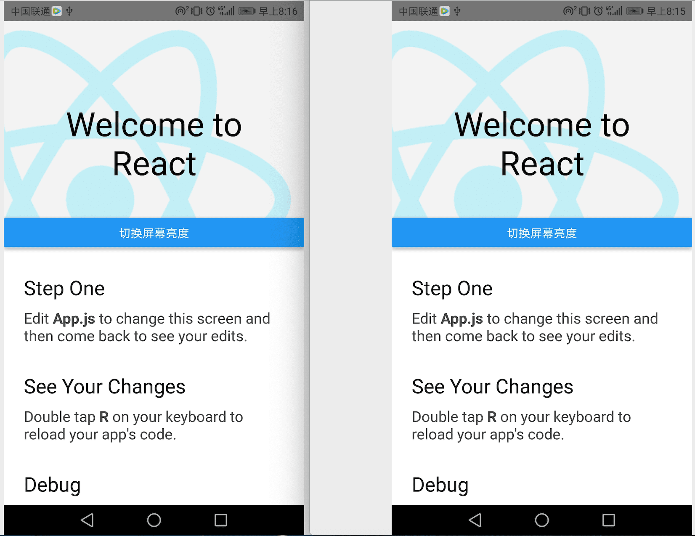

原生模块参考[中文官网](https://reactnative.cn/docs/native-modules-android)，在JS无法实现的原生能力时，可以使用原生模块，以“改变屏幕亮度”为例。

高亮对比效果图如下（右图为高亮）


- 准备

  IED：Android Studio

## 1. 编写Nation Module

创建一个新的Java类并命名为`UtilModule.java`，放置到`android/app/src/main/java/com/your-app-name/`目录下，其具体代码如下：

```java
package com.helloworld;

import android.view.Window;
import android.view.WindowManager.LayoutParams;
import android.app.Activity;

import androidx.annotation.NonNull;

import com.facebook.react.bridge.ReactApplicationContext;
import com.facebook.react.bridge.ReactContextBaseJavaModule;
import com.facebook.react.bridge.ReactMethod;

public class UtilModule extends ReactContextBaseJavaModule {
    private static final String TAG = "UtilModule";
    private final ReactApplicationContext mContext;
    private float mOldBrightness = -1.0f;

    public UtilModule(ReactApplicationContext reactContext) {
        super(reactContext);
        mContext = reactContext;
    }

    @Override
    @NonNull
    public String getName() {
        return "UtilModule";
    }

    @ReactMethod
    @SuppressWarnings("unused")
    public void brightenScreen() {
        Activity curActivity = mContext.getCurrentActivity();
        if (curActivity != null) {
            this.runOnUiThread(() -> {
                Window win = curActivity.getWindow();
                LayoutParams params = win.getAttributes();
                mOldBrightness = params.screenBrightness;
                params.screenBrightness = 0.9f;
                win.setAttributes(params);
                win.addFlags(LayoutParams.FLAG_KEEP_SCREEN_ON);
            });
        }
    }

    @ReactMethod
    @SuppressWarnings("unused")
    public void restoreBrightness() {
        Activity curActivity = mContext.getCurrentActivity();
        if (curActivity != null) {
            this.runOnUiThread(() -> {
                Window win = curActivity.getWindow();
                LayoutParams params = win.getAttributes();
                params.screenBrightness = mOldBrightness;
                win.setAttributes(params);
                win.clearFlags(LayoutParams.FLAG_KEEP_SCREEN_ON);
            });
        }
    }

    private void runOnUiThread(Runnable doWork) {
        if (mContext.isOnUiQueueThread()) {
            doWork.run();
        } else {
            mContext.runOnUiQueueThread(doWork);
        }
    }
}

```

## 2. 注册Native Module

创建一个新的Java类并命名为`UtilPackage.java`，放置到`android/app/src/main/java/com/your-app-name/`目录下，其具体代码如下：

```java
package com.helloworld;

import java.util.ArrayList;
import java.util.Collections;
import java.util.List;

import androidx.annotation.NonNull;

import com.facebook.react.ReactPackage;
import com.facebook.react.bridge.NativeModule;
import com.facebook.react.bridge.ReactApplicationContext;
import com.facebook.react.uimanager.ViewManager;

public class UtilPackage implements ReactPackage {

    @Override
    @NonNull
    public List<ViewManager> createViewManagers(@NonNull ReactApplicationContext reactContext) {
        return Collections.emptyList();
    }

    @Override
    @NonNull
    public List<NativeModule> createNativeModules(@NonNull ReactApplicationContext reactContext) {
        List<NativeModule> modules = new ArrayList<>();
        modules.add(new UtilModule(reactContext));
        return modules;
    }
}
```

这个package需要在`MainApplication.java`文件的`getPackages方法`中提供。这个文件位于`react-native`应用文件夹的`android`目录中。具体路径是：`android/app/src/main/java/com/your-app-name/MainApplication.java`。

```java
// MainApplication.java
...
import com.your-app-name.CustomToastPackage; // <-- 引入你自己的包
...
protected List<ReactPackage> getPackages() {
  @SuppressWarnings("UnnecessaryLocalVariable")
  List<ReactPackage> packages = new PackageList(this).getPackages();
  // Packages that cannot be autolinked yet can be added manually here, for example:
  // packages.add(new MyReactNativePackage());
  packages.add(new UtilPackage()); // <-- 添加这一行，类名替换成你的Package类的名字 name.
  return packages;
}
```

## 3. 在JavaScript中调用

```js
import { NativeModules } from 'react-native';
const UtilModule = NativeModules.UtilModule;

UtilModule.brightenScreen();
UtilModule.restoreBrightness();
```

## 调试

```sh
# 以下命令行为/bin/bash下
# 日志及正则匹配
adb logcat | grep ======
# 清空日志
adb logcat -c
# 日志输出文件
adb logcat > logcat.log
```
