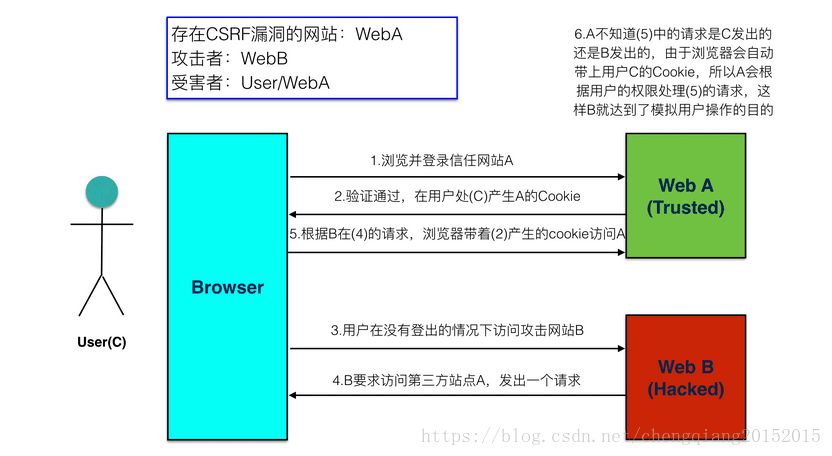

# XSRF攻击

***写在前面的话：本章节中的`token`均指`JWT(Json Web Token)`，存储于`session`的`token`称为`SessionId`以做区别。***

XSRF 又名 [CSRF](https://developer.mozilla.org/en-US/docs/Learn/Server-side/First_steps/Website_security#Cross-Site_Request_Forgery_(CSRF))，跨站请求伪造，是前端常见的一种攻击方式，先通过一张图来认识它的攻击手段。



## XSRF攻击的危害

以受害者名义进行诸如：发送请求，盗取账号，交易转账。

## XSRF攻击方式

1. POST方法：表单提交（`action属性`指向受攻击网站A）
2. GET方法：`图片`或`script标签`的`src属性`指向受攻击网站A

## XSRF攻击防范

包括但不限于：

- referer验证，但是 referer请求头 也是可以伪造的。

  ```py
  import request
  header = {
    'HOST': 'www.baidu.com',
    'Referer': 'https://www.baidu.com'
  }
  requests.get('https://www.baidu.com', header)
  ```

- `XSRF-token`，`token`不在前端生成，而是在每次访问站点的时候服务端生成。由于`token`很难伪造，所以就能区分这个请求是否是用户正常发起的。服务端通过 `set-cookie` 的方式回塞到客户端，然后客户端发送请求的时候，从 `cookie` 中对应的字段读取出 `token`后：
  1. 添加到请求 `headers` 中。这样服务端就可以从请求 `headers` 中读取这个 `token` 并验证（如axios库即是以`xsrfCookieName`表示存储token的`cookie`名称，`xsrfHeaderName`表示请求headers中token对应的`header`名称）。
  2. 添加到表单隐藏元素中（如Python的Django框架中，模板语法``就是使用的该方法插入了隐藏表单元素）。

  ***为什么cookie可以存取token？*** 存哪里都不是重点，因为XSRF攻击的思想在于`借用cookie`，而cookie中具体是什么，攻击者是不可预知的，亦无法伪造。但前提是站点不存在XSS漏洞。

  注意：`httpOnly`能防止XSS攻击`窃取cookie`造成用户信息泄露，但由于认证模式本质是`SessionId`形式，会容易`借用cookie`带来XSRF。

  当然`token`的获取可以通过另外提供接口，或者干脆不要存储在cookie。不要随意登录不健康网站！
