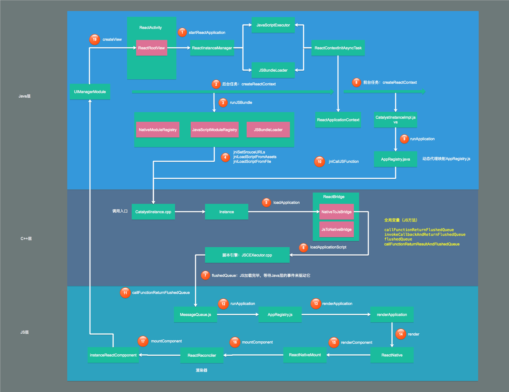

React Native(V0.61.4)

## 1. 应用初始化流程

将以/react-natve/template的Demo为例，从外部JS代码起步，了解内部的逻辑。

```json
// demo的依赖，缺少了两个，安装启动后，界面如下图
"@react-native-community/cli-platform-android": "^2.9.0",
"@react-native-community/cli-platform-ios": "^2.9.0",
```


### 1.1. 首先会在应用的 MainApplication 里做RN的初始化操作

MainApplication 里继承 Application 实现了 ReactApplication 接口，该接口要求创建一个ReactNativeHost对象，后者持有`ReactInstanceManager`（ReactNative应用总的管理类，这个单词将贯穿始终）实例，并做了一些初始化操作。

```java
public interface ReactApplication {
  /** Get the default {@link ReactNativeHost} for this app. */
  ReactNativeHost getReactNativeHost();
}
```

```java
public class MainApplication extends Application implements ReactApplication {

  // ReactNativeHost类（private @Nullable ReactInstanceManager mReactInstanceManager），
  // 持有ReactInstanceManager实例，后者正是ReactNative应用总的管理类。
  private final ReactNativeHost mReactNativeHost =
    // 在创建 ReactNativeHost 实例时，Override重写了里面的几个方法，这些方法提供一些初始化信息
    new ReactNativeHost(this) {

      // 是否开启dev模式，dev模式下会有一些调试工具，例如红盒
      @Override
      public boolean getUseDeveloperSupport() {
        return BuildConfig.DEBUG;
      }

      // 返回app需要的ReactPackage，包括：
      // NativeModule（官网Demo之Toast模块就是加在这里——https://reactnative.cn/docs/native-modules-android/）
      // JavaScriptModule以及ViewManager
      @Override
      protected List<ReactPackage> getPackages() {
        @SuppressWarnings("UnnecessaryLocalVariable")
        List<ReactPackage> packages = new PackageList(this).getPackages();
        // Packages that cannot be autolinked yet can be added manually here, for example:
        packages.add(new MyReactNativePackage());
        return packages;
      }

      @Override
      protected String getJSMainModuleName() {
        return "index";
      }
    };

  @Override
  public ReactNativeHost getReactNativeHost() {
    return mReactNativeHost;
  }

  @Override
  public void onCreate() {
    super.onCreate();
    // SoLoader：加载C++底层库，准备解析JS。
    SoLoader.init(this, /* native exopackage */ false);
  }
  // ...
}
```

ReactNativeHost主要的工作就是`创建ReactInstanceManager`，它将一些信息传递给了后者。

```java
public abstract class ReactNativeHost {
  protected ReactInstanceManager createReactInstanceManager() {
    ReactMarker.logMarker(ReactMarkerConstants.BUILD_REACT_INSTANCE_MANAGER_START);
    ReactInstanceManagerBuilder builder =
      // new ReactInstanceManager(...)
      ReactInstanceManager.builder()
        // mApplication：应用上下文，Application instance
        .setApplication(mApplication)
        // mJSMainModulePath：setJSMainModulePath 传递url以从打包服务器拉取js Bundle的js应用入口
        // 仅在dev模式下有效，一般都是默认的"index"
        .setJSMainModulePath(getJSMainModuleName())
        // mUseDeveloperSupport：是否开启dev模式
        .setUseDeveloperSupport(getUseDeveloperSupport())
        // mRedBoxHandler：红盒的回调
        .setRedBoxHandler(getRedBoxHandler())
        // mJavaScriptExecutorFactory：自定义JSExecutor
        .setJavaScriptExecutorFactory(getJavaScriptExecutorFactory())
        // mUIImplementationProvider：自定义UI实现机制
        .setUIImplementationProvider(getUIImplementationProvider())
        // mJSIModulesPackage
        .setJSIModulesPackage(getJSIModulePackage())
        .setInitialLifecycleState(LifecycleState.BEFORE_CREATE);

    // 添加ReactPackage，无法自动链接的包可以在 getPackages 手动添加
    for (ReactPackage reactPackage : getPackages()) {
      builder.addPackage(reactPackage);
    }

    // 可以自定义js Bundle的加载路径，默认会走入else逻辑，即为Android assets
    String jsBundleFile = getJSBundleFile();
    if (jsBundleFile != null) {
      builder.setJSBundleFile(jsBundleFile);
    } else {
      /**
        protected @Nullable String getBundleAssetName() {
          return "index.android.bundle";
        }
        public ReactInstanceManagerBuilder setBundleAssetName(String bundleAssetName) {
          mJSBundleAssetUrl = (bundleAssetName == null ? null : "assets://" + bundleAssetName);
          mJSBundleLoader = null;
          return this;
        }
      */
      builder.setBundleAssetName(Assertions.assertNotNull(getBundleAssetName()));
    }
    ReactInstanceManager reactInstanceManager = builder.build();
    ReactMarker.logMarker(ReactMarkerConstants.BUILD_REACT_INSTANCE_MANAGER_END);
    return reactInstanceManager;
  }
}
```

### 1.2 页面继承ReactActivity，ReactActivity作为JS页面的容器

```java
public class MainActivity extends ReactActivity {

  /**
  * Returns the name of the main component registered from JavaScript. This is used to schedule
  * rendering of the component.
  */
  @Override
  protected String getMainComponentName() {
    // 返回组件名
    return "HelloWorld";
  }
}
```

### 1.3 有了ReactActivity作为容器，就可以用JS开发页面了

```js
import React from 'react';
import { AppRegistry, StyleSheet, Text, View } from 'react-native';

const App: () => React$Node = () => {
  return (
    <View>
      <Text>TODO：UI渲染（JSX语法）</Text>
    </View>
  );
};

const styles = StyleSheet.create({
  // TODO: 创建CSS样式
});

// 注册组件名，JS与Java格子各自维护了一个注册表
AppRegistry.registerComponent('HelloWorld', () => App);
```

## 2. 应用启动流程

> 一句话概括启动流程：先是应用终端启动并创建应用上下文，应用上下文启动JS Runtime，进行布局，再由应用终端进行渲染，最后将渲染的View添加到ReactRootView上，最终呈现在用户面前。



<p style="background-color:cyan;line-height:50px;text-align:center;border-radius:5px;" height="50px">即将进入Java层</p>

首先，从ReactActivity入手。ReactActivity基于Activity，并实现了它的生命周期方法。且所有的功能都由它的委托类 ReactActivityDelegate 来完成。

所以主要来关注 ReactActivityDelegate 的实现。先来看看 ReactActivityDelegate 的 onCreate() 方法。

### 2.1 创建布局容器：ReactActivityDelegate.onCreate(Bundle savedInstanceState)

```java
public class ReactActivityDelegate {

  private final @Nullable Activity mActivity;
  private final @Nullable String mMainComponentName;

  private ReactDelegate mReactDelegate;

  // 构造函数
  public ReactActivityDelegate(ReactActivity activity, @Nullable String mainComponentName) {
    mActivity = activity;
    mMainComponentName = mainComponentName;
  }

  protected void onCreate(Bundle savedInstanceState) {
    // 方法return this.mMainComponentName，本例为"HelloWorld"
    String mainComponentName = getMainComponentName();
    mReactDelegate =
        new ReactDelegate(
          // 返回构建函数时传入的上下文 this.mActivity
          getPlainActivity(),
          // 获取了初始化时（@本篇1.1）的 ReactNativeHost 实例
          // (ReactApplication)语法即强制类型转换
          //  ((ReactApplication) getPlainActivity().getApplication()).getReactNativeHost();
          getReactNativeHost(),
          mainComponentName,
          // 启动配置选项，本例为默认的null
          getLaunchOptions()
        ) {
          @Override
          protected ReactRootView createRootView() {
            return ReactActivityDelegate.this.createRootView();
          }
        };

    // mMainComponentName：实例化时传递的组件名，本例为"HelloWorld"
    if (mMainComponentName != null) {
      // 载入app页面
      loadApp(mainComponentName);
    }
  }

  protected void loadApp(String appKey) {
    mReactDelegate.loadApp(appKey);
    // Activity的setContentView()方法
    getPlainActivity().setContentView(mReactDelegate.getReactRootView());
  }
}
```

```java
public class ReactDelegate {

  private ReactRootView mReactRootView;
  @Nullable private final String mMainComponentName;

  public ReactDelegate(
      Activity activity,
      ReactNativeHost reactNativeHost,
      @Nullable String appKey,
      @Nullable Bundle launchOptions) {
    mActivity = activity;
    mMainComponentName = appKey;
    mLaunchOptions = launchOptions;
    mReactNativeHost = reactNativeHost;
  }

  public ReactRootView getReactRootView() {
    return mReactRootView;
  }

  public void loadApp() {
    loadApp(mMainComponentName);
  }

  public void loadApp(String appKey) {
    if (mReactRootView != null) {
      throw new IllegalStateException("Cannot loadApp while app is already running.");
    }
    // 创建ReactRootView作为根视图,它本质上是一个FrameLayout
    mReactRootView = createRootView();
    // 启动RN应用
    mReactRootView.startReactApplication(
      getReactNativeHost().getReactInstanceManager(),
      appKey,
      mLaunchOptions
    );
  }

  protected ReactRootView createRootView() {
    return new ReactRootView(mActivity);
  }
}
```

可以发现ReactActivityDelegate在创建时主要做了以下事情：

1. 创建ReactRootView作为应用的容器，它本质上是一个FrameLayout（安卓布局之帧布局）。
2. 调用ReactRootView.startReactApplication()进一步执行应用启动流程。
3. 调用Activity.setContentView()将创建的ReactRootView作为ReactActivity的content view。

**RN核心的地方就在于ReactRootView，它就是一个View，可以像用其他UI组件那样把它用在Android应用的任何地方。**

来进一步去ReactRootView看启动流程。

### 2.2 执行应用启动：startReactApplication(ReactInstanceManager reactInstanceManager,String moduleName,@Nullable Bundle initialProperties,@Nullable String initialUITemplate)

四个参数分别为

- ReactInstanceManager reactInstanceManager：React实例总的管理类
- String moduleName：模块的名字，对应`ReactActivity.getMainComponentName()`（Java）与`AppRegistry.registerComponent()`（JS)；本例为"HelloWorld"。
- @Nullable Bundle initialProperties：Bundle类型的数据，如果不继承ReactActivity而是自己实现页面容器，可以通过这个参数在startActivity()时传递参数到JS层；启动配置选项，本例为默认的null。
- Nullable String initialUITemplate：初始化UI模版；本例此处为null。

```java
import android.os.Bundle;

public class ReactRootView extends FrameLayout implements RootView, ReactRoot {
  /**
   * Schedule rendering of the react component rendered by the JS application from the given JS
   * module (@{param moduleName}) using provided {@param reactInstanceManager} to attach to the JS
   * context of that manager. Extra parameter {@param initialProperties} can be used to pass initial
   * properties for the react component.
   */
  public void startReactApplication(
      ReactInstanceManager reactInstanceManager,
      String moduleName,
      @Nullable Bundle initialProperties,
      @Nullable String initialUITemplate) {
    Systrace.beginSection(TRACE_TAG_REACT_JAVA_BRIDGE, "startReactApplication");
    try {
      UiThreadUtil.assertOnUiThread();

      // TODO(6788889): Use POJO instead of bundle here, apparently we can't just use WritableMap
      // here as it may be deallocated in native after passing via JNI bridge, but we want to reuse
      // it in the case of re-creating the catalyst instance
      Assertions.assertCondition(
          mReactInstanceManager == null,
          "This root view has already been attached to a catalyst instance manager");

      mReactInstanceManager = reactInstanceManager;
      mJSModuleName = moduleName;
      mAppProperties = initialProperties;
      mInitialUITemplate = initialUITemplate;

      if (mUseSurface) {
        // TODO initialize surface here
      }
      // 创建RN应用上下文
      mReactInstanceManager.createReactContextInBackground();

      attachToReactInstanceManager();

    } finally {
      Systrace.endSection(TRACE_TAG_REACT_JAVA_BRIDGE);
    }
  }
}
```

### 2.3 创建RN应用的上下文的准备工作：ReactInstanceManager.createReactContextInBackground()

```java

public class ReactInstanceManager {
  /**
   * Trigger react context initialization asynchronously in a background async task. This enables
   * applications to pre-load the application JS, and execute global code before {@link
   * ReactRootView} is available and measured.
   *
   * <p>Called from UI thread.
   */
  @ThreadConfined(UI)
  public void createReactContextInBackground() {
    Log.d(ReactConstants.TAG, "ReactInstanceManager.createReactContextInBackground()");
    UiThreadUtil
        .assertOnUiThread(); // Assert before setting mHasStartedCreatingInitialContext = true
    if (!mHasStartedCreatingInitialContext) {
      mHasStartedCreatingInitialContext = true;
      recreateReactContextInBackgroundInner();
    }
  }

  /**
   * Recreate the react application and context. This should be called if configuration has changed
   * or the developer has requested the app to be reloaded. It should only be called after an
   * initial call to createReactContextInBackground.
   *
   * <p>Called from UI thread.
   */
  @ThreadConfined(UI)
  public void recreateReactContextInBackground() {
    Assertions.assertCondition(
        mHasStartedCreatingInitialContext,
        "recreateReactContextInBackground should only be called after the initial "
            + "createReactContextInBackground call.");
    recreateReactContextInBackgroundInner();
  }

  @ThreadConfined(UI)
  private void recreateReactContextInBackgroundInner() {
    Log.d(ReactConstants.TAG, "ReactInstanceManager.recreateReactContextInBackgroundInner()");
    PrinterHolder.getPrinter()
        .logMessage(ReactDebugOverlayTags.RN_CORE, "RNCore: recreateReactContextInBackground");
    UiThreadUtil.assertOnUiThread();

    // 仅开发模式，会走入该if逻辑。实现在线更新Bundle，晃动弹出调试菜单等功能，这一部分属于调试功能流程。
    // mUseDeveloperSupport 被赋值是在实例化时方法调用：setUseDeveloperSupport(getUseDeveloperSupport())
    // mJSMainModulePath 被赋值是在实例化时方法调用：setJSMainModulePath(getJSMainModuleName())
    if (mUseDeveloperSupport && mJSMainModulePath != null) {
      final DeveloperSettings devSettings = mDevSupportManager.getDevSettings();

      if (!Systrace.isTracing(TRACE_TAG_REACT_APPS | TRACE_TAG_REACT_JS_VM_CALLS)) {
        if (mBundleLoader == null) {
          // 若if条件成立（其实，我没有找到成立的场景），则从文件中获取，mBundleLoader在ReactInstanceManager实例化时传入
          /**
          (mJSBundleLoader == null && mJSBundleAssetUrl != null)
            ? JSBundleLoader.createAssetLoader(
                mApplication, mJSBundleAssetUrl, false)
            : mJSBundleLoader
          没有找到 mBundleLoader == null 成立的场景，因为 mJSBundleLoader 和 mJSBundleAssetUrl 没有全为null的场景
           */
          mDevSupportManager.handleReloadJS();
        } else {
          mDevSupportManager.isPackagerRunning(
              new PackagerStatusCallback() {
                @Override
                public void onPackagerStatusFetched(final boolean packagerIsRunning) {
                  UiThreadUtil.runOnUiThread(
                      new Runnable() {
                        @Override
                        public void run() {
                          if (packagerIsRunning) {
                            mDevSupportManager.handleReloadJS();
                          } else if (mDevSupportManager.hasUpToDateJSBundleInCache()
                              && !devSettings.isRemoteJSDebugEnabled()) {
                            // If there is a up-to-date bundle downloaded from server,
                            // with remote JS debugging disabled, always use that.
                            onJSBundleLoadedFromServer();
                          } else {
                            // If dev server is down, disable the remote JS debugging.
                            devSettings.setRemoteJSDebugEnabled(false);
                            recreateReactContextInBackgroundFromBundleLoader();
                          }
                        }
                      });
                }
              });
        }
        return;
      }
    }
    // 线上模式
    recreateReactContextInBackgroundFromBundleLoader();
  }

  @ThreadConfined(UI)
  private void recreateReactContextInBackgroundFromBundleLoader() {
    Log.d(
        ReactConstants.TAG,
        "ReactInstanceManager.recreateReactContextInBackgroundFromBundleLoader()");
    PrinterHolder.getPrinter()
        .logMessage(ReactDebugOverlayTags.RN_CORE, "RNCore: load from BundleLoader");

    // setJavaScriptExecutorFactory默认为 new JSCExecutorFactory(mApplication.getPackageName(), getFriendlyDeviceName()); 参数分别为应用程序和设备的名称
    // JSCExecutorFactory的create方法，使其拥有一个 JSCExecutor 实例，后者通过 extends JavaScriptExecutor 的 native方法
    // {@code private static native HybridData initHybrid(ReadableNativeMap jscConfig)} 传递到 C++ 层。
    /* @code
      @Override
      public JavaScriptExecutor create() throws Exception {
        WritableNativeMap jscConfig = new WritableNativeMap();
        jscConfig.putString("OwnerIdentity", "ReactNative");
        jscConfig.putString("AppIdentity", mAppName);
        jscConfig.putString("DeviceIdentity", mDeviceName);
        return new JSCExecutor(jscConfig);
      }
    */
    recreateReactContextInBackground(setJavaScriptExecutorFactory, mBundleLoader);
  }

  @ThreadConfined(UI)
  private void recreateReactContextInBackground(
      JavaScriptExecutorFactory jsExecutorFactory, JSBundleLoader jsBundleLoader) {
    Log.d(ReactConstants.TAG, "ReactInstanceManager.recreateReactContextInBackground()");
    UiThreadUtil.assertOnUiThread();

    final ReactContextInitParams initParams =
        new ReactContextInitParams(jsExecutorFactory, jsBundleLoader);
    if (mCreateReactContextThread == null) {
      // 初始化一个异步任务，创建reactApplicationContext
      runCreateReactContextOnNewThread(initParams);
    } else {
      // 创建ReactContext的后台任务已经开启，缓存initParams在队列中等待重新创建ReactContext
      mPendingReactContextInitParams = initParams;
    }
  }
}
```

整个代码的调用链，最终开启异步任务ReactContextInitAsyncTask来创建上下文ReactApplicationContext。

ReactInstanceManager.createReactContextInBackground()
->ReactInstanceManager.recreateReactContextInBackgroundInner() ->ReactInstanceManager.recreateReactContextInBackgroundFromBundleLoader() ->ReactInstanceManager.recreateReactContextInBackground(JavaScriptExecutorFactory jsExecutorFactory, JSBundleLoader jsBundleLoader)
->ReactInstanceManager.runCreateReactContextOnNewThread(initParams)

该方法runCreateReactContextOnNewThread，启动了一个异步线程去执行ReactApplicationContext的创建。

### 2.4 开启异步线程去执行创建上下文：ReactInstanceManager.runCreateReactContextOnNewThread(final ReactContextInitParams initParams)

```java
public class ReactInstanceManager {
  @ThreadConfined(UI)
  private void runCreateReactContextOnNewThread(final ReactContextInitParams initParams) {
    Log.d(ReactConstants.TAG, "ReactInstanceManager.runCreateReactContextOnNewThread()");
    UiThreadUtil.assertOnUiThread();
    synchronized (mAttachedReactRoots) {
      synchronized (mReactContextLock) {
        if (mCurrentReactContext != null) {
          tearDownReactContext(mCurrentReactContext);
          mCurrentReactContext = null;
        }
      }
    }

    mCreateReactContextThread =
        new Thread(
            null,
            new Runnable() {
              @Override
              public void run() {
                ReactMarker.logMarker(REACT_CONTEXT_THREAD_END);
                synchronized (ReactInstanceManager.this.mHasStartedDestroying) {
                  while (ReactInstanceManager.this.mHasStartedDestroying) {
                    try {
                      ReactInstanceManager.this.mHasStartedDestroying.wait();
                    } catch (InterruptedException e) {
                      continue;
                    }
                  }
                }
                // As destroy() may have run and set this to false, ensure that it is true before we
                // create
                mHasStartedCreatingInitialContext = true;

                try {
                  Process.setThreadPriority(Process.THREAD_PRIORITY_DISPLAY);
                  ReactMarker.logMarker(VM_INIT);
                  final ReactApplicationContext reactApplicationContext =
                      // 异步执行的createReactContext()方法，真正执行创建ReactContext
                      // 这两个参数重点说明一下，请看下文。
                      createReactContext(
                          initParams.getJsExecutorFactory().create(),
                          initParams.getJsBundleLoader());

                  mCreateReactContextThread = null;
                  ReactMarker.logMarker(PRE_SETUP_REACT_CONTEXT_START);
                  final Runnable maybeRecreateReactContextRunnable =
                      new Runnable() {
                        @Override
                        public void run() {
                          if (mPendingReactContextInitParams != null) {
                            runCreateReactContextOnNewThread(mPendingReactContextInitParams);
                            mPendingReactContextInitParams = null;
                          }
                        }
                      };
                  Runnable setupReactContextRunnable =
                      new Runnable() {
                        @Override
                        public void run() {
                          try {
                            setupReactContext(reactApplicationContext);
                          } catch (Exception e) {
                            mDevSupportManager.handleException(e);
                          }
                        }
                      };

                  reactApplicationContext.runOnNativeModulesQueueThread(setupReactContextRunnable);
                  UiThreadUtil.runOnUiThread(maybeRecreateReactContextRunnable);
                } catch (Exception e) {
                  mDevSupportManager.handleException(e);
                }
              }
            },
            "create_react_context");
    ReactMarker.logMarker(REACT_CONTEXT_THREAD_START);
    mCreateReactContextThread.start();
  }
}
```

重点来看看传入ReactInstanceManager.createReactContext()的2个参数：

- JavaScriptExecutor jsExecutor：执行JS

    JSCExecutor 继承于 JavaScriptExecutor（@本篇2.3 的`recreateReactContextInBackgroundFromBundleLoader`方法提及了），
    当该类被加载时，它会自动去加载"reactnativejnifb.so"库（`SoLoader.loadLibrary("jscexecutor");`，可以理解为浏览器内核的JS引擎），
    并会调用native方法`initHybrid()`初始化C++层RN与JSC（JSCore，即JavaScriptCore，JS解析的核心部分）通信的框架。

- JSBundleLoader jsBundleLoader：加载JS

    缓存了JSBundle的信息，封装了上层加载JSBundle的相关接口，CatalystInstance（三端通信总管理类）通过其调用ReactBridge去加载JS文件，
    不同的场景会创建不同的加载器，具体可以查看类JSBundleLoader。

接下来调用ReactInstanceManager.createReactContext()，真正开始创建ReactContext。

### 2.5 真正开始创建ReactContext：ReactInstanceManager.createReactContext(JavaScriptExecutor jsExecutor, JSBundleLoader jsBundleLoader)

```java
public class ReactInstanceManager {
  /** @return instance of {@link ReactContext} configured a {@link CatalystInstance} set */
  private ReactApplicationContext createReactContext(
      JavaScriptExecutor jsExecutor, JSBundleLoader jsBundleLoader) {
    Log.d(ReactConstants.TAG, "ReactInstanceManager.createReactContext()");
    ReactMarker.logMarker(CREATE_REACT_CONTEXT_START, jsExecutor.getName());

    // ReactApplicationContext是ReactContext的包装类
    final ReactApplicationContext reactContext = new ReactApplicationContext(mApplicationContext);

    // 若未自定义则使用默认的{@link DevSupportManager}，在dev模式下为红盒（弹出红框，提示错误），在prod模式下rethrows（应用程序崩溃）
    NativeModuleCallExceptionHandler exceptionHandler =
        mNativeModuleCallExceptionHandler != null
            ? mNativeModuleCallExceptionHandler
            : mDevSupportManager;
    reactContext.setNativeModuleCallExceptionHandler(exceptionHandler);

    /*
    // 该处注释：在ReactInstanceManager实例化时执行
    // 加锁、创建CoreModulesPackage实例，CoreModulesPackage里面封装了RN Framework核心功能，包括：通信、调试等。
    synchronized (mPackages) {
      PrinterHolder.getPrinter()
          .logMessage(ReactDebugOverlayTags.RN_CORE, "RNCore: Use Split Packages");
      mPackages.add(
          new CoreModulesPackage(
              this,
              new DefaultHardwareBackBtnHandler() {
                @Override
                public void invokeDefaultOnBackPressed() {
                  ReactInstanceManager.this.invokeDefaultOnBackPressed();
                }
              },
              mUIImplementationProvider,
              lazyViewManagersEnabled,
              minTimeLeftInFrameForNonBatchedOperationMs));
      if (mUseDeveloperSupport) {
        mPackages.add(new DebugCorePackage());
      }
      mPackages.addAll(packages);
    }
    */
    // 该过程，用于处理CoreModulesPackage 和 Application里注入的ReactPackage（@本篇1.1）
    // 把JavaModule添加到注册表中，返回注册表，该函数收起在下文
    NativeModuleRegistry nativeModuleRegistry = processPackages(reactContext, mPackages, false);

    // jsExecutor、nativeModuleRegistry、jsBundleLoader等各种参数处理好之后，开始构建CatalystInstanceImpl实例。
    CatalystInstanceImpl.Builder catalystInstanceBuilder =
        new CatalystInstanceImpl.Builder()
            .setReactQueueConfigurationSpec(ReactQueueConfigurationSpec.createDefault())
            .setJSExecutor(jsExecutor) // jsExecutor：执行JS（@本篇2.4）
            .setRegistry(nativeModuleRegistry) // nativeModuleRegistry：JavaModule注册表
            .setJSBundleLoader(jsBundleLoader) // jsBundleLoader：加载JS（@本篇2.4）
            .setNativeModuleCallExceptionHandler(exceptionHandler);

    ReactMarker.logMarker(CREATE_CATALYST_INSTANCE_START);
    // CREATE_CATALYST_INSTANCE_END is in JSCExecutor.cpp
    Systrace.beginSection(TRACE_TAG_REACT_JAVA_BRIDGE, "createCatalystInstance");
    final CatalystInstance catalystInstance;
    try {
      catalystInstance = catalystInstanceBuilder.build();
    } finally {
      Systrace.endSection(TRACE_TAG_REACT_JAVA_BRIDGE);
      ReactMarker.logMarker(CREATE_CATALYST_INSTANCE_END);
    }
    // 关联ReactContext与CatalystInstance
    reactContext.initializeWithInstance(catalystInstance);

    // （@本篇1）mJSIModulePackage默认为null。是在实例化ReactInstanceManagerBuilder后，
    // 调用setJSIModulesPackage(getJSIModulePackage())设置的
    if (mJSIModulePackage != null) {
      catalystInstance.addJSIModules(
          mJSIModulePackage.getJSIModules(
              reactContext, catalystInstance.getJavaScriptContextHolder()));

      if (ReactFeatureFlags.useTurboModules) {
        catalystInstance.setTurboModuleManager(
            catalystInstance.getJSIModule(JSIModuleType.TurboModuleManager));
      }
    }
    if (mBridgeIdleDebugListener != null) {
      catalystInstance.addBridgeIdleDebugListener(mBridgeIdleDebugListener);
    }
    if (Systrace.isTracing(TRACE_TAG_REACT_APPS | TRACE_TAG_REACT_JS_VM_CALLS)) {
      // 调用CatalystInstanceImpl的Native方法，把Java Registry转换为Json，再由C++层传送到JS层。
      catalystInstance.setGlobalVariable("__RCTProfileIsProfiling", "true");
    }
    ReactMarker.logMarker(ReactMarkerConstants.PRE_RUN_JS_BUNDLE_START);
    Systrace.beginSection(TRACE_TAG_REACT_JAVA_BRIDGE, "runJSBundle");
    // 通过CatalystInstance开始加载JS Bundle
    catalystInstance.runJSBundle();
    Systrace.endSection(TRACE_TAG_REACT_JAVA_BRIDGE);

    return reactContext;
  }
}
```

<details>
<summary>processPackages辅助函数：把JavaModule添加到注册表中。</summary>

```java
public class ReactInstanceManager {
  private NativeModuleRegistry processPackages(
      ReactApplicationContext reactContext,
      List<ReactPackage> packages,
      boolean checkAndUpdatePackageMembership) {

    // 创建JavaModule注册表Builder，其build方法用来创建JavaModule注册表，
    // 下一步，JavaModule注册表会将所有的JavaModule注册到CatalystInstance中。
    NativeModuleRegistryBuilder nativeModuleRegistryBuilder =
        new NativeModuleRegistryBuilder(reactContext, this);

    ReactMarker.logMarker(PROCESS_PACKAGES_START);

    // TODO(6818138): Solve use-case of native modules overriding
    synchronized (mPackages) {
      // 循环处理ReactPackage，处理的过程就是将其添加到注册表中
      for (ReactPackage reactPackage : packages) {
        if (checkAndUpdatePackageMembership && mPackages.contains(reactPackage)) {
          continue;
        }
        Systrace.beginSection(TRACE_TAG_REACT_JAVA_BRIDGE, "createAndProcessCustomReactPackage");
        try {
          if (checkAndUpdatePackageMembership) {
            mPackages.add(reactPackage);
          }
          processPackage(reactPackage, nativeModuleRegistryBuilder);
        } finally {
          Systrace.endSection(TRACE_TAG_REACT_JAVA_BRIDGE);
        }
      }
    }
    ReactMarker.logMarker(PROCESS_PACKAGES_END);

    ReactMarker.logMarker(BUILD_NATIVE_MODULE_REGISTRY_START);
    Systrace.beginSection(TRACE_TAG_REACT_JAVA_BRIDGE, "buildNativeModuleRegistry");
    NativeModuleRegistry nativeModuleRegistry;
    try {
      // build方法调用，生成JavaModule注册表
      nativeModuleRegistry = nativeModuleRegistryBuilder.build();
    } finally {
      Systrace.endSection(TRACE_TAG_REACT_JAVA_BRIDGE);
      ReactMarker.logMarker(BUILD_NATIVE_MODULE_REGISTRY_END);
    }

    return nativeModuleRegistry;
  }
}
```

</details>

未完待续。。。

## Reference

- [React Native源码篇](https://github.com/sucese/react-native/tree/master/doc)
- [移动端跨平台开发方案解析](https://www.jianshu.com/p/702e0546c8de)
- [React Native教程](https://wiki.imooc.com/reactnative/introduce.html)
