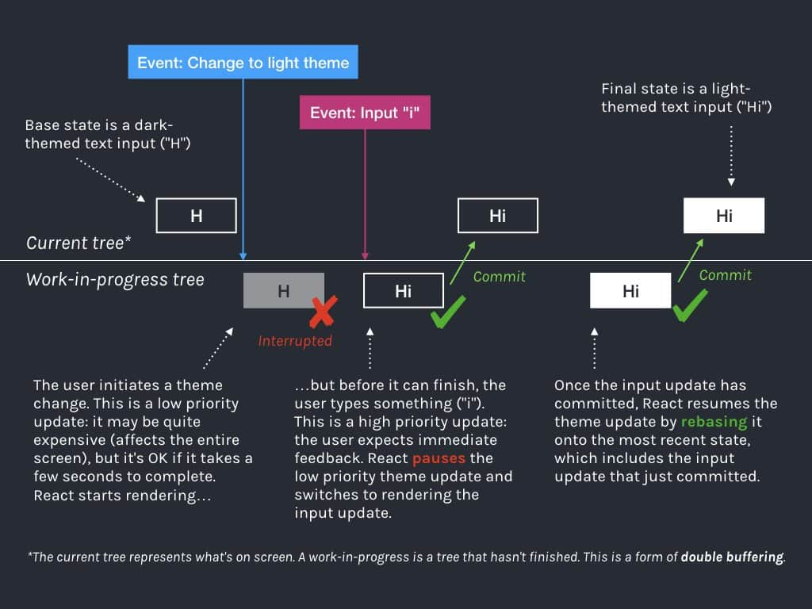

## 什么是优先级

React将人机交互研究的结果整合到真实的UI中，这和Chromium的处理方式所见略同（[请看这一节](../../base/browser/06event-loop.html#chromium是如何解决队头阻塞的)）。具体到React运行上的体现如下：

- 生命周期方法：同步执行。
- 受控的用户输入：比如输入框内输入文字，同步执行（对应Chromium的`用户交互`）。
- 交互事件：比如动画，高优先级执行（对应Chromium的`合成页面`）。
- 其他：比如数据请求，低优先级执行（对应Chromium的`默认`）。

## 如何调度优先级

在[React16架构一节](./idea.html)有介绍，`React`通过`Scheduler`调度任务。

具体到代码，每当需要调度任务时，`React`会调用`Scheduler`提供的方法`runWithPriority`。

该方法接收一个`优先级`常量与一个`回调函数`作为参数。`回调函数`会以`优先级`高低为顺序，排列在一个`定时器`中并在合适的时间触发。

对于更新来讲，传递的`回调函数`一般为[状态更新流程概览一节](./state-overview.html#render阶段的开始)提到的`render阶段`的入口函数。

> `runWithPriority`源码请看[这里](https://github.com/facebook/react/blob/v16.13.1/packages/scheduler/src/Scheduler.js#L217)，对`Scheduler`的定义请看[这里](https://github.com/facebook/react/blob/v16.13.1/packages/scheduler/src/SchedulerPriorities.js)。

## 调度更新Demo



> 图片来源[Andrew Clark推文：关于不同优先级的调度更新](https://twitter.com/acdlite/status/978412930973687808)。

在该例中，有两个`Update`。姑且将“关闭黑夜模式”产生的`Update`称为`u1`，输入字母“i”产生的`Update`称为`u2`。

其中`u1`先触发并进入`render阶段`。其被定义为优先级较低。此时：

```js
fiber.updateQueue = {
  baseQueue: null,
  baseState: {
    blackTheme: true,
    text: 'H'
  },
  effects: null,
  shared: {
    pending: u1
  }
}
```

在`u1`完成`render阶段`前，用户通过键盘输入字母“i”，产生了`u2`。`u2`属于受控的用户输入，优先级高于`u1`，于是`u1`产生的`render阶段`被中断（interrupted）。

此时

```js
fiber.updateQueue.shared.pending === u2 ----> u1
                                     ^        |
                                     |________|
// 即
u2.next === u1;
u1.next === u2;
```

其中`u2`优先级高于`u1`，接下来进入`u2`产生的`render阶段`。

在[processUpdateQueue]((https://github.com/facebook/react/blob/v16.13.1/packages/react-reconciler/src/ReactUpdateQueue.js#L335))方法中，`shared.pending`被赋值给`变量baseQueue`，尽管其指向最后一个`update u2`，不过`update`的执行顺序为：`u1 --> u2`。

接下来遍历`baseUpdate`，处理优先级合适的`Update`（这一次处理的是更高优的`u2`）。

由于`u2`不是`baseUpdate`中的第一个`update`，在其之前的`u1`由于优先级不够被跳过。而`update`之间可能有依赖关系，所以被跳过的`update`及其后面所有`update`（即`u1 --> u2`）会成为下次更新的`baseUpdate`。

最终`u2`完成`render - commit阶段`。

此时：

```js
fiber.updateQueue = {
  baseQueue: u2 ----> u1,
              ^        |
              |________|
  baseState: {
    blackTheme: true,
    text: 'Hi'
  },
  effects: null,
  shared: {
    pending: null
  }
}
```

在`commit阶段`结尾会再调度一次更新。在该次更新中会基于`baseUpdate`保存的`u1 --> u2`，开启一次新的`render阶段`。

最终两次`Update`都完成后的结果如下：

```js
fiber.updateQueue = {
  baseQueue: null,
  baseState: {
    blackTheme: false,
    text: 'Hi'
  },
  effects: null,
  shared: {
    pending: null
  }
}
```

那么，`u2`对应的更新实际执行了两次，相应的`render阶段`的生命周期勾子`componentWillXXX`也会触发两次。这也是为什么这些勾子会被标记为`unsafe_`。

## 如何保证状态正确

### 如何保证Update不丢失

[处理updateQueue一节](./update.html#updatequeue在render阶段工作流程)介绍了，`processUpdateQueue`函数会对两个环形链表进行merge操作。

实际上，会赋值到`workInProgress updateQueue.baseQueue`（源码请看[这里](https://github.com/facebook/react/blob/v16.13.1/packages/react-reconciler/src/ReactUpdateQueue.js#L362)），并备份到`current updateQueue.baseQueue`（源码请看[这里](https://github.com/facebook/react/blob/v16.13.1/packages/react-reconciler/src/ReactUpdateQueue.js#L370-L376)）。

- 当`render阶段`被中断后重新开始时，会基于`current updateQueue`克隆出`workInProgress updateQueue`。由于`current updateQueue.baseQueue`已经保存了上一次的`Update`，所以不会丢失。
- 当`commit阶段`完成渲染，由于`workInProgress updateQueue.baseQueue`中保存了上一次的`Update`，所以 `workInProgress Fiber树`变成`current Fiber树`后也不会造成`Update`丢失。

### 如何保证状态依赖的连续性

当某个`Update`由于优先级低而被跳过时，保存在`baseQueue`中的不仅是该`Update`，还包括链表中该`Update`之后的所有`Update`。

考虑如下例子（该例注释在[源码里](https://github.com/facebook/react/blob/v16.13.1/packages/react-reconciler/src/ReactUpdateQueue.js#L61)）：

```js
baseState: ''
shared.pending: A1 -->  B2 -->  C1 -->  D2
```

其中字母代表该`Update`要在页面插入的字母，数字代表优先级，值越低优先级越高。

1. 第一次render，优先级为1。

    ```js
    baseState: ''
    baseQueue: null
    Updates: [A1, C1]
    memoizedState: 'AC'
    ```

    其中`B2`由于优先级为2，低于当前优先级，所以他及其后面的所有`Update`会被保存在`baseUpdate`中作为下次更新的`Update`（即`B2、C1、D2`）。这么做是为了保持状态的前后依赖顺序。
2. 第二次render，优先级为2。

    ```js
    baseState: 'A'
    baseQueue: B2 --> C1 -->  D2
    Updates: [B2, C1, D2]
    memoizedState: 'ABCD'
    ```

    注意此时，`baseState`并非上一次更新的`memoizedState`，这是由于`B2`被跳过了（源码请看[这里](https://github.com/facebook/react/blob/v16.13.1/packages/react-reconciler/src/ReactUpdateQueue.js#L395)）。

    即当有`Update`被跳过时，`下次更新的baseState !== 上次更新的memoizedState`（此时的`baseState`赋值逻辑请看[这里](https://github.com/facebook/react/blob/v16.13.1/packages/react-reconciler/src/ReactUpdateQueue.js#L410)）。

`React`保证最终的状态一定和用户触发的交互一致，但是中间状态可能由于系统资源而异。

:::tip 高优先级任务打断低优先级任务Demo

- Demo链接：[https://codesandbox.io/s/dawn-river-wgn5n?file=/src/App.js](https://codesandbox.io/s/dawn-river-wgn5n?file=/src/App.js)。
- 当使用并发模式，页面从0 - 2 - 3；
- 当使用legacy模式，页面从0 - 1 - 3；
:::

## Reference

- [深入源码剖析componentWillXXX为什么UNSAFE](https://juejin.im/post/6847902224287285255)；
- [Andrew Clark推文：关于不同优先级的调度更新](https://twitter.com/acdlite/status/978412930973687808)。
