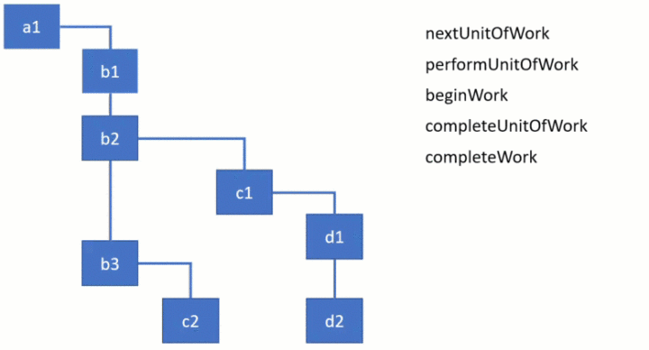

`render阶段`主要工作是：创建或更删`Fiber节点`以构建`Fiber树结构`、`mount`时初始化`离屏DOM树`、构建`effectList`单向链表等。

## “render阶段”入口

`render`阶段开始于`performSyncWorkOnRoot`或`performConcurrentWorkOnRoot`方法的调用（源码请看[这里](https://github.com/facebook/react/blob/v16.13.1/packages/react-reconciler/src/ReactFiberWorkLoop.js#L623-L639)）。这取决于本次更新是同步更新还是异步更新。

```js
// performSyncWorkOnRoot会调用该方法
function workLoopSync() {
  while (workInProgress !== null) {
    performUnitOfWork(workInProgress);
  }
}

// performConcurrentWorkOnRoot会调用该方法
function workLoopConcurrent() {
  while (workInProgress !== null && !shouldYield()) {
    performUnitOfWork(workInProgress);
  }
}
```

二者的区别在于是否调用`shouldYield`。如果当前浏览器帧没有剩余时间，`shouldYield`会中止循环，直到浏览器有空闲时间后再继续遍历。

- 变量`workInProgress`代表当前已创建的`workInProgress fiber`；
- 方法`performUnitOfWork`会创建下一个`Fiber节点`并赋值给`workInProgress`，并将`workInProgress`与已创建的`Fiber节点`连接起来构成`Fiber树`。

> `workLoopConcurrent`源码请看[这里](https://github.com/facebook/react/blob/v16.13.1/packages/react-reconciler/src/ReactFiberWorkLoop.js#L1467)。



已知`Fiber Reconciler`通过`Fiber树`中序遍历的方式实现可中断的递归，所以`performUnitOfWork`的工作可以分为两部分：“递”和“归”。

::: tip Fiber Reconciler的遍历，伪码如下：

```js
let root = fiber;
let node = fiber;
while (true) {
  // Do something with node
  if (node.child) {
    node = node.child;
    continue;
  }
  // Do something with node
  if (node === root) {
    return;
  }
  while (!node.sibling) {
    if (!node.return || node.return === root) {
      return;
    }
    node = node.return;
  }
  node = node.sibling;
}
```

> 参考自[Fiber Principles: Contributing To Fiber (#7942)](https://github.com/facebook/react/issues/7942)

:::

## “递”阶段

首先从`RootFiber`开始向下深度优先遍历。为遍历到的每个`Fiber节点`调用[beginWork](https://github.com/facebook/react/blob/v16.13.1/packages/react-reconciler/src/ReactFiberBeginWork.js#L2874)方法。

该方法会根据传入的`Fiber节点`创建`子Fiber节点`，并将这两个`Fiber节点`通过`child`属性连接起来。

当遍历到叶子节点（`fiber.child === null`，即没有子组件的组件，请看[这里](https://github.com/facebook/react/blob/v16.13.1/packages/react-reconciler/src/ReactFiberWorkLoop.js#L1494)）时就会进入“归”阶段。

## “归”阶段

在“归”阶段会调用`completeWork`处理`Fiber节点`。

当某个`Fiber节点`执行完`completeWork`，

- 如果其存在`兄弟Fiber节点`（即`fiber.sibling !== null`，请看[这里](https://github.com/facebook/react/blob/v16.13.1/packages/react-reconciler/src/ReactFiberWorkLoop.js#L1621)），会进入后者的“递”阶段。
- 反之，会进入`父级Fiber节点`（即`fiber.return`，请看[这里](https://github.com/facebook/react/blob/v16.13.1/packages/react-reconciler/src/ReactFiberWorkLoop.js#L1627)）的“归”阶段。

“递”和“归”阶段会交错执行直到“归”到`RootFiber`（即`fiber.return === null`），完成遍历。至此，render阶段的工作就结束了。

## Demo

```js
const Input = () => <input />
const List = () => [
  <span key="a">1</span>,
  <span key="b">2</span>,
  <span key="c">3</span>
]
function App() {
  return (
    <div>
      <Input />
      <List />
    </div>
  )
}
ReactDOM.render(<App />, document.getElementById("root"));
```

render阶段会依次执行（`console.log(workInProgress.tag, workInProgress.type)`）：

```js
3 null "beginWork"  // rootFiber，3 === HostRoot
2 App "beginWork"
5 "div" "beginWork"
2 Input "beginWork"
5 "input" "beginWork"
5 "input" "completeWork"
0 Input "completeWork"
2 List "beginWork"
5 "span" "beginWork"
5 "span" "completeWork"
5 "span" "beginWork"
5 "span" "completeWork"
5 "span" "beginWork"
5 "span" "completeWork"
0 List "completeWork"
5 "div" "completeWork"
0 App "completeWork"
3 null "completeWork"
```

其中，`Fiber节点`的`tag属性`对应的类型请看[这里](https://github.com/facebook/react/blob/v16.13.1/packages/shared/ReactWorkTags.js#L35)。

## Reference

- [Fiber 内部: 深入理解 React 的新 reconciliation 算法](https://zhuanlan.zhihu.com/p/59055212)。
