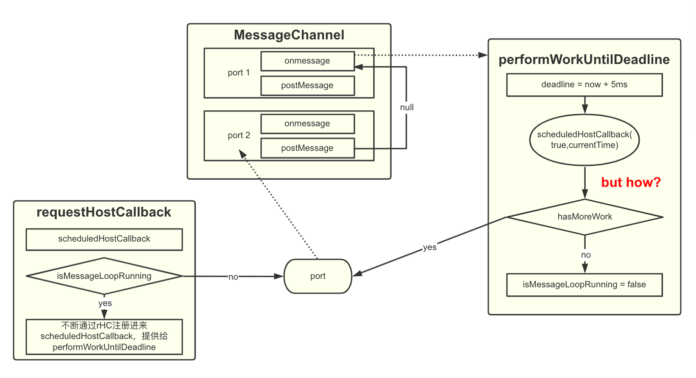
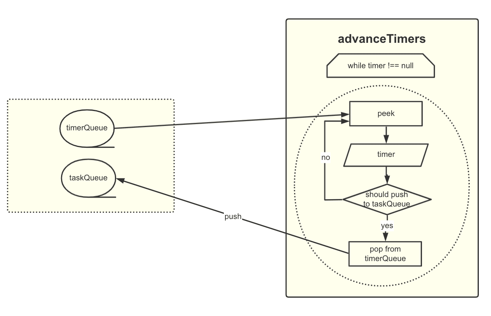
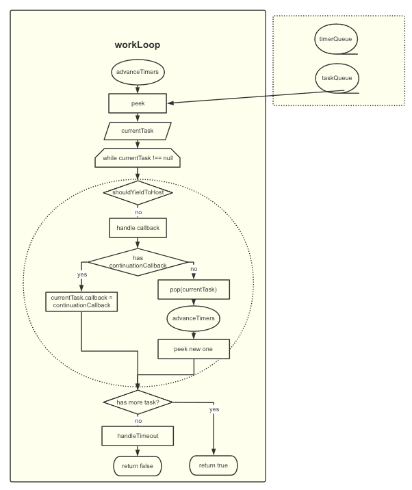
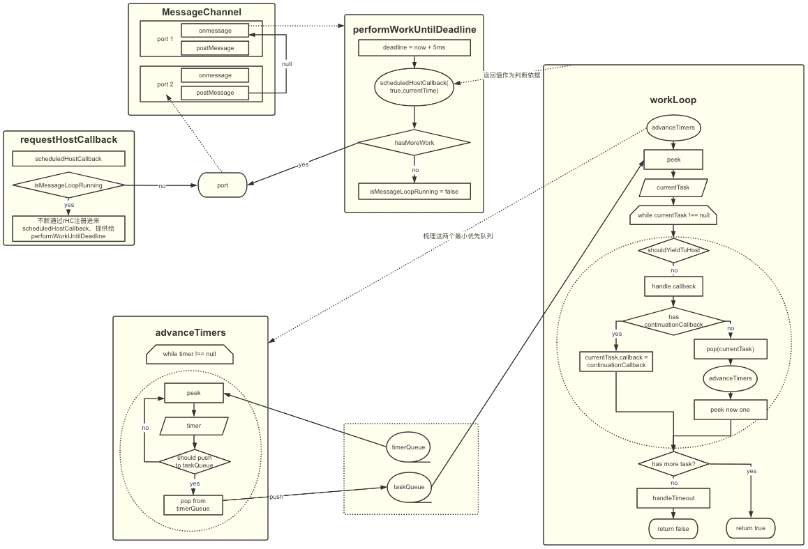

在[React架构一节](./constructure.html#scheduler（调度器）)介绍了`Scheduler`，主要包含两个功能：

- 时间切片
- 优先级调度

## 时间切片原理

`时间切片`的本质是模拟实现`requestIdleCallback`。

在去年2019.9.27的[release](https://github.com/facebook/react/releases/tag/v16.10.0) 中，`React`在`Scheduler`中开启了新的调度任务方案试验：

- 旧方案
  - `requestAnimationFrame`（简称**rAF**）回调，是唯一的`帧同步`（`Vsync`同步信号）的API，通常用于实现JS动画。
  - `requestIdleCallback`（简称**rIC**）回调，则唯一的在`帧`的`空闲时间`执行的，无法模拟其执行时间。
- 新方案：通过高频（短间隔）的调用`postMessage`（[MessageChannel](https://developer.mozilla.org/zh-CN/docs/Web/API/MessageChannel)，是宏任务）来调度任务。

### 契机

通过对这次release的[commit-message](https://github.com/facebook/react/pull/16214)的查看，主要是考虑不再顾虑`vsync`，每帧执行更多次的任务，同时优先级比`setTimeout`（该API的注意事项请看[这一节](../../base/browser/06event-loop.html#使用settimeout的一些注意事项)）高的原因，是考虑了浏览器对“后台未激活页面”的节流效果，同时兼容性极佳。

`MessageChannel`的实现请看[这里](https://github.com/facebook/react/blob/v16.13.1/packages/scheduler/src/forks/SchedulerHostConfig.default.js#L224-L234)。

> 对于非DOM或是没有MessageChannel的宿主环境，降级采用setTimeout来实现，源码在[这里](https://github.com/facebook/react/blob/v16.13.1/packages/scheduler/src/forks/SchedulerHostConfig.default.js#L47-L55)。

### requestHostCallback（rHC）

- 准备好当前要执行的任务（`scheduledHostCallback`）
- 开启消息循环调度
- 调用`performWorkUntilDeadline`

```js
const channel = new MessageChannel();
const port = channel.port2;
channel.port1.onmessage = performWorkUntilDeadline;

requestHostCallback = function(callback) {
  scheduledHostCallback = callback;
  // isMessageLoopRunning 标志当前消息循环是否开启
  if (!isMessageLoopRunning) {
    isMessageLoopRunning = true;
    // 打开isMessageLoopRunning后
    // channel 的 port2 端口将受到消息，也就是开始 performWorkUntilDeadline 了
    port.postMessage(null);
  }
  // else 逻辑自然就是
  // 源源不断的 为 performWorkUntilDeadline 提供新的 scheduledHostCallback
  // 直到不再（hasMoreWork === false ?）通过 rHC 注册进来
};
```

### performWorkUntilDeadline

```js
const performWorkUntilDeadline = () => {
  // 是否有待执行任务
  if (scheduledHostCallback !== null) {
    const currentTime = getCurrentTime();
    // 延迟时间
    deadline = currentTime + yieldInterval;
    // 模拟rIC
    const hasTimeRemaining = true;
    try {
      const hasMoreWork = scheduledHostCallback(
        // 还有时间做事
        hasTimeRemaining,
        currentTime,
      );
      if (!hasMoreWork) {
        // 如果完成了最后一个任务，就关闭消息循环
        // 取消 scheduledHostCallback 的引用
        isMessageLoopRunning = false;
        scheduledHostCallback = null;
      } else {
        // 如果还有任务，就用 port 继续向 channel 的 port2 端口发消息
        // 这是一个类似于递归的操作
        port.postMessage(null);
      }
    } catch (error) {
      // 如果当前的任务执行除了故障，则进入下一个任务，并抛出错误
      port.postMessage(null);
      throw error;
    }
  } else {
    // 关闭当前消息循环标记
    isMessageLoopRunning = false;
  }
  // Yielding to the browser will give it a chance to paint, so we can
  // reset this.
  needsPaint = false;
};
```

### yieldInterval

为任务分配的默认剩余时间[yieldInterval](https://github.com/facebook/react/blob/v16.13.1/packages/scheduler/src/forks/SchedulerHostConfig.default.js#L119)为5ms。并暴露了[forceFrameRate方法](https://github.com/facebook/react/blob/v16.13.1/packages/scheduler/src/forks/SchedulerHostConfig.default.js#L172)，允许开发者自定义。



> But How？： 一切都要从`Scheduler`说起（剧透下，下文的`workLoop`函数本章上下文有了关联）。

## Scheduler优先级调度

### scheduleCallback

```js
function unstable_scheduleCallback(priorityLevel, callback, options) {
  // [A]：getCurrentTime 获取当前时间
  var currentTime = getCurrentTime();

  // 给定回调函数一个开始时间，并根据 options.delay 来延迟
  var startTime;
  // 给定回调函数一个定时器，并根据 options.timeout 来定时
  var timeout;
  if (typeof options === 'object' && options !== null) {
    var delay = options.delay;
    if (typeof delay === 'number' && delay > 0) {
      startTime = currentTime + delay;
    } else {
      startTime = currentTime;
    }
    // 直接使用自定义，或是用 timeoutForPriorityLevel 方法来确定 定时时间
    // [B]：那么 timeoutForPriorityLevel 是怎么做的呢？而 priorityLevel 哪来的？
    timeout =
      typeof options.timeout === 'number'
        ? options.timeout
        : timeoutForPriorityLevel(priorityLevel);
  } else {
    timeout = timeoutForPriorityLevel(priorityLevel);
    startTime = currentTime;
  }

  // [C] 定义一个过期时间，后面会用到
  var expirationTime = startTime + timeout;

  // 初始化 Scheduler 中的 task 结构
  var newTask = {
    id: taskIdCounter++, // taskIdCounter为全局变量，使 taskId 必然不同
    callback,
    priorityLevel,
    startTime,
    expirationTime,
    sortIndex: -1, // [D] sortIndex 用于时间排序，后面会有用
  };
  if (enableProfiling) {
    newTask.isQueued = false;
  }

  if (startTime > currentTime) {
    // 由于 options.delay 属性，这就给予了该任务开始时间大于当前时间的可能
    // 此时，任务的 sortIndex 被赋值为了 startTime，
    newTask.sortIndex = startTime;
    // [E]：这里出现了一个定时器队列（timerQueue），用于保存 未过期（待激活）的任务
    // 如果开始时间大于当前时间，就将它 push 进这个定时器队列
    push(timerQueue, newTask);
    // 这里其实是优先队列的概念，暂不讨论，先进入 else 分支
    if (peek(taskQueue) === null && newTask === peek(timerQueue)) {
      // 所有的任务都被 delayed，当前任务 就是最早要执行的延时任务
      if (isHostTimeoutScheduled) {
        // Cancel an existing timeout.
        cancelHostTimeout();
      } else {
        isHostTimeoutScheduled = true;
      }
      // Schedule a timeout.
      requestHostTimeout(handleTimeout, startTime - currentTime);
    }
  } else {
    // expirationTime 作为了 sortIndex 的值，从逻辑上基本可以确认 sortIndex 就是用于排序了
    newTask.sortIndex = expirationTime;
    // [F]: 这里又出现了 push 方法，这次是将任务 push 进任务队列（taskQueue），
    // 用来保存 已过期 的任务，定时器队列和任务队列同构，都是个优先队列
    push(taskQueue, newTask);
    if (enableProfiling) {
      markTaskStart(newTask, currentTime);
      newTask.isQueued = true;
    }
    // 从逻辑上看，这里就是判断当前是否正处于流程，即 performWorkUntilDeadline 是否正处于一个递归的执行状态中中，如果不在的话，就开启这个调度
    if (!isHostCallbackScheduled && !isPerformingWork) {
      isHostCallbackScheduled = true;
      // [G]：那这个 flushWork 是干什么的呢？
      requestHostCallback(flushWork);
    }
  }

  return newTask;
}
```

- A：`getCurrentTime`即`performance.now`，源码请看[这里](https://github.com/facebook/react/blob/v16.13.1/packages/scheduler/src/forks/SchedulerHostConfig.default.js#L101-L109)，用于获取当前时间。
- B：根据创建更新的优先级，返回`定时时长`。其中`priorityLevel`请看[这里](https://github.com/facebook/react/blob/v16.13.1/packages/scheduler/src/SchedulerPriorities.js)。

  :::details timeoutForPriorityLevel

  ```js
  var maxSigned31BitInt = 1073741823;

  // 立即执行，根据 [C] 的逻辑，expirationTime = currentTime - 1
  var IMMEDIATE_PRIORITY_TIMEOUT = -1;
  // 再往后就一定会进入 else 分支，并 push 到任务队列立即进入 performWorkUntilDealine
  var USER_BLOCKING_PRIORITY = 250;
  var NORMAL_PRIORITY_TIMEOUT = 5000;
  var LOW_PRIORITY_TIMEOUT = 10000;
  // 最低的优先级看起来是永远不会被 timeout 到的，稍后看看它会在什么时候执行
  var IDLE_PRIORITY = maxSigned31BitInt;


  // 将 priorityLevel 常量化
  function timeoutForPriorityLevel(priorityLevel) {
    switch (priorityLevel) {
      case ImmediatePriority:
        return IMMEDIATE_PRIORITY_TIMEOUT;
      case UserBlockingPriority:
        return USER_BLOCKING_PRIORITY;
      case IdlePriority:
        return IDLE_PRIORITY;
      case LowPriority:
        return LOW_PRIORITY_TIMEOUT;
      case NormalPriority:
      default:
        return NORMAL_PRIORITY_TIMEOUT;
    }
  }
  ```

  :::
- C：那么，任务执行的时机就是由`当前时间（currentTime）+ 延时（delay）+ 优先级定时时长（XXX_PRIORITY_TIMEOUT）`来决定，其中，增量`定时时长`则由`priorityLevel`中的各个值来决定。

- D、E、F：这三处都和一个数据结构有关。
  - `sortIndex`：即排序索引，根据前面的内容和`[B]`的解释，那么该属性的值要么是`startTime`，要么是`expirationTime`，显然都是越小越早。因此，用这个值来排序，势必也就将任务的优先级排出来了。
  - `timerQueue`和`taskQueue`：`sortIndex`是用于在这两个同构队列中排序。没有悬念，这里使用了处理优先级事务的标准方案——**最小优先队列（小顶堆）**（该数据结构在[这一节](/general/dataStructure/heap.html#二叉堆（大顶堆、最大堆）)有介绍）。
- G：`flushWork`，顾名思义，将当前所有的任务一一处理掉。

### flushWork

那么，`Scheduler`是如何将任务都`flush`掉的：

```js
function flushWork(hasTimeRemaining, initialTime) {
  if (enableProfiling) {
    markSchedulerUnsuspended(initialTime);
  }

  // [A]：为什么要重置这些状态呢？
  isHostCallbackScheduled = false;
  if (isHostTimeoutScheduled) {
    // We scheduled a timeout but it's no longer needed. Cancel it.
    isHostTimeoutScheduled = false;
    cancelHostTimeout();
  }

  // 从逻辑上看，在任务本身没有抛错的情况下，会返回 workLoop 的结果，后者做了些什么呢？
  isPerformingWork = true;
  const previousPriorityLevel = currentPriorityLevel;
  try {
    if (enableProfiling) {
      try {
        return workLoop(hasTimeRemaining, initialTime);
      } catch (error) {
        if (currentTask !== null) {
          const currentTime = getCurrentTime();
          markTaskErrored(currentTask, currentTime);
          currentTask.isQueued = false;
        }
        throw error;
      }
    } else {
      // 生产环境下，flushWork 不会去 catch workLoop 中抛出的错误
      return workLoop(hasTimeRemaining, initialTime);
    }
  } finally {
    // workLoop函数执行完毕，准备 return 其返回值了
    currentTask = null;
    currentPriorityLevel = previousPriorityLevel;
    isPerformingWork = false;
    if (enableProfiling) {
      const currentTime = getCurrentTime();
      markSchedulerSuspended(currentTime);
    }
  }
}
```

- A；由于 rHC 并不会立即执行传入的回调函数（宏任务），所以`isHostCallbackScheduled`为 true 的状态可能会维持一段时间；等到`flushWork`开始执行时，需释放该状态以支持其他任务被`Scheduler`进来。

### workLoop

顾名思义，该方法包含一个处理任务的循环。那么循环里做了什么呢？

```js
function workLoop(hasTimeRemaining, initialTime) {
  let currentTime = initialTime;
  // [A]：将 timerQueue 的任务转移到 taskQueue
  advanceTimers(currentTime);
  // 将任务队列最顶端的任务 peek 一下
  currentTask = peek(taskQueue);
  // 只要 currentTask 存在，这个 loop 就会继续下去
  while (
    currentTask !== null &&
    !(enableSchedulerDebugging && isSchedulerPaused)
  ) {
    if (
      currentTask.expirationTime > currentTime &&
      (!hasTimeRemaining || shouldYieldToHost())
    ) {
      // This currentTask hasn't expired, and we've reached the deadline.
      // dealine 到了，但是当前任务尚未过期，因此让它在下次调度周期内再执行
      // [B]：shouldYieldToHost 是怎么做判断的呢？
      break;
    }
    const callback = currentTask.callback;
    if (callback !== null) {
      // callback 当前任务可用
      currentTask.callback = null;
      currentPriorityLevel = currentTask.priorityLevel;
      // 判断当前任务是否过期
      const didUserCallbackTimeout = currentTask.expirationTime <= currentTime;
      markTaskRun(currentTask, currentTime);
      // [C]：continuationCallback？这是什么意思？让任务继续执行？
      const continuationCallback = callback(didUserCallbackTimeout);
      currentTime = getCurrentTime();
      if (typeof continuationCallback === 'function') {
          // 看来，如果 continuationCallback 成立，则用它来取代当前的 callback
        currentTask.callback = continuationCallback;
        markTaskYield(currentTask, currentTime);
      } else {
        if (enableProfiling) {
          markTaskCompleted(currentTask, currentTime);
          currentTask.isQueued = false;
        }
        // 进入 else 逻辑，逻辑上则应该是判定当前任务已经完成，pop 掉当前任务
        if (currentTask === peek(taskQueue)) {
          pop(taskQueue);
        }
      }
      // [A]：将 timerQueue 的任务转移到 taskQueue
      advanceTimers(currentTime);
    } else {
      // 如果当前的任务已经不可用，则将它 pop 掉
      pop(taskQueue);
    }
    // 再次从 taskQueue 中 peek 一个任务出来
    // 注意，如果前面的 continuationCallback 成立，则不用进36行的 else 逻辑，taskQueue 自然不会发生 pop 行为
    // 那么此时 peek 出的任务依然是当前的任务，只是 callback 已经是 continuationCallback 了
    currentTask = peek(taskQueue);
  }
  // 检查还有没有更多的任务吗？
  // 终于回归到 performWorkUntilDealine 中的 hasMoreWork 逻辑上了！
  if (currentTask !== null) {
    return true;
  } else {
    // [D]：干了点儿啥呢？
    let firstTimer = peek(timerQueue);
    if (firstTimer !== null) {
      requestHostTimeout(handleTimeout, firstTimer.startTime - currentTime);
    }
    return false;
  }
}
```

- A：上述代码块中，出现了两次`advanceTimers`方法，作用是把`timerQueue`中排队的任务根据需要转移到`taskQueue`，那么每一次`while`循环都应执行一下。

  :::details advanceTimers

  该函数逻辑较简单，即根据`startTime <= currentTime ?`来判断某个`timer`是否到了执行时间，然后将它转移到`taskQueue`中，并更新`timer.sortIndex`。

  

  ```js
  function advanceTimers(currentTime) {
    // 把 timerQueue 中排队的任务根据需要转移到 taskQueue 中去
    // Check for tasks that are no longer delayed and add them to the queue.
    let timer = peek(timerQueue);
    while (timer !== null) {
      if (timer.callback === null) {
        // Timer was cancelled.
        pop(timerQueue);
      } else if (timer.startTime <= currentTime) {
        // Timer fired. Transfer to the task queue.
        pop(timerQueue);
        timer.sortIndex = timer.expirationTime;
        push(taskQueue, timer);
        if (enableProfiling) {
          markTaskStart(timer, currentTime);
          timer.isQueued = true;
        }
      } else {
        // Remaining timers are pending.
        return;
      }
      timer = peek(timerQueue);
    }
  }
  ```

  :::
- B：`hasTimeRemaining`和`shouldYieldToHost`一起判定了是否还有时间来执行任务。如果没有，则`break`出`while`循环。换句话说，`shouldYieldToHost`保证了**以 5ms 为周期的循环调度**。

  这里介绍下`shouldYieldToHost`（源码请看[这里](https://github.com/facebook/react/blob/v16.13.1/packages/scheduler/src/forks/SchedulerHostConfig.default.js#L127-L170)），`React-Facebook`向`Chromium`建议了一个新的API[navigator.scheduling.isInputPending](https://web.dev/isinputpending/)（目前兼容`Chromium 87+`），对高优先级的任务主要是**浏览器绘制**和**用户输入**要优先进行， 这也是[React设计理念中的 Scheduling部分](https://zh-hans.reactjs.org/docs/design-principles.html#scheduling)所诠释的。
- C：`continuationCallback = callback(didUserCallbackTimeout)`，将任务是否已经过期的状态传给了任务本身。这是考虑到一个场景：如果该任务支持根据过期状态有不同的行为。

  而根据随后的赋值给`currentTask.callback`，故返回的东西从逻辑上来讲，需要控制为非函数类型的值（`typeof continuationCallback === 'function' ?`），因此它的执行时间可能会大大超出预料，就更需要在之后再执行一次`advanceTimers`了。
- D：就是将`timer`中剩下的任务再进行一次梳理，看看`requestHostTimeout`和`handleTimeout`都做了什么就知道了。

  :::details requestHostTimeout and handleTimeout

  ```js
  // 很简单，就是在下一轮浏览器 eventloop 的定时器阶段执行回调，如果传入了具体时间则另说  
  requestHostTimeout = function(callback, ms) {
    taskTimeoutID = setTimeout(() => {
      callback(getCurrentTime());
    }, ms);
  };

  // 相关的 cancel 方法则是直接 clear 掉定时器并重置 taskTimoutID
  cancelHostTimeout = function() {
    clearTimeout(taskTimeoutID);
    taskTimeoutID = -1;
  };
  ```

  ```js
  function handleTimeout(currentTime) {
    isHostTimeoutScheduled = false;
    // 这里再次重新梳理了 task
    advanceTimers(currentTime);

    // 如果这时候 isHostCallbackScheduled 已然为 true
    // 说明有新的任务注册了进来
    // 从逻辑上来看，这些定时任务将再次被滞后
    if (!isHostCallbackScheduled) {
      // flush 新进入 taskQueue 的任务
      if (peek(taskQueue) !== null) {
        // 如果本方法中的 advanceTimer 有对 taskQueue push 进任务
        // 则直接开始 flush 它们
        isHostCallbackScheduled = true;
        requestHostCallback(flushWork);
      } else {
        // 如果 taskQueue 仍然为空，就开始递归的调用该方法
        // 直到清理掉 timerQueue 中所有的任务
        const firstTimer = peek(timerQueue);
        if (firstTimer !== null) {
          // startTime - currentTime，就是 XXX_PRIORITY_TIMEOUT 的值
          requestHostTimeout(handleTimeout, firstTimer.startTime - currentTime);
        }
      }
    }
  }
  ```

  :::

  

## 总结

### postMessage 如何运作

主要就是通过`performWorkUntilDeadline`这个方法来实现一个**递归**的消息**发送-接收-处理**流程，来实现任务的处理。

### 任务如何被处理

一切都围绕着两个最小优先队列进行：

- taskQueue
- timerQueue

1. 入口：通过钩子、事件等进行调度`unstable_scheduleCallback`，此时任务被按照一定的优先级规则进行预设，而这些预设的主要目的就是确认执行时机（`timeoutForPriorityLevel`）。
2. 宏任务触发：`requestHostCallback`被调用，其首次调用时会**发送**消息，接收方收到后执行`performWorkUntilDeadline`，而正是后者，实现了**递归**的消息**发送-接收-处理**。
3. 任务进行：每当开始处理一系列任务的时候（`flushWork`），会产生一个`while`循环（`workLoop`）来不断地对队列中的内容进行处理，这期间还会逐步的将被递延任务从`timerQueue`中梳理（`advanceTimers`）到`taskQueue`中，使得任务能按预设的优先级有序的执行。甚至，对于更高阶的任务回调实现，还可以将任务“分段进行”（`continuationCallback`）。
4. 时间切片：任务进行（`workLoop`）时，每次`peek`一个`task`后，会判断（`shouldYieldToHost`）是否需要切片。如果无需，则继续`while`循环执行任务；反之，则跳出`while`循环，`workLoop`返回`true`，此时`performWorkUntilDeadline`会再度开启一个`宏任务`。
5. 而穿插在这整个过程中的一个原则是所有的任务都尽量不占用与用户感知最密切的浏览器任务（`needsPainiting` || `isInputPending`），当然，这一点能做得多极致也与Chrome的（`navigator.scheduling`）有关。

## 总览图



## Reference

- [探索 React 的内在 —— postMessage & Scheduler](https://segmentfault.com/a/1190000022942008)
