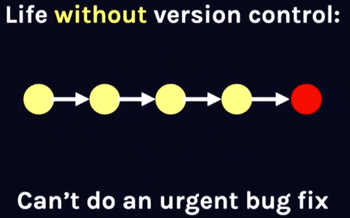
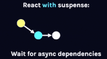

## 同步更新的React

更新机制可以类比代码版本控制。

在没有`代码版本控制`前，在代码中井然的逐步叠加功能。直到遇到了一个紧急线上bug（红色节点）。

为了修复这个bug，则需要首先将之前的代码提交。

在`React`中，所有通过`ReactDOM.render`创建的应用（其他创建应用的方式参考[ReactDOM.render一节](./reactdom-render.html)）都是通过类似的方式更新状态。

即没有优先级概念，高优先级的更新（红色节点）需要排在其他更新后面执行。

## 并发更新的React

当有了`代码版本控制`，有紧急线上bug需要修复时，只需暂存当前分支的修改，在master分支修复bug并紧急上线。

然后通过`git rebase`命令和开发分支连接上，开发分支基于修复bug的版本继续开发。

[查看大图（1.94M）外链](http://static.vfa25.cn/react-with-suspense.gif)

在`React`中，通过`ReactDOM.createBlockingRoot`和`ReactDOM.createRoot`创建的应用会采用并发的方式更新状态。

高优更新（绿色节点）中断正在进行中的低优更新（蓝色节点），先完成`render - commit`流程。

待高优更新完成后，低优更新基于高优更新的结果重新更新。

## Reference

- Beyond React 16 by Dan Abramov - JSConf Iceland [油管](https://www.youtube.com/watch?v=v6iR3Zk4oDY)、[境内](https://www.bilibili.com/video/BV1fs411H7HY?from=search&seid=10299330411094865930)。
