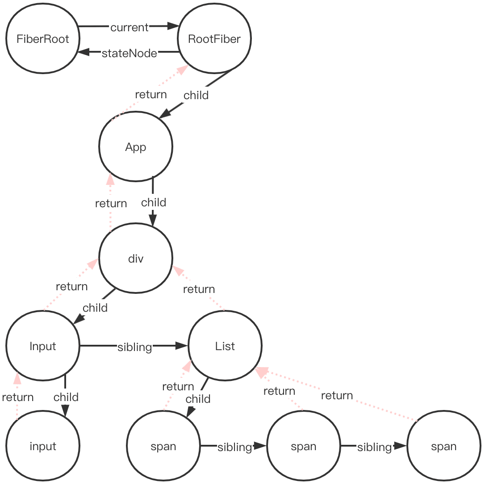

> 本章基于react v16.13.1；并忽略断言、DEV环境代码，仅保留核心逻辑。

## 我理解的Fiber

Fiber是什么，个人认为类似于DOM，首先能通过树结构保存节点信息、以之作为渲染依据，同时暴露API来访问或修改自身结构。

## ReactDom.render入口

<!-- > 作为初次将创建节点的API。流程为：①创建`ReactRoot`，②其承建`FiberRoot`（顾名思义、根`Fiber`节点），并在`FiberRoot root`上创建了`expirationTime`，同时创建更新对象`update`，以之放到`root`节点后，进入更新流程。即创建更新、然后调度更新。 -->

API入口在路径`/packages/react-dom/src/client/ReactDOM.js`下。

```js
// /packages/react-dom/src/client/ReactDOMLegacy.js
export function render(
  element: React$Element<any>,
  container: DOMContainer,
  callback: ?Function,
) {
  return legacyRenderSubtreeIntoContainer(
    null,
    element,
    container,
    false,
    callback,
  );
}
```

下面来看一下`legacyRenderSubtreeIntoContainer`方法，主要做了这些事

1. 首次渲染调用`legacyCreateRootFromDOMContainer`方法，以创建`ReactRoot root`、这是react应用的root实例；
2. 同时，后者承建了`FiberRoot`，即Fiber树的根节点；`Fiber`是React创建和更新的重要依据。
3. 随后，同步的进行创建、调度更新`updateContainer`，同步是由于初次渲染要尽快完成。

接下来，1和2步骤请看[创建ReactRoot和FiberRoot节点](#创建reactroot和fiberroot节点)，3步骤请看[创建、调度更新](#创建、调度更新)。代码如下：

```js
// /packages/react-dom/src/client/ReactDOMLegacy.js
function legacyRenderSubtreeIntoContainer(
  parentComponent: ?React$Component<any, any>,
  children: ReactNodeList,
  container: DOMContainer,
  /**
   * forceHydrate：仅且SSR（ReactDom.hydrate）时该参数为true，
   * 用于是否调和（复用）原来已存在的的节点（即入参container），
   * SSR的本质就是Node服务端直接返回完整的DOM结构，到浏览器端仅做事件绑定。
   */
  forceHydrate: boolean,
  callback: ?Function,
) {
  // TODO: Without `any` type, Flow says "Property cannot be accessed on any
  // member of intersection type." Whyyyyyy.
  // _reactRootContainer属性标记是否根节点；
  let root: RootType = (container._reactRootContainer: any);
  let fiberRoot;
  if (!root) {
    // Initial mount
    // 初始化挂载，获取到ReactRoot root
    //（其实此时的返回值root是个空对象，FiberRoot实例挂载属性root._internalRoot上）
    root = container._reactRootContainer = legacyCreateRootFromDOMContainer(
      container,
      forceHydrate,
    );
    fiberRoot = root._internalRoot;
    // 判断是否有回调函数callback，有则调用
    if (typeof callback === 'function') {
      const originalCallback = callback;
      callback = function() {
        const instance = getPublicRootInstance(fiberRoot);
        originalCallback.call(instance);
      };
    }
    // Initial mount should not be batched.
    unbatchedUpdates(() => {
      updateContainer(children, fiberRoot, parentComponent, callback);
    });
  } else {
    fiberRoot = root._internalRoot;
    if (typeof callback === 'function') {
      const originalCallback = callback;
      callback = function() {
        const instance = getPublicRootInstance(fiberRoot);
        originalCallback.call(instance);
      };
    }
    // Update
    updateContainer(children, fiberRoot, parentComponent, callback);
  }
  return getPublicRootInstance(fiberRoot);
}
```

## 创建ReactRoot和FiberRoot节点

<details>
<summary>平台方法：client.ReactDOM 的 legacyCreateRootFromDOMContainer 方法——创建ReactRoot实例</summary>

- 函数体内的`shouldHydrateDueToLegacyHeuristic`方法，用以判断是否应`shouldHydrate`
- 非`shouldHydrate`时，循环清空DOM挂载节点下的所有子节点
- 调用`createLegacyRoot`方法，进行实际创建`ReactRoot root`

```js
// /packages/react-dom/src/client/ReactDOMLegacy.js
function legacyCreateRootFromDOMContainer(
  container: DOMContainer,
  forceHydrate: boolean,
): RootType {
  // shouldHydrate这里认为是false，本篇暂不考虑SSR
  const shouldHydrate =
    forceHydrate || shouldHydrateDueToLegacyHeuristic(container);
  // First clear any existing content.
  // 命中if逻辑，循环清空DOM挂载节点下的所有子节点
  if (!shouldHydrate) {
    let warned = false;
    let rootSibling;
    while ((rootSibling = container.lastChild)) {
      container.removeChild(rootSibling);
    }
  }
  // 返回 createLegacyRoot 的调用的返回值
  return createLegacyRoot(
    container,
    shouldHydrate
      ? {
          hydrate: true,
        }
      : undefined,
  );
}

// 以下两函数为辅助函数
export const ROOT_ATTRIBUTE_NAME = 'data-reactroot';
function shouldHydrateDueToLegacyHeuristic(container) {
  const rootElement = getReactRootElementInContainer(container);
  return !!(
    rootElement &&
    rootElement.nodeType === ELEMENT_NODE &&
    rootElement.hasAttribute(ROOT_ATTRIBUTE_NAME)
    // SSR时，会为root节点的firstChild、加上'data-reactroot'属性，以此标识本应用是有SSR
  );
}

export const DOCUMENT_NODE = 9; // 即window.document.nodeType
function getReactRootElementInContainer(container: any) {
  if (!container) {
    return null;
  }
  if (container.nodeType === DOCUMENT_NODE) {
    return container.documentElement;
  } else {
    return container.firstChild;
  }
}
```

在下方代码块中，`createLegacyRoot`方法首先`new ReactDOMBlockingRoot（ReactRoot）`实例，该实例的`_internalRoot`属性，则最终将调用依赖模块`react-reconciler/inline.dom`的`createContainer`方法，进行实际创建`FiberRoot`实例。

```js
// /packages/react-dom/src/client/ReactDOMRoot.js
export const LegacyRoot = 0;
export function createLegacyRoot(
  container: DOMContainer,
  options?: RootOptions,
): RootType {
  // 实参即 container=container、LegacyRoot=0、options=undefined
  return new ReactDOMBlockingRoot(container, LegacyRoot, options);
}

function ReactDOMBlockingRoot(
  container: DOMContainer,
  tag: RootTag,
  options: void | RootOptions,
) {
  this._internalRoot = createRootImpl(container, tag, options);
}

import {createContainer} from 'react-reconciler/inline.dom';
function createRootImpl(
  container: DOMContainer,
  tag: RootTag,
  options: void | RootOptions,
) {
  // Tag is either LegacyRoot or Concurrent Root
  const hydrate = options != null && options.hydrate === true; // flase
  const hydrationCallbacks =
    (options != null && options.hydrationOptions) || null; // null
  // 这里调用的依赖函数createContainer，详情贴在下文
  const root = createContainer(container, tag, hydrate, hydrationCallbacks);
  markContainerAsRoot(root.current, container);
  if (hydrate && tag !== LegacyRoot) {
    const doc =
      container.nodeType === DOCUMENT_NODE
        ? container
        : container.ownerDocument;
    eagerlyTrapReplayableEvents(doc);
  }
  return root;
}
```

</details>

<details>
<summary>公共方法：react-reconciler/inline.dom 的 createContainer方法——创建FiberRoot实例</summary>

```js
// /packages/react-reconciler/src/ReactFiberReconciler.js
export function createContainer(
  containerInfo: Container,
  tag: RootTag,
  hydrate: boolean,
  hydrationCallbacks: null | SuspenseHydrationCallbacks,
): OpaqueRoot {
  return createFiberRoot(containerInfo, tag, hydrate, hydrationCallbacks);
}
```

```js
/**
 * /packages/react-reconciler/src/ReactFiberRoot.js
 * @param {DOMContainer} containerInfo 应用挂载DOM节点
 * @param {RootTag} tag 常量LegacyRoot=0
 * @param {*} hydrate 是否SSR, false
 * @param {*} hydrationCallbacks SSR回调, null
 */
export function createFiberRoot(
  containerInfo: any,
  tag: RootTag,
  hydrate: boolean,
  hydrationCallbacks: null | SuspenseHydrationCallbacks,
): FiberRoot {
  const root: FiberRoot = (new FiberRootNode(containerInfo, tag, hydrate): any);
  if (enableSuspenseCallback) {
    root.hydrationCallbacks = hydrationCallbacks;
  }

  // Cyclic construction. This cheats the type system right now because
  // stateNode is any.
  const uninitializedFiber = createHostRootFiber(tag);
  root.current = uninitializedFiber;
  uninitializedFiber.stateNode = root;

  initializeUpdateQueue(uninitializedFiber);

  return root;
}

function FiberRootNode(containerInfo, tag, hydrate) {
  this.tag = tag;
  this.current = null;
  this.containerInfo = containerInfo;
  this.pendingChildren = null;
  this.pingCache = null;
  this.finishedExpirationTime = NoWork;
  this.finishedWork = null;
  this.timeoutHandle = noTimeout;
  this.context = null;
  this.pendingContext = null;
  this.hydrate = hydrate;
  this.callbackNode = null;
  this.callbackPriority = NoPriority;
  this.firstPendingTime = NoWork;
  this.firstSuspendedTime = NoWork;
  this.lastSuspendedTime = NoWork;
  this.nextKnownPendingLevel = NoWork;
  this.lastPingedTime = NoWork;
  this.lastExpiredTime = NoWork;

  if (enableSchedulerTracing) {
    this.interactionThreadID = unstable_getThreadID();
    this.memoizedInteractions = new Set();
    this.pendingInteractionMap = new Map();
  }
  if (enableSuspenseCallback) {
    this.hydrationCallbacks = null;
  }
}
```

在上述代码块中，实例化`FiberRootNode`即创建`FiberRoot`对象。

</details>

在`ReactDom.render`代码块中，`legacyCreateRootFromDOMContainer`方法用于返回一个对象`ReactRoot root`，该对象有两个原型方法`render`和`unmount`，一个实例属性`_internalRoot`、即`FiberRoot`实例。

- 重点来了——那么什么是`FiberRoot`（数据结构👉[FiberRoot](./data-structure.html#fiberroot)）?
  - 整个应用的起点
  - 包含应用挂载的目标DOM节点：即下文中`react-reconciler/inline.dom`的`createContainer`创建方法的第一参数`containerInfo: Container`
  - 最重要的是：记录整个应用更新过程的各种信息

那么`Fiber`（数据结构👉[Fiber](./data-structure.html#fiber)）如何串联起整个应用。如下图示，其中：

- return属性值: 指向父节点，用于对当前处理完的节点的向上返回
- child属性值: 指向第一个子节点
- sibling: 指向兄弟节点，且所有兄弟节点return指向同一父节点



## 创建、调度更新

在`ReactDom.render`代码块中，该处代码负责创建、调度更新。

```js
// Initial mount should not be batched.
unbatchedUpdates(() => {
  updateContainer(children, fiberRoot, parentComponent, callback);
});
```

外层函数`unbatchedUpdates`用于在调度更新时以同步的方式。

<details>
<summary>unbatchedUpdates代码详情</summary>

通过维护全局变量`executionContext`，函数体里设置该变量值为`LegacyUnbatchedContext`。后续在真正调度更新`scheduleUpdateOnFiber`方法执行时，由于计算得来的`expirationTime`值为`Sync`，命中判断，故而会执行`performSyncWorkOnRoot(root);`同步逻辑。

```js
// /packages/react-reconciler/srcReactFiberWorkLoop.js
const NoContext = /*                    */ 0b000000;
const BatchedContext = /*               */ 0b000001;
const LegacyUnbatchedContext = /*       */ 0b001000;

// Describes where we are in the React execution stack
let executionContext: ExecutionContext = NoContext;

export function unbatchedUpdates<A, R>(fn: (a: A) => R, a: A): R {
  const prevExecutionContext = executionContext;
   // 0b000000 &= ~0b000001 即 0b000000 &= 0b111110 即 0b000000
  executionContext &= ~BatchedContext;
   // 0b000000 |= 0b001000 即 0b001000
  executionContext |= LegacyUnbatchedContext;
  try {
    return fn(a);
  } finally {
    // 这里逻辑进不来
    executionContext = prevExecutionContext;
    if (executionContext === NoContext) {
      // Flush the immediate callbacks that were scheduled during this batch
      flushSyncCallbackQueue();
    }
  }
}
```

</details>

重点来啦：`react-reconciler/inline.dom`的`updateContainer`方法。

- 首先计算了个时间：`expirationTime`，即超时时间；
- 创建`update`（数据结构👉[react-update 和 updateQueue](./data-structure.html#react-update-和-updatequeue)），用于标记应用中需要更新的节点；
- 每个Fiber节点维护一个循环链表结构的更新队列`fiber.updateQueue`，执行`update`入队；
- 调度更新。

```js
/**
 * /packages/react-reconciler/src/ReactFiberReconciler.js
 * @param {*} element App组件实例
 * @param {*} container FiberRoot实例
 * @param {*} parentComponent null
 * @param {*} callback 回调函数
 */
export function updateContainer(
  element: ReactNodeList,
  container: OpaqueRoot,
  parentComponent: ?React$Component<any, any>,
  callback: ?Function,
): ExpirationTime {
  // current即RootFiber（根Fiber对象）
  const current = container.current;
  const currentTime = requestCurrentTimeForUpdate();
  const suspenseConfig = requestCurrentSuspenseConfig();
  // 重点
  const expirationTime = computeExpirationForFiber(
    currentTime,
    current,
    suspenseConfig,
  );

  // client端忽略该逻辑，没有root节点上提供context的入口
  // getContextForSubtree函数也仅会返回空对象
  const context = getContextForSubtree(parentComponent);
  if (container.context === null) {
    container.context = context;
  } else {
    container.pendingContext = context;
  }

  // 创建update，用于标记应用中需要更新的节点
  const update = createUpdate(expirationTime, suspenseConfig);
  // Caution: React DevTools currently depends on this property
  // being called "element".
  update.payload = {element};

  callback = callback === undefined ? null : callback;
  if (callback !== null) {
    update.callback = callback;
  }

  // 更新队列入队
  enqueueUpdate(current, update);
  // 开始进行任务调度（基于任务优先级）
  scheduleWork(current, expirationTime);

  return expirationTime;
}

export function createUpdate(
  expirationTime: ExpirationTime,
  suspenseConfig: null | SuspenseConfig,
): Update<*> {
  let update: Update<*> = {
    expirationTime,
    suspenseConfig,
    tag: UpdateState, // const UpdateState = 0;
    payload: null,
    callback: null,
    next: (null: any),
  };
  update.next = update;
  return update;
}

export function enqueueUpdate<State>(fiber: Fiber, update: Update<State>) {
  const updateQueue = fiber.updateQueue;
  if (updateQueue === null) {
    // Only occurs if the fiber has been unmounted.
    return;
  }

  const sharedQueue = updateQueue.shared;
  const pending = sharedQueue.pending;
  if (pending === null) {
    // This is the first update. Create a circular list.
    update.next = update;
  } else {
    // 更新循环链表
    update.next = pending.next;
    pending.next = update;
  }
  sharedQueue.pending = update;
}
```

### expirationTime

即过期时间。已知React的API诸如`setState`会进行异步渲染；那么通过计算`expirationTime`设置过期时间，
防止一些低优先级任务被一直打断而无法执行，且当到达`expirationTime`时会强制执行。

#### 1. expirationTime种类

```js
// /packages/scheduler/src/SchedulerPriorities.js
// TODO: Use symbols?
export const NoPriority = 0;
export const ImmediatePriority = 1;
export const UserBlockingPriority = 2;
export const NormalPriority = 3;
export const LowPriority = 4;
export const IdlePriority = 5;
```

#### 2. 计算expirationTime

其计算逻辑在`/packages/react-reconciler/src/ReactFiberWorkLoop.js`

1. 对于代码段`const currentTime = requestCurrentTimeForUpdate();`的返回值，
即根据当前时间（`performance.now`）得来的一个数值变量。

    <details>
    <summary>requestCurrentTimeForUpdate代码详情</summary>

    ```js
    // Expiration times are computed by adding to the current time (the start
    // time). However, if two updates are scheduled within the same event, we
    // should treat their start times as simultaneous, even if the actual clock
    // time has advanced between the first and second call.

    // In other words, because expiration times determine how updates are batched,
    // we want all updates of like priority that occur within the same event to
    // receive the same expiration time. Otherwise we get tearing.
    let currentEventTime: ExpirationTime = NoWork;

    export function requestCurrentTimeForUpdate() {
      // 如果 executionContext 值为 RenderContext 或 CommitContext，命中该判断
      if ((executionContext & (RenderContext | CommitContext)) !== NoContext) {
        // We're inside React, so it's fine to read the actual time.
        return msToExpirationTime(now());
      }
      // We're not inside React, so we may be in the middle of a browser event.
      if (currentEventTime !== NoWork) {
        // Use the same start time for all updates until we enter React again.
        return currentEventTime;
      }
      // React生成后的第一次更新，计算开始时间
      // This is the first update since React yielded. Compute a new start time.
      currentEventTime = msToExpirationTime(now());
      return currentEventTime;
    }

    export const NoWork = 0;
    // TODO: Think of a better name for Never. The key difference with Idle is that
    // Never work can be committed in an inconsistent state without tearing the UI.
    // The main example is offscreen content, like a hidden subtree. So one possible
    // name is Offscreen. However, it also includes dehydrated Suspense boundaries,
    // which are inconsistent in the sense that they haven't finished yet, but
    // aren't visibly inconsistent because the server rendered HTML matches what the
    // hydrated tree would look like.
    export const Never = 1;
    // Idle is slightly higher priority than Never. It must completely finish in
    // order to be consistent.
    export const Idle = 2;

    // V8等现代浏览器处理延时值为32位：根据补码规则，最大正整数为Math.pow(2, 31)-1
    // 比如setTimeout(()=>{console.log(1)}, Math.pow(2, 31))会立即执行
    // Max 31 bit integer. The max integer size in V8 for 32-bit systems.
    // Math.pow(2, 30) - 1
    // 0b111111111111111111111111111111
    export const MAX_SIGNED_31_BIT_INT = 1073741823;
    export const Sync = MAX_SIGNED_31_BIT_INT;
    export const Batched = Sync - 1;

    const UNIT_SIZE = 10;
    const MAGIC_NUMBER_OFFSET = Batched - 1;

    // 1 unit of expiration time represents 10ms.
    export function msToExpirationTime(ms: number): ExpirationTime {
      // Always add an offset so that we don't clash with the magic number for NoWork.
      return MAGIC_NUMBER_OFFSET - ((ms / UNIT_SIZE) | 0); // 对数值按位或0，即取整运算
    }
    ```

    代码段中的`now()`是在构建时设置的

    ```js
    // /packages/scheduler/src/forks/SchedulerHostConfig.default.js
    if (
      typeof performance === 'object' &&
      typeof performance.now === 'function'
    ) {
      getCurrentTime = () => performance.now();
    } else {
      const initialTime = Date.now();
      getCurrentTime = () => Date.now() - initialTime;
    }
    ```

    </details>

2. 代码段`const suspenseConfig = requestCurrentSuspenseConfig();`则拿到suspenseConfig，且此时值为null

    <details>
    <summary>requestCurrentSuspenseConfig代码详情</summary>

    ```js
    const ReactSharedInternals = React.__SECRET_INTERNALS_DO_NOT_USE_OR_YOU_WILL_BE_FIRED
    ReactSharedInternals.ReactCurrentBatchConfig = {
      suspense: null,
    };
    const {ReactCurrentBatchConfig} = ReactSharedInternals;
    export function requestCurrentSuspenseConfig(): null | SuspenseConfig {
      return ReactCurrentBatchConfig.suspense;
    }
    ```

    </details>

3. 代码段`const expirationTime = computeExpirationForFiber(currentTime, current, suspenseConfig);`

    - 根据`Scheduler优先级`得到expirationTime值；
    - 对非常接近时间的数次更新得到相同expirationTime值的优化。

    <details>
    <summary>computeExpirationForFiber代码详情</summary>

    ```js
    /**
    * @param {*} currentTime 第1步的返回值，根据当前时间计算的
    * @param {*} fiber 此时实参为RootFiber
    * @param {*} suspenseConfig 此时实参为null

    export type TypeOfMode = number;
    export const NoMode = 0b0000;
    export const StrictMode = 0b0001;
    export const BlockingMode = 0b0010;
    export const ConcurrentMode = 0b0100;
    export const ProfileMode = 0b1000;
    */
    export function computeExpirationForFiber(
      currentTime: ExpirationTime,
      fiber: Fiber,
      suspenseConfig: null | SuspenseConfig,
    ): ExpirationTime {
      const mode = fiber.mode;
      // mode是否处于BlockingMode，若为非则命中判断，返回常量
      if ((mode & BlockingMode) === NoMode) {
        return Sync;
      }

      const priorityLevel = getCurrentPriorityLevel();
      // mode是否处于ConcurrentMode，若为非则命中判断，返回常量
      if ((mode & ConcurrentMode) === NoMode) {
        return priorityLevel === ImmediatePriority ? Sync : Batched;
      }

      // 当前正在执行渲染
      if ((executionContext & RenderContext) !== NoContext) {
        // Use whatever time we're already rendering
        // TODO: Should there be a way to opt out, like with `runWithPriority`?
        return renderExpirationTime;
      }

      let expirationTime;
      if (suspenseConfig !== null) {
        // Compute an expiration time based on the Suspense timeout.
        expirationTime = computeSuspenseExpiration(
          currentTime,
          suspenseConfig.timeoutMs | 0 || LOW_PRIORITY_EXPIRATION,
        );
      } else {
        // Compute an expiration time based on the Scheduler priority.
        switch (priorityLevel) {
          case ImmediatePriority:
            expirationTime = Sync;
            break;
          case UserBlockingPriority:
            // TODO: Rename this to computeUserBlockingExpiration
            expirationTime = computeInteractiveExpiration(currentTime);
            break;
          case NormalPriority:
          case LowPriority: // TODO: Handle LowPriority
            // TODO: Rename this to... something better.
            expirationTime = computeAsyncExpiration(currentTime);
            break;
          case IdlePriority:
            expirationTime = Idle;
            break;
          default:
            invariant(false, 'Expected a valid priority level');
        }
      }

      // If we're in the middle of rendering a tree, do not update at the same
      // expiration time that is already rendering.
      // TODO: We shouldn't have to do this if the update is on a different root.
      // Refactor computeExpirationForFiber + scheduleUpdate so we have access to
      // the root when we check for this condition.
      // 如果当前正在渲染一棵树，防止下一个即将进行的更新和现在正创建的更新的expirationTime一样
      if (workInProgressRoot !== null && expirationTime === renderExpirationTime) {
        // This is a trick to move this update into a separate batch
        expirationTime -= 1;
      }

      return expirationTime;
    }
    ```

    该代码段中函数`computeInteractiveExpiration`和`computeAsyncExpiration`代码如下。
    - 这两个的唯一区别是传入内部函数`computeExpirationBucket`的实参是不一样的；即前者是高优先级，后者是低优先级。
    - 来看一下`ceiling`函数
      - 第一实参`MAGIC_NUMBER_OFFSET - currentTime + expirationInMs / UNIT_SIZE`

        其中currentTime是计算得来的`currentTime =  MAGIC_NUMBER_OFFSET - ((ms / UNIT_SIZE) | 0);`
        那么这个第一实参即`((now() + expirationInMs) / UNIT_SIZE) | 0`
      - 函数体`(((num / precision) | 0) + 1) * precision;`

        这个逻辑是用来抹平`precision`数值大小的差值，比如当`precision=25`时，对于当`100<num<124`，返回值均为`125`。这样、可以使得调用时间点较接近的两次`setState`得到相同的`expirationTime`，以便在一次更新中完成。

    ```js
    export const MAX_SIGNED_31_BIT_INT = 1073741823;
    export const Sync = MAX_SIGNED_31_BIT_INT;
    export const Batched = Sync - 1;

    const UNIT_SIZE = 10;
    const MAGIC_NUMBER_OFFSET = Batched - 1;
    // We intentionally set a higher expiration time for interactive updates in
    // dev than in production.
    //
    // If the main thread is being blocked so long that you hit the expiration,
    // it's a problem that could be solved with better scheduling.
    //
    // People will be more likely to notice this and fix it with the long
    // expiration time in development.
    //
    // In production we opt for better UX at the risk of masking scheduling
    // problems, by expiring fast.
    export const HIGH_PRIORITY_EXPIRATION = __DEV__ ? 500 : 150;
    export const HIGH_PRIORITY_BATCH_SIZE = 100;

    export function computeInteractiveExpiration(currentTime: ExpirationTime) {
      return computeExpirationBucket(
        currentTime,
        HIGH_PRIORITY_EXPIRATION,
        HIGH_PRIORITY_BATCH_SIZE,
      );
    }

    // TODO: This corresponds to Scheduler's NormalPriority, not LowPriority. Update
    // the names to reflect.
    export const LOW_PRIORITY_EXPIRATION = 5000;
    export const LOW_PRIORITY_BATCH_SIZE = 250;

    export function computeAsyncExpiration(
      currentTime: ExpirationTime,
    ): ExpirationTime {
      return computeExpirationBucket(
        currentTime,
        LOW_PRIORITY_EXPIRATION,
        LOW_PRIORITY_BATCH_SIZE,
      );
    }

    function ceiling(num: number, precision: number): number {
      return (((num / precision) | 0) + 1) * precision;
    }

    function computeExpirationBucket(
      currentTime,
      expirationInMs,
      bucketSizeMs,
    ): ExpirationTime {
      return (
        MAGIC_NUMBER_OFFSET -
        ceiling(
          MAGIC_NUMBER_OFFSET - currentTime + expirationInMs / UNIT_SIZE,
          bucketSizeMs / UNIT_SIZE,
        )
      );
    }
    ```

    </details>

## 结论

React的创建方法`React.render`或组件方法`this.setState(this.updater.enqueueSetState)`的更新流程都是基于`Fiber树`，
唯一的区别是前者基于整体的应用级，后者基于组件级。

1. 创建Fiber（`createFiberRoot`）或获取Fiber（`getInstance`）；
2. 计算`expirationTime`（`computeExpirationForFiber`）；
3. 创建`update`（`createUpdate`），添加属性或方法`update.payload = payload;`、`update.callback = callback;`；
4. `update`入队`enqueueUpdate(fiber, update);`；
5. 执行调度`scheduleWork(fiber, expirationTime);`。
