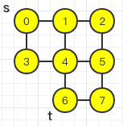
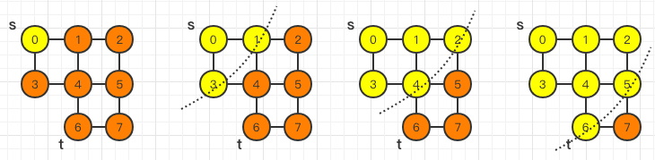
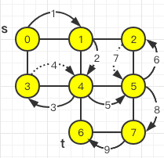

## 什么是搜索算法

算法是作用于具体数据结构之上的，`深度优先搜索算法`和`广度优先搜索算法`都是基于`图（Graph）`结构。

- 图这种数据结构的表达能力很强，大部分涉及搜索的场景都可以抽象成“图”。
- 图上的搜索算法，最直接的理解就是，在图中找出从一个顶点出发，到另一个顶点的路径。
- 除了最简单暴力的深度优先、广度优先搜索，还有`A*、IDA*`等启发式搜索算法。

本章节示例使用`邻接表`来存储`无向图`。



```java
import java.util.LinkedList;
import java.util.Queue;

// 无向图、邻接表
public class Graph {

	private int v; // 顶点的个数
	private LinkedList<Integer> adj[]; // 邻接表

	public Graph(int v) {
		this.v = v;
		adj = new LinkedList[v];
		for (int i = 0; i < v; ++i) {
			adj[i] = new LinkedList<>();
		}
	}
	
	public static void main(String[] arg) {
		Graph graph = new Graph(8);
		graph.addEdge(0, 1);
		graph.addEdge(0, 3);
		graph.addEdge(1, 4);
		graph.addEdge(1, 2);
		graph.addEdge(3, 4);
		graph.addEdge(2, 5);
		graph.addEdge(4, 5);
		graph.addEdge(4, 6);
		graph.addEdge(5, 7);
		graph.addEdge(6, 7);
	}
}
```

## 广度优先搜索（BFS）

`广度优先搜索（Breadth-First-Search`），就是一种“地毯式”层层推进的搜索策略，即先查找离起始`顶点`最近的，然后是次近的，依次往外搜索。



图的`广度优先搜索`的代码实现。其中`s`表示`起始顶点`，`t`表示`终止顶点`。搜索一条`从s到t`的路径。实际上，该路径也是两顶点的最短路径。

```java
// 搜索一条从s到t的路径，其中s表示起始顶点，t表示终止顶点
public void bfs(int s, int t) {
  if (s == t) return;
  // 记录已经被访问的顶点，避免顶点被重复访问
  boolean[] visited = new boolean[v];
  visited[s] = true;
  // 引入队列的逻辑，类似于二叉树的分层遍历
  // 出队时机：每当访问一未曾访问过的顶点时
  // 入队时机：每当访问一未曾访问过的顶点时，将其邻接表全量入队
  Queue<Integer> queue = new LinkedList<>();
  queue.add(s);
  // 每当访问一未曾访问过的顶点时，记录前驱顶点，用于打印路径结果
  int[] prev = new int[v];
  for (int i = 0; i < v; ++i) {
    prev[i] = -1;
  }
  while (queue.size() != 0) {
    int w = queue.poll();
    for (int i = 0; i < adj[w].size(); i++) {
      int q = adj[w].get(i);
      if (!visited[q]) {
        prev[q] = w;
        if (q == t) {
          print(prev, s, t);
          return;
        }
        visited[q] = true;
        queue.add(q);
      }
    }
  }
}

// 递归打印s->t的路径
private void print(int[] prev, int s, int t) {
  if (prev[t] != -1 && t != s) {
    print(prev, s, prev[t]);
  }
  System.out.print(t + " ");
}

// ----------本例输出：0 1 4 6----------
```

### BFS的时间复杂度

- 时间复杂度表示为：`V+E`，其中`V`表示顶点的个数，`E`表示边的个数。而对于一个连通图，每个顶点都是联通的，即$E\geq(V-1)$。故而时间复杂度为$O(E)$。
- 空间复杂度则为$O(V)$，其中`V`表示顶点的个数。

## 深度优先搜索（DFS）

`深度优先搜索（Depth-First-Search）`，最直观的例子就是“走迷宫”：随机选择一个岔路口来走，若发现走不通时，则回退到上一个岔路口，重新选择一条路继续走，直到最终找到出口。

如下图所示，其中实线箭头表示遍历，虚线箭头表示回退。



深度优先搜索本质是**回溯思想**。

```java
public void dfs(int s, int t) {
  found = false;
  boolean[] visited = new boolean[v];
  int[] prev = new int[v];
  for (int i = 0; i < v; ++i) {
    prev[i] = -1;
  }
  recurDfs(s, t, visited, prev);
  print(prev, s, t);
}

private void recurDfs(int w, int t, boolean[] visited, int[] prev) {
  if (found == true) return;
  visited[w] = true;
  if (w == t) {
    found = true;
    return;
  }
  for (int i = 0; i < adj[w].size(); i++) {
    int q = adj[w].get(i);
    if (!visited[q]) {
      prev[q] = w;
      recurDfs(q, t, visited, prev);
    }
  }
}

// ----------本例输出：0 1 4 5 7 6----------
```

### DFS的时间复杂度

- 时间复杂度。由于每条边最多会被访问两次（一次是遍历，一次是回退）。故而时间复杂度为$O(E)$，其中`E`表示边的个数。
- 空间复杂度则为$O(V)$，其中`V`表示顶点的个数。

## 总结

- 广度优先搜索
  - 通俗的理解就是：地毯式层层推进，从起始顶点开始，依次往外遍历；
  - 需要借助**队列**来实现；
  - 遍历得到的路径，是起始顶点到终止顶点的最短路径；
  - 缺点是当层次较深、顶点较多时，队列需要较大内存。
- 深度优先搜索
  - 本质是**回溯思想**，适合用递归实现，即需要借助**栈**来实现。
  - 优点是每层搜索只维护一个顶点，节省内存；
  - 缺点是无法找到最短路径。
- 在执行效率方面，深度优先和广度优先搜索的时间复杂度均为$O(E)$，空间复杂度均为$O(V)$。
