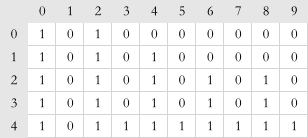

- 适用场景：求解最优解，显著降低时间复杂度。

:::tip 动态规划思想
把问题分解为多个阶段，每个阶段对应一个决策。记录每一个阶段可达的状态集合（去掉重复的），然后通过当前阶段的状态集合，来推导下一个阶段的状态集合，动态地往前推进。
:::

## Demo

### 0-1 背包问题

:::details 0-1 背包问题
[这一节](./backtracking.html#_0-1-背包问题)介绍了回溯算法解决“0-1背包问题”，那么动态规划如何解决呢？

- **状态**概念：
  1. 把整个求解过程分为 n 个阶段，每个阶段会决策一个物品是否放到背包中。每个物品决策（放入或者不放入背包）完之后，背包中的物品的重量会有多种情况，也就是说，会达到多种不同的状态，对应到`递归树`中，就是有很多不同的节点。
  2. 把每一层重复的状态（节点）合并，只记录不同的状态，然后基于上一层的状态集合，来推导下一层的状态集合。通过合并每一层重复的状态，这样就保证每一层不同状态的个数都不会超过 w 个（w 表示背包的承载重量）。于是，就成功避免了每层状态个数的指数级增长。
- 用一个二维数组`states[n][w+1]`，来记录每层可以达到的不同**状态**。仍用[回溯算法一节](./backtracking.html#_0-1-背包问题)的例子：
  1. 第 0 个（下标从 0 开始编号）物品的重量是 2，要么装入背包，要么不装入背包，决策完之后，会对应背包的两种状态，背包中物品的总重量是 0 或者 2。用`states[0][0]=true`和`states[0][2]=true`来表示这两种状态。
  2. 第 1 个物品的重量也是 2，基于之前的背包状态，在这个物品决策完之后，不同的状态有 3 个，背包中物品总重量分别是`0(0+0)，2(0+2 or 2+0)，4(2+2)`。用`states[1][0]=true`，`states[1][2]=true`，`states[1][4]=true`来表示这三种状态。
  3. 以此类推，直到考察完所有的物品后，整个 states 状态数组就都计算好了。

如下图示，0 表示 false，1 表示 true。只需要在最后一层，找一个值为 true 且最接近 w（这里是 9）的值，就是背包中物品总重量的最大值。



```java
// weight:物品重量，n:物品个数，w:背包可承载重量
public int knapsack(int[] weight, int n, int w) {
    boolean[][] states = new boolean[n][w + 1]; // 默认值false
    // 第一行特殊处理，哨兵优化
    states[0][0] = true; // 第一行不放
    if (weight[0] <= w) {
        states[0][weight[0]] = true; // 第一行放
    }
    for (int i = 1; i < n; ++i) { // 动态规划状态转移
        for (int j = 0; j <= w; ++j) { // 不把第i个物品放入背包
            if (states[i - 1][j] == true) states[i][j] = states[i - 1][j];
        }
        for (int j = 0; j <= w - weight[i]; ++j) { // 把第i个物品放入背包
            // 每层循环都是在[0, j]的背包重量限制内
            if (states[i - 1][j] == true) states[i][j + weight[i]] = true;
        }
    }
    for (int i = w; i >= 0; --i) { // 所有决策走完，只需遍历第n层，右起查找最大的那个状态
        if (states[n - 1][i] == true) return i;
    }
    return 0;
}
```

优化为临时一维数组，降低空间复杂度

```java
// items:物品重量，n:物品个数，w:背包可承载重量
public static int knapsack2(int[] items, int n, int w) {
    boolean[] states = new boolean[w + 1];
    states[0] = true;
    if (items[0] <= w) {
        states[items[0]] = true;
    }
    for (int i = 1; i < n; ++i) { // 动态规划
        for (int j = w - items[i]; j >= 0; --j) { // 把第i个物品放入背包
            if (states[j] == true) states[j + items[i]] = true;
        }
    }
    for (int i = w; i >= 0; --i) { // 输出结果
        if (states[i] == true) return i;
    }
    return 0;
}
```

> 注：第8行需要从大到小递减，不然会出现重复计算的bug。如：当item[2] == 2，s[1]、s[2]、s[4]为true，会出现s[1]->s[3]、s[2]->s[4]、s[3]->s[5]、s[4]->s[6]、s[5]->s[7]...

- 0-1 背包问题时间复杂度
  - 使用`回溯算法`的时间复杂度为指数级的$O(2^n)$；
  - 使用`动态规划`的时间复杂度为$O(n*w)$。其中`n`表示物品个数，`w`表示背包可以承载的总重量。

:::

### 双11购物凑满减问题

:::details 双11购物凑满减问题

- 需求描述
  1. 要找的是大于等于 满减条件 的值中的最小值；
  2. 找出这个最小总价格对应都要购买哪些商品。
- 解决方法
  1. 可以使用二维数组`states[n][3*w]`，找出大于等于 满减条件；
  2. 状态`(i, j)`是`(i-1, j)`或者`(i-1, j-value[i])`两个状态的充分条件。那么，就检查这两个状态是否是可达的，也就是`states[i-1][j]`或者`states[i-1][j-value[i]]`是否是 true。若不同为true，前者表示未买第`i`个商品，后者则表示已买第`i`个商品；若同为true，则两个可达状态任选其一。

```java
// items商品价格，n商品个数, w表示满减条件，比如200
public static void double11advance(int[] items, int n, int w) {
    boolean[][] states = new boolean[n][3 * w + 1];
    states[0][0] = true;
    if (items[0] <= 3 * w) {
        states[0][items[0]] = true;
    }

    for (int i = 1; i < n; ++i) { // 动态规划
        for (int j = 0; j <= 3 * w; ++j) {
            if (states[i - 1][j] == true) states[i][j] = states[i - 1][j];
        }
        for (int j = 0; j <= 3 * w - items[i]; ++j) {
            if (states[i - 1][j] == true) states[i][j + items[i]] = true;
        }
    }
    int j;
    for (j = w; j < 3 * w + 1; ++j) {
        if (states[n - 1][j] == true) break; // 获取到符合 满减条件 的最小值
    }
    if (j == 3 * w + 1) return;
    for (int i = n - 1; i >= 1; --i) {
        if (j - items[i] >= 0 && states[i][j - items[i]] == true) {
            System.out.print(items[i] + " "); // 购买了这个商品
            j -= items[i];
        }
    }
    if (j != 0) System.out.print(items[0]);
}
```

:::

## 一个模型三个特征

- **多阶段决策最优解模型**

  动态规划一般是用来解决最优问题。而解决问题的过程，需要经历多个**决策**阶段。每个决策阶段都对应着一组**状态**。然后寻找一组决策序列，经过这组决策序列，能够产生最终期望求解的**最优值**。
- **最优子结构**

  最优子结构指的是，问题的最优解包含子问题的最优解。反过来说就是，可以通过子问题的最优解，推导出问题的最优解。

  对应`动态规划问题模型`上，就是**后面阶段的状态可以通过前面阶段的状态推导出来**（即**状态转移**）。

  > 以`最短路径`为例，`min_dist(i, j) = w[i][j] + min(min_dist(i, j-1), min_dist(i-1, j))`
- **无后效性**
  1. 推导后面阶段状态时，只关心前面阶段状态值，不关心这个状态的路径（如何一步步推导出来）。
  2. 某阶段状态一旦确定，就不受之后阶段的决策影响。

  无后效性是一个非常“宽松”的要求。只要满足`动态规划问题模型`，其实基本上都会满足无后效性。
  > 以`最短路径`为例，①当到达`(i, j)`位置时，如果需要计算其状态，只会关注其前驱位置`(i-1, j)`或是`(i, j-1)` 的状态，而不关注它们的的路径。②同时，当下次决策时，也不允许后退，即前面阶段的状态确定之后，不会被后面阶段的决策所改变。
- **重复子问题**

  不同的决策序列，到达某个相同的阶段时，可能会产生重复的状态。
  > 以`最短路径`为例，如果看一下其`递归树`，会发现有很多重复节点。毕竟条条大路（多个路径）通（经过）罗马（同一节点）。

<!-- ## 有章可循：动态规划解题思路总结

### 状态转移表法 -->
