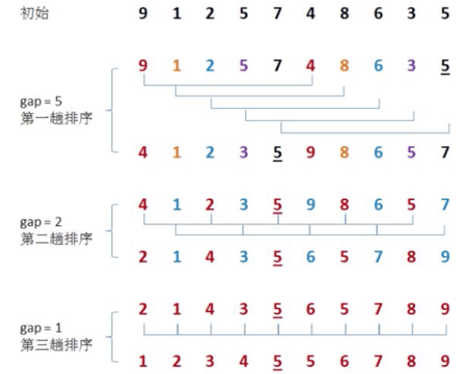
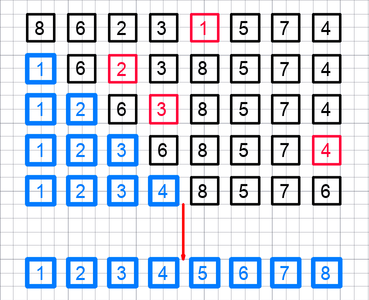
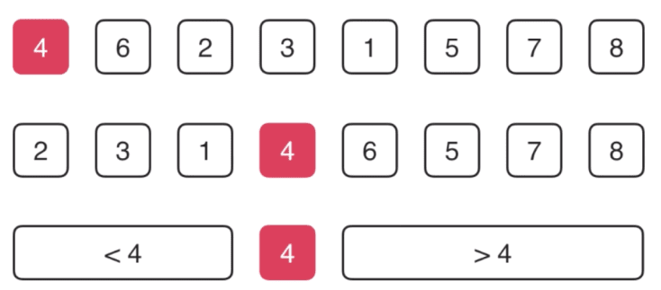
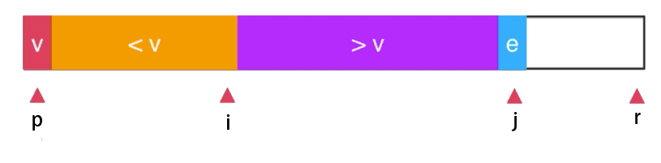

# 排序(Sort)

最常用的排序算法：

- $O(n^2)$：冒泡排序、插入排序、选择排序；
  - 性能剧透：**插入排序（通常作为复杂排序算法的子过程优化） > 冒泡排序 > 选择排序。**
  - 冒泡排序和选择排序的使用仅限于理论，但有些语言中排序函数的实现原理会用到`插入排序`算法。
  - 更进一步，优化插入排序：[希尔排序](#希尔排序)。以较大步长移动数据，以换取较少的比较和交换，时间复杂度为$O(n^{3/2})$。
- $O(nlogn)$：归并排序、快速排序；
- $O(n)$：计数排序、基数排序、桶排序等（线性排序的时间复杂度最低，这三种排序都不涉及元素之间的比较操作，非基于比较的排序算法，但缺点是适用场景比较特殊）。

|   名称   |       时间复杂度       |是否稳定排序？|是否原地排序？|
| ------- | --------------------- | --------- | -------- |
| 冒泡排序  | $O(n^2)$             |      ✅    |    ✅    |
| 插入排序  | $O(n^2)$             |      ✅    |    ✅    |
| 选择排序  | $O(n^2)$             |      ❌    |    ✅    |
| <h4><a href="#_20世纪对世界影响最大的算法之一-快排-quick-sort" style="color: purple;">快速排序</a></h4> | $O(nlogn)$ |❌|✅|
| 归并排序  | $O(nlogn)$           |      ✅    |    ❌    |
| 计数排序  | $O(n+k)$，k是数据范围  |      ✅    |    ❌    |
| 冒泡排序  | $O(n)$               |      ✅    |    ❌    |
| 冒泡排序  | $O(dn)$，d是维度      |      ✅    |    ❌    |

## 如何分析一个“排序算法”

- **排序算法的执行效率**
  1. 最好情况、最坏情况、平均情况时间复杂度
  2. 时间复杂度的系数、常数 、低阶
  3. 比较次数和交换（或移动）次数
- **排序算法的内存消耗**

  **原地排序算法（Sorted in place）**，特指空间复杂度是$O(1)$的排序算法。

- **排序算法的稳定性**

  这个概念是说，如果待排序的序列中存在值相等的元素，经过排序之后，相等元素之间原有的 ***先后顺序不变***。

  若符合，即为`稳定的排序算法`；否则，为`不稳定的排序算法`。

  ::: details 稳定的排序算法场景示例：电商交易系统中的“订单”排序

  订单有两个属性，一个是下单时间，另一个是订单金额。

  如果现在有 10 万条订单数据，按照金额从小到大对订单数据排序。
  对于金额相同的订单，需按照下单时间从早到晚有序。对于这样一个排序需求，怎么来做呢？

  1. 最先想到的方法是：先按照金额对订单数据进行排序，然后，再遍历排序之后的订单数据，对于每个金额相同的小区间再按照下单时间排序。这种排序思路简单，但是实现起来会很复杂。

  2. 借助稳定排序算法，却可以非常简洁地解决。解决思路：先按照下单时间给订单排序。排序完成之后，用稳定排序算法，按照订单金额重新排序。两遍排序之后，得到的订单数据就是按照金额从小到大排序，金额相同的订单按照下单时间从早到晚排序的。

  :::

- **有序度**和**逆序度**

  - 有序度：
  
  数组中具有有序关系的元素对的个数。有序元素对用数学表达式表示就是这样：

  ```md
  有序元素对：a[i] <= a[j], 如果 i < j。
  ```

  完全有序的数组的有序度叫作 **满有序度**。
  - 逆序度则反之，即 **逆序度 = 满有序度 - 有序度**。

## 冒泡排序(Bubble Sort)

- 冒泡排序是原地排序算法吗？

  **是**。只涉及相邻数据的交换操作，只需要常量级的临时空间，所以它的空间复杂度为$O(1)$。
- 冒泡排序是稳定的排序算法吗？

  **是**。在冒泡排序中，只有交换才可以改变两个元素的前后顺序。为了保证冒泡排序算法的稳定性，当有相邻的两个元素大小相等的时候，不做交换，相同大小的数据在排序前后不会改变顺序，所以冒泡排序是稳定的排序算法。
- 冒泡排序的时间复杂度是多少？

  如果大循环里设置提前退出冒泡循环的标志位，则最好情况时间复杂度为$O(n)$，最坏情况时间复杂度为$O(n^2)$。
  那平均复杂度如何计算？
  
  根据`有序度`定义。最坏情况下，初始状态的有序度是 0，所以要进行$\frac{n(n-1)}{2}$次交换。最好情况下，初始状态的有序度是$\frac{n(n-1)}{2}$，就不需要进行交换。

  用均摊时间复杂度的思路，可以取个中间值$\frac{n(n-1)}{4}$，来表示初始有序度既不是很高也不是很低的平均情况。故平均时间复杂度为$O(n^2)$。

## 插入排序(Insertion Sort)

::: tip 一句话概括

遍历未排序区间，取其第一个索引结点，并再度遍历已排序区间，以将前者结点“插入”到后者合适的位置（插入排序是可以提前终止内层循环的，即最好情况时间复杂度为$O(n)$，所以它将会在一些复杂的排序算法中，作为子过程优化）。

:::


首先，将数组中的数据分为两个区间，**已排序区间**和**未排序区间**。

初始已排序区间只有一个元素，就是数组的第一个元素。插入算法的核心思想是 ***取未排序区间中的元素，在已排序区间中找到合适的插入位置将其插入，并保证已排序区间数据一直有序***。重复这个过程，直到未排序区间中元素为空，算法结束。

[插入排序（Java）](https://github.com/vfa25/dataStructure-algorithm/blob/master/algorithms/src/sort/InsertionSort.java)

```py
def insertionSort(a, n):
    if n < 1:
        return
    for i in range(1, n):
        temp = a[i]
        j = i
        # 遍历已排序空间，查找插入的位置
        while j >= 1 and a[j - 1] > temp:
            a[j] = a[j - 1]
            j -= 1
        a[j] = temp  # 插入数据


if __name__ == '__main__':
    a = [4, 5, 6, 1, 3, 2]
    insertionSort(a, 6)
    print(a)  # [1, 2, 3, 4, 5, 6]
```

- 插入排序是原地排序算法吗？

  **是**。从实现过程可以很明显地看出，插入排序算法的运行并不需要额外的存储空间，所以空间复杂度是$O(1)$。
- 插入排序是稳定的排序算法吗？

  **是**。在插入排序中，对于值相同的元素，可以选择将后面出现的元素，插入到前面出现元素的后面，这样就可以保持原有的前后顺序不变，所以插入排序是稳定的排序算法。
- 插入排序的时间复杂度是多少？

  最好情况时间复杂度为$O(n)$，即从尾到头遍历已经有序的数据；最坏情况时间复杂度为$O(n^2)$,即原数组倒序，每次插入都相当于在数组的第一个位置插入新的数据，所以需要移动大量的数据。既然数组插入操作时间复杂度为$O(n)$，那么循环执行n次插入操作，所以平均时间复杂度为$O(n^2)$。

### 希尔排序

[希尔排序维基百科](https://zh.wikipedia.org/wiki/%E5%B8%8C%E5%B0%94%E6%8E%92%E5%BA%8F)



[希尔排序：缩小增量的分组原则，每次对增量倍数的分组进行插入排序（Java）](https://github.com/vfa25/dataStructure-algorithm/blob/master/algorithms/src/sort/ShellSort.java)

## 选择排序(Selection Sort)

::: tip 一句话概括

遍历未排序区间，每次都“选择”其中最小值，并替换到已排序区间末尾的位置。

:::

选择排序算法的实现思路有点类似插入排序，也分已排序区间和未排序区间。但是选择排序每次会从未排序区间中找到最小的元素，将其放到已排序区间的末尾，即`对调`原索引位置的元素。



[选择排序：泛型参数（Java）](https://github.com/vfa25/dataStructure-algorithm/blob/master/algorithms/src/sort/SelectionSort.java)

- 选择排序是原地排序算法吗？

  **是**。只涉及筛选出最小元素，只需要常量级的临时空间，所以它的空间复杂度为$O(1)$。
- 选择排序是稳定的排序算法吗？

  **不是**。选择排序是一种不稳定的排序算法。选择排序每次都要找剩余未排序元素中的最小值，并和前面的元素交换位置，这样破坏了稳定性。
- 选择排序的时间复杂度是多少？

  每个元素总要遍历一圈。故，选择排序的最好情况时间复杂度、最坏情况和平均情况时间复杂度都为$O(n^2)$。

## 归并排序(Merge Sort)

::: tip 一句话概括

分治思想。在中点对切，以递归函数将原数据结构分段为若干组，最后各组开始两两“归并”，在该过程时实现排序。

:::

基于分治思想的排序算法，一般可以用递归来实现。来看一下递推公式及终止条件：

```md
递推公式
merge_sort(p…r) = merge(merge_sort(p…q), merge_sort(q+1…r))
终止条件
p >= r 不用再继续分解
```

`merge_sort(p…r)`表示：给下标从 p 到 r 之间的数组排序。
现在将这个排序问题转化为了两个子问题：`merge_sort(p…q)`和`merge_sort(q+1…r)`，
其中下标 q 等于 p 和 r 的中间位置，也就是$\frac{p+r}{2}$。
当下标从 p 到 q 和从 q+1 到 r 这两个子数组都排好序之后，
再将两个有序的子数组合并在一起，这样下标从 p 到 r 之间的数据就也排好序了。

来看一下伪代码：

```js
  // 归并排序算法，A是数组，n表示数组大小
  merge_sort(A, n) {
    merge_sort_c(A, 0, n-1)
  }

  // 递归调用函数
  merge_sort_c(A, p, r) {
    // 递归终止条件
    // ① 这里依然可以作为优化点；if (r - p <= 15) { return insertionSort(A, p, r)}
    if p >= r return

    // 取 p 到 r 的中点值
    q = (p + r) / 2
    // 归。分治递归
    merge_sort_c(A, p, q)
    merge_sort_c(A, q+1, r)
    // 并。将 A[p, q] 和 A[q+1, r] 合并为 A[p, r]
    // ② 这里可以作为优化点，出发点是对于原数组近乎有序的情况；if (A[q] > A[q+1]) 时，才执行下行
    merge(A[p…r], A[p…q], A[q+1, r])
  }
```

并函数 merge 怎么实现呢？可以使用双指针。

申请一个临时数组 tmp，大小与 A[p…r] 相同。用两个游标 i 和 j，分别指向 A[p…q] 和 A[q+1…r] 的第一个元素。比较这两个元素 A[i] 和 A[j]，如果 A[i]<=A[j]，就把 A[i] 放入到临时数组 tmp，并且 i 后移一位，否则将 A[j] 放入到数组 tmp，j 后移一位。直到其中一个子数组中的所有数据都放入临时数组中，再把另一个数组中的数据依次加入到临时数组的末尾。

来看一下伪代码：

```js
merge(A[p…r], A[p…q], A[q+1, r]) {
    // 初始化三个数组的索引变量
    var i := p, j := q+1, k = 0
    // 申请一个大小与A[p…r]一样的临时数组
    var tmp := new array[0…r-p]
    while i <= q AND j <= r do {
      if A[i] <= A[j] {
        tmp[k++] = A[i++]
      } else {
        tmp[k++] = A[j++]
      }
    }

    // 判断哪个子数组中有剩余数据
    var start := i, end := q
    if j <= r then start := j, end := r

    // 将剩余数据拷贝到临时数组tmp
    while start <= end do {
      tmp[k++] = A[start++]
    }

    // 将tmp中的数组拷贝回A[p…r]
    for i := 0 to r-p do {
      A[p+i] = tmp[i]
    }
}
```

思路大致是：

递归的过程，_merge_sort_between最终分治成最多两两一组的子数组；

随后，并的过程，_merge开始对子数组进行排序合并。

[归并排序（Python）](https://github.com/vfa25/dataStructure-algorithm/blob/master/leetcode-notes/sort/merge_sort.py)、[部分优化（Java）](https://github.com/vfa25/dataStructure-algorithm/blob/master/algorithms/src/sort/MergeSort.java)

- 归并排序是稳定的排序算法吗？

  **是**。结合伪代码，归并排序的排序逻辑在_merge合并函数，只需在合并的过程中，如果 A[p…q] 和 A[q+1…r] 之间有值相同的元素，那先把 A[p…q] 中的元素放入 tmp 数组。这样就保证了值相同的元素，在合并前后的先后顺序不变。所以，归并排序是一个稳定的排序算法。
- 归并排序的时间复杂度是多少？

  同于递归求解的问题可以写成递推公式，递归代码的时间复杂度也可以写成递推公式。

  ```md
  T(1) = C // n = 1，只需要常数级的执行时间，记为C
  T(n) = 2 * T(n/2) + n // n > 1，等分递归 + 归并操作(n级)
  >>>  = 2^k * T(n/(2^k)) + k * n // k为常数
  ```

  已知$T(1) = C$。即$n/2^k = 1$时，$k = log_2{n}$；

  代入块中，$T(n) = Cn + nlog_2{n} = O(nlogn)$。

  即最好情况、最坏情况、平均时间复杂度均为$O(nlogn)$。

- 归并排序的空间复杂度是多少？

    归并排序的空间复杂度任何情况都是$O(nlogn)$，但它的缺点也同样致命——不是“原地排序”。

    因为归并排序的合并函数，在合并两个有序数组为一个有序数组时，需要借助额外的存储空间。
    不过在任意时刻，CPU 只会有一个函数在执行，也就只会有一个临时的内存空间在使用，并在函数调用栈出栈时，回收临时内存空间。
    所以，临时内存空间最大也就是 n 个数据的大小，空间复杂度为$O(n)$。

### 自底向上的归并排序实现

上述归并排序，是自顶向下，通过逐步`递归`来实现的。那么通过自底线上，通过`迭代`的方式，也是一种实现思路。

- 将数组，自左至右以某个合适数值（例如：2）分为若干个小段。
- 迭代的过程，不断倍增该分段数值，最终实现整个数组的归并排序。

```js
function sort(arr) {
  n := arr.length
  // 外层循环：对进行merge的元素个数进行遍历。每次遍历变量 sz 将乘等于2，表示每轮归并，包含的元素个数倍增
  for sz := 1 to <n AND sz *= 2 do {
    // 内层循环：变量i 表示每轮归并，元素的起始位置；循环条件i + sz < n表示有效归并；并处理数组越界的边缘情况
    for i := 0 to <n-sz AND i += sz*2 do {
      // 对 arr[i...u+sz-1] 和 arr[i+sz...i+2*sz-1]进行归并
      merge(arr, i, i+sz-1, Math.min(i+sz+sz-1, n-1))
    }
  }
}
```

特性：

- **由于没有使用数组随机访问的特性，因此自底向上的归并思想，可以对链表实现$O(nlogn)$的排序。**
- 时间复杂度依然是$O(nlogn)$。同时，这是以循环层数来判断时间复杂度的反例。

[自底向上，迭代方法实现归并排序（Java）](https://github.com/vfa25/dataStructure-algorithm/blob/master/algorithms/src/sort/MergeSortBU.java)

## 20世纪对世界影响最大的算法之一——快排(Quick Sort)

快排，利用**分治**和**分区**思想：

如果要排序 数组中下标从 p 到 r 之间的一组数据，选择 p 到 r 之间的任意一个数据作为 pivot（分区点）。

遍历 p 到 r 之间的数据，将小于 pivot 的放到左边，将大于 pivot 的放到右边，将 pivot 放到中间。经过这一步骤之后，数组 p 到 r 之间的数据就被分成了三个部分，前面 p 到 q-1 之间都是小于 pivot 的，中间是 pivot，后面的 q+1 到 r 之间是大于 pivot 的。



来看一下递推公式及终止条件：

```md
递推公式
quick_sort(p…r) = quick_sort(p…q-1), quick_sort(q+1…r)
终止条件
p >= r
```

来看一下伪代码：

```js
// 快速排序算法，A是数组，n表示数组大小
quick_sort(A, n) {
  quick_sort_c(A, 0, n-1)
}

// 快排递归调用函数，p, r为下标
quick_sort_c(A, p, r) {
  if p >= r then return

  q = partition(A, p, r) // 获取分治点
  quick_sort_c(A, p, q-1)
  quick_sort_c(A, q+1, r)
}
```

partition() 分区函数。其实就是随机选择一个元素作为 pivot（一般情况下，可以选择 p 到 r 区间的最后一个元素），然后对 A[p…r] 分区，函数返回 pivot 的下标。

但如果希望快排是原地排序算法，即空间复杂度得是$O(1)$。

关键就是：**如何使 partition() 分区函数对 A[p…r] 的完成原地分区操作** 。

有点类似选择排序。通过游标 i 把 A[p…r-1] 分成两部分。A[p…i-1] 的元素都是小于 pivot 的，即“已处理区间”；而，A[i…r-1] 是“未处理区间”。每次都从未处理的区间 A[i…r-1] 中取一个元素 A[j]，与 pivot 对比，如果小于 pivot，则将其加入到已处理区间的尾部，也就是 A[i] 的位置。



来看一下伪代码：

```js
partition(A, p, r) {
    pivot := A[r]
    i := p
    for j:=p to r-1 do {
        if A[j] < pivot {
            swap A[i] with A[j]
            i := i + 1
        }
    }
    swap A[i] with A[j]
    return i
}
```

[快速排序（Python）](https://github.com/vfa25/dataStructure-algorithm/blob/master/leetcode-notes/sort/quick_sort.py)

每轮循环游针示意图：


**归并和快排有什么区别**

归并排序的处理过程是 **由下而上** 的，先处理子问题，然后再合并。平均时间复杂度$O(nlogn)$；是稳定排序；不是原地排序（因为合并函数无法在原地执行）。

快速排序的处理过程是 **由上而下** 的，先分区，然后再处理子问题。平均时间复杂度$O(nlogn)$；不是稳定排序；是原地排序。

- 快速排序是稳定的排序算法吗？

    **不是**。因为分区的过程涉及交换操作，如果数组中有两个相同的元素，比如序列 6，8，6，3，4，在经过第一次分区操作之后，两个 6 的相对先后顺序就会改变。所以，快速排序并不是一个稳定的排序算法。

- 快速排序的时间复杂度是多少？

    如果每次分区操作，都能将数组等分，那么对应最好情况时间复杂度为$O(nlogn)$；如果在极端的情况，即每次分区，其中一个分区恒为空，则需要进行n次分区，平均每次扫描n/2个元素，那么对应最坏情况时间复杂度为$O(n^2)$。但是平均情况下时间复杂度都是$O(nlogn)$。不仅如此，快速排序算法时间复杂度退化到$O(n^2)$的概率非常小，而且可以通过合理地选择 pivot 来避免这种情况。

**快排优化**

导致快排时间复杂度降为$O(n^2)$的原因是分区点选择不合理，最理想的分区点是：`被分区点分开的两个分区中，数据的数量差不多`。那么，如何优化分区点的选择？

1. 三数取中法
    1. 从区间的首、中、尾分别取一个数，然后比较大小，取中间值作为分区点。
    2. 如果要排序的数组比较大，那“三数取中”可能就不够用了，可能要“5数取中”或者“10数取中”。
2. 随机法
    - 每次从要排序的区间中，随机选择一个元素作为分区点。
3. 警惕快排的递归发生堆栈溢出，有如下解决方法：
    - 限制递归深度，一旦递归超过了设置的阈值就停止递归。
    - 在堆上模拟实现一个函数调用栈，手动模拟递归压栈、出栈过程，这样就没有系统栈大小的限制。

**通用排序函数实现思路、技巧**

1. 数据量不大时，可以采取用时间换空间的思路。
2. 数据量大时，优化快排分区点的选择。
3. 防止堆栈溢出，可以选择在堆上手动模拟调用栈解决。
4. 在排序区间中，当元素个数小于某个常数是，可以考虑使用$O(n^2)$级别的插入排序。
5. 用哨兵简化代码，每次排序都减少一次判断，尽可能把性能优化到极致。

## 桶排序(Bucket Sort)

- 原理
  1. 将要排序的数据分到几个有序的桶里（如基于链表或动态扩容的数组），每个桶里的数据再单独进行`归并或快速排序`。
  2. 桶内排完序之后，再把每个桶里的数据按照顺序依次取出，组成的序列就是有序的了。

- 使用条件
  1. 要排序的数据需要很容易就能划分成m个桶，并且桶与桶之间有着天然的大小顺序。
  2. 数据在各个桶之间分布是均匀的。

- 时间复杂度分析

  时间复杂度为$O(n)$：如果要排序的数据有 n 个，把它们均匀地划分到 m 个桶内，每个桶里就有$k=\frac{n}{m}$个元素。每个桶内部使用快速排序，时间复杂度为$O(klogk)$。m 个桶排序的时间复杂度就是$O(mklogk)$，因为$k=\frac{n}{m}$，所以整个桶排序的时间复杂度就是$O(n*log(n/m))$。当桶的个数 m 接近数据个数 n 时，$log(n/m)$就是一个非常小的常量，这个时候桶排序的时间复杂度接近$O(n)$。

- 适用场景
  1. 桶排序比较适合用在外部排序中。
  2. 外部排序就是数据存储在外部磁盘且数据量大，但内存有限，无法将整个数据全部加载到内存中。

## 计数排序(Counting Sort)

- 原理
  1. 计数其实就是桶排序的一种特殊情况。
  2. 当要排序的n个数据所处范围并不大时，比如最大值为k，则分成k个桶
  3. 每个桶内的数据值都是相同的，就省掉了桶内排序的时间。

- 使用条件
  1. 只能用在数据范围不大的场景中，若数据范围k比要排序的数据n大很多，就不适合用计数排序；
  2. 负整数处理：计数排序只能给非负整数排序，其他类型需要在不改变相对大小情况下，转换为非负整数；
  3. 浮点数处理：比如如果考试成绩精确到小数后一位，就需要将所有分数乘以10，转换为整数。

- 应用案例

  高考查分数的个人分数排名。案例解析：

  假设只有8个考生分数在0-5分之间，成绩存于数组`A[8] = [2，5，3，0，2，3，0，3]`。如何进行计数排序？

  1. 第一阶段：计数排序可以看做特殊的桶排序，那么先以分数来分桶，桶数组记为`C[6]`。
  我希望得到`桶索引i`时，A数组中，小于等于C[i]的个数。

      使用大小为6的数组C[6]表示桶，下标对应分数，即0，1，2，3，4，5。
      C[6]存储的是考生人数，只需遍历一边考生分数，就可以得到`C[6] = [2，0，2，3，0，1]`。
      再对C[6]数组顺序求和则`C[6]=[2，2，4，7，7，8]`，C[k]存储的即是小于等于分数k的考生个数。

  2. 最后结果是：以数组`R[8] = [0，0，2，2，3，3，3，5]`存储考生名次。那，如何得到R[8]的呢？

      从后到前（以实现稳定排序）依次扫描数组A，比如扫描到3时，可以从数组C中取出下标为3的值7。
      也就是说，到目前为止，包括自己在内，分数小于等于3的考生有7个，
      也就是说3是数组R的第7个元素（也就是数组R中下标为6的位置）。

      当3放入数组R后，小于等于3的元素就剩下6个了，相应的C[3]要减1变成6。

      以此类推，当扫描到第二个分数为3的考生时，就会把它放入数组R中第6个元素的位置（也就是下标为5的位置）。

      当扫描完数组A后，数组R内的数据就是按照分数从小到大排列的了。

[计数排序（Python）](https://github.com/vfa25/dataStructure-algorithm/blob/master/leetcode-notes/sort/counting_sort.py)

## 基数排序(Radix Sort)

- 原理（以排序十万个手机号为例说明）
  1. 比较两个手机号码a，b的大小，如果在前面几位中a已经比b大了，那后面几位就不用看了。
  2. 借助稳定排序算法的思想，可以先按照最后一位来排序手机号码，然后再按照倒数第二位来重新排序，以此类推，最后按照第一个位重新排序。
  3. 经过11次排序后，手机号码就变为有序的了。
  4. 每次排序有序数据范围较小，可以使用桶排序或计数排序来完成。

- 使用条件
  1. 要求数据可以分割出独立的“位”来比较；
  2. 位之间有递进关系，如果a数据的高位比b数据大，那么剩下的地位就不用比较了；
  3. 每一位的数据范围不能太大，要可以用线性排序算法来排序，否则，基数排序的时间复杂度无法做到$O(n)$。
