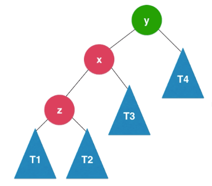

AVL树，由`G.M.Adelson-Velsky`和`E.M.Landis`在1962年的论文提出，故以二人名字首字母命名。
AVL树，是最早的自平衡二叉搜索树结构。

- 平衡二叉树定义：对于任意一个结点，左子树和右子树的高度差不大于1；如下图所示。
- 平衡二叉树的高度和结点数量之间的关系也是$Ologn$。
- 通过对结点`添加高度标记`和`记录平衡因子`（左右子结点高度之差）来作为判断逻辑依据。


## AVL树出现的背景

- 首先，它是基于二叉搜索树并对其进行改进，防止退化为链表，因此引入了`平衡因子`的概念。
- AVL树在保证了每个结点的左右子树之间的高度差不大于1的同时，仍需满足二叉搜索树的特点，
  即每个结点的左子树均应小于该结点，同理右子树均应大于该结点。

## 辅助函数

- getHeight：每个node结点均应维护一个树的高度的属性

```pascal
// node结点初始化时，高度属性默认为1。node.height := 1

Function int getHeight(Node node)
  if node == null then return 0
  return node.height
End getHeight
```

- getBalanceFactor：获得结点node的平衡因子，显然叶子结点会默认为0

```pascal
Function int getBalanceFactor(Node node)
  if node == null then return 0
  return getHeight(node.left) - getHeight(node.right)
End getBalanceFactor
```

- isBST：判断二叉树是否是二叉搜索树

搜索树一个重要的特点是，当中序遍历时，输出会由小及大。

```pascal
Function boolean isBST()
  keys := new Array()
  inOrder(root, keys)
  for i := 1 to keys.size() - 1
    do if keys.get(i - 1)> keys.get(i) then return false
  end
  return true
End isBST

Function void inOrder(Node node, Array keys)
  if node == null then return

  inOrder(node.left, keys)
  keys.add(node.key)
  inOrder(node.right, keys)
End inOrder
```

- isBalanced：判断二叉树是否是平衡二叉树

```pascal
Function boolean isBalanced()
  return isBalanced(root)
End isBalanced

// 判断以node为根的二叉树是否是平衡二叉树，递归算法
Function boolean isBalanced(Node node)
  if node == null then return true

  int balanceFactor := getBalanceFactor(node) // 获取结点的平衡因子
  if Math.abs(balanceFactor) > 1 then return false

  return isBalanced(node.left) AND isBalanced(node.right)
End isBalanced
```

## 自平衡机制

### 维护平衡性的时机

- 已知在二叉树的插入操作，会从根结点一路寻下来，直到找到正确的位置，并会是个叶子结点。

- 若存在有不平衡性的结点，其必然存在于从该叶子结点，沿父结点，回溯到根结点这一路径。
- 指导思想：如何才是不平衡——`平衡因子大于1`。


因此，添加结点后，需沿着该叶子结点向上回溯，一一去维护平衡性。

## AVL树的左旋转和右旋转

### 右旋转

图示，y结点率先不满足平衡性，且子树整体向左倾斜。


- 此时`y`结点的平衡因子为2（其左子结点的平衡因子$\geq0$），需解决
- 同时，$T1<z<T2<x<T3<y<T4$，需维持


```pascal
// 临时变量缓存T3
x.right := y
y.left := T3
```
