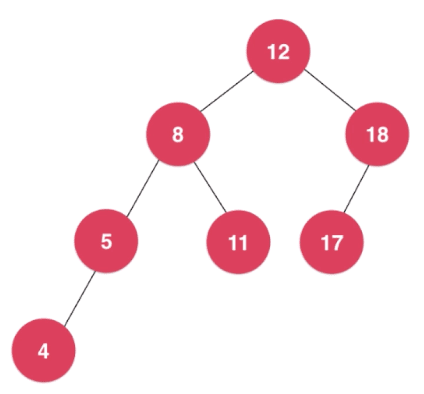
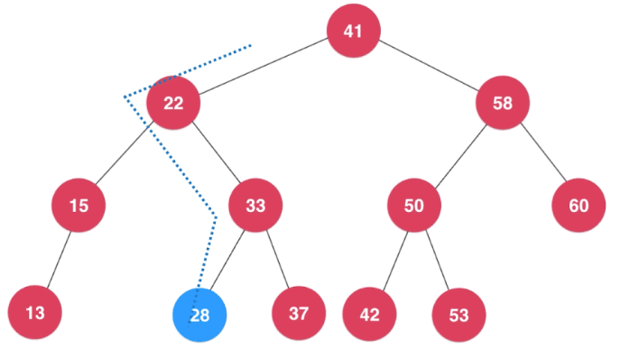
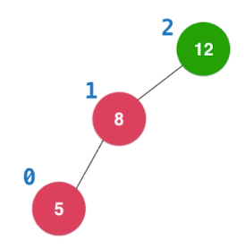
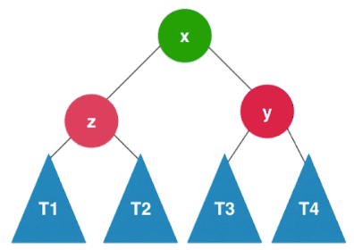
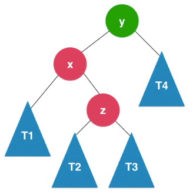
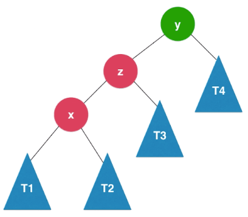

AVL树，由`G.M.Adelson-Velsky`和`E.M.Landis`在1962年的论文提出，故以二人名字首字母命名。
AVL树，是最早的自平衡二叉搜索树结构。

- 平衡二叉树定义：对于任意一个结点，左子树和右子树的高度差不大于1；如下图所示。
- 平衡二叉树的高度和结点数量之间的关系也是$Ologn$。
- 通过对结点`添加高度标记`和`记录平衡因子`（左右子结点高度之差）来作为判断逻辑依据。



## AVL树出现的背景

它是基于二叉搜索树并对其进行改进，防止退化为链表，因此引入了`平衡因子`的概念。

AVL树在保证绝对平衡性（即每个结点的左右子树之间的高度差不大于1）的同时，仍需满足二叉搜索树的特点（即每个结点的左子树均应小于该结点，同理右子树均应大于该结点）。

## 辅助函数

- getHeight：每个node结点均应维护一个树的高度的属性

```js
int getHeight(Node node) {
  if node == null then return 0
  // 注：Node node结点初始化时，高度属性默认为1。node.height := 1
  return node.height
}
```

- getBalanceFactor：获得结点node的平衡因子，显然叶子结点会默认为0

```js
int getBalanceFactor(Node node) {
  if node == null then return 0
  return getHeight(node.left) - getHeight(node.right)
}
```

- isBST：判断二叉树是否是二叉搜索树

搜索树一个重要的特点是，当中序遍历时，输出会由小及大。

```js
boolean isBST() {
  keys := new Array()
  inOrder(root, keys)
  for i := 1 to keys.size() - 1
    do if keys.get(i - 1)> keys.get(i) then return false
  end
  return true
}

void inOrder(Node node, Array keys) {
  if node == null then return

  inOrder(node.left, keys)
  keys.add(node.key)
  inOrder(node.right, keys)
}
```

- isBalanced：判断二叉树是否是平衡二叉树

```js
boolean isBalanced() {
  return isBalanced(root)
}

// 判断以node为根的二叉树是否是平衡二叉树，递归算法
boolean isBalanced(Node node) {
  if node == null then return true

  int balanceFactor := getBalanceFactor(node) // 获取结点的平衡因子
  if Math.abs(balanceFactor) > 1 then return false

  return isBalanced(node.left) AND isBalanced(node.right)
}
```

## 自平衡机制

### 维护平衡性的时机

- 已知在二叉树的插入操作，会从根结点一路寻下来，直到找到正确的位置，并会是个叶子结点。

- 若存在有不平衡性的结点，其必然存在于从该叶子结点，沿父结点，回溯到根结点这一路径。
- 指导思想：如何才是不平衡——`平衡因子大于1`。


因此，添加结点后，需沿着该叶子结点向上回溯，一一去维护平衡性。

## AVL树的左旋转和右旋转

### LL、RR：插入的结点在不平衡结点的一侧的同一侧

- LL：右旋转

  图示，`结点y`率先不满足平衡性，且新插入的`结点z`在不平衡结点的左侧的左侧。
  

  - 此时`结点y`的平衡因子为2，需解决
  - 同时，$T1<z<T2<x<T3<y<T4$的特性，需维持

  那么只需要将`结点y`作为`结点x`的右子结点，然后将`结点x`的原右子结点作为`结点y`的新左子结点即可。

  

  ```js
  // 对结点y进行右旋操作，返回旋转后新的根结点x
  Node rightRotate(Node y) {
    x := y.left
    tmp := x.right

    // 向右旋转
    x.right := y
    y.left := tmp

    // 更新height，诸如结点T1/T2/T3/T4/z的高度均未变化
    y.height := Math.max(getHeight(y.left), getHeight(y.right)) + 1
    x.height := Math.max(getHeight(x.left), getHeight(x.right)) + 1

    return x
  }
  ```

- RR：左旋转同理

  ```js
  // 对结点y进行左旋操作，返回旋转后新的根结点x
  Node leftRotate(Node y) {
    x := y.right
    tmp := x.left

    // 向左旋转
    x.left := y
    y.right := tmp

    // 更新height
    y.height = Math.max(getHeight(y.left), getHeight(y.right)) + 1
    x.height = Math.max(getHeight(x.left), getHeight(x.right)) + 1

    return x
  }
  ```

### LR、RL：插入的结点在不平衡结点的一侧的另一侧

- LR

  图示，`结点y`率先不满足平衡性，且新插入的`结点z`在不平衡结点的左侧的右侧。
  

  - 此时`结点y`的平衡因子为2，需解决
  - 同时，$T1<x<T2<z<T3<y<T4$的特性，需维持

  首先对`结点x`（即`y.left`）进行左旋转，转化成了LL的情况，然后按后者的情况处理即可。
  
  
- RL同理

## 维护平衡核心逻辑

[AVL树实现（Java）](https://github.com/vfa25/dataStructure-algorithm/blob/master/datastructure/src/tree/AVLTree.java)

```js
Node handleBalance(Node node) {
  // LL
  if balanceFactor > 1 and getBalanceFactor(node.left) >= 0
    then return rightRotate(node)
  // RR
  if balanceFactor < -1 and getBalanceFactor(node.right) <= 0
    then return leftRotate(node)
  // LR
  if balanceFactor > 1 and getBalanceFactor(node.left) < 0
    then
      node.left := leftRotate(node.left)
      return rightRotate(node)
  // RL
  if balanceFactor < -1 and getBalanceFactor(node.right) > 0
    then
      node.right := rightRotate(node.right)
      return leftRotate(node)

  return node
}
```

## 添加操作

```js
add(root, key, value)

Node add(Node node, K key, V value) {
  if node == null
    then
      size ++
      return new Node(key, value)

  if key < node.key
    then node.left := add(node.left, key, value)
  else if key > node.key
    then node.right := add(node.right, key, value)
  else
    node.value := value

  // 更新height
  node.height = 1 + Math.max(getHeight(node.left), getHeight(node.right))
  // 计算平衡因子
  balanceFactor := getBalanceFactor(node)
  // 平衡维护
  return handleBalance(node)
}
```

## 删除操作

维护平衡性逻辑同理于添加操作，从待删除结点向上回溯维护平衡性。

不过，在删除操作时，若待删除结点同时存在左右子树，此时需查找后继结点，并维护平衡性。

```js
// - 符号为第一种实现方式，+ 符号为第二种实现方式
Node remove(Node node, K key) {
  .../* 省略 */...
  if key == node.key and node.left != null and node.right != null
    then
      // 找到后继结点，即比待删除结点大的最小结点
      successor := minimum(node.right)
      // 删除掉以node.right为根的二叉搜索树中的最小结点，返回删除结点后新的二叉搜索树的根
-     // 第一种实现方式
-     successor.right := removeMin(node.right)
+     // 第二种实现方式
+     successor.right := remove(node.right, successor.key)
      successor.left := node.left

      node.left := node.right := null
      retNode := successor

+ if retNode == null then return null
  return handleBalance(retNode)
}

- Node removeMin(Node node) {
-     if node.left == null
-       then
-         rightNode := node.right
-         node.right := null
-         return rightNode
-     node.left := removeMin(node.left)
-     return node
- }
```

## AVL树的优化

- 若增删操作后，结点的高度和之前的高度相等，那么它的祖先结点将无需维护平衡性。

## AVL树的局限性

由于要维持高度平衡性，所以在动态增删时，代价较高。

因此引出，统计意义上性能更优的——`红黑树`，尽管二者增删改查都是$O(logn)$的时间复杂度，但`红黑树`只做到了`近似平衡`，故而旋转操作相对更少。
