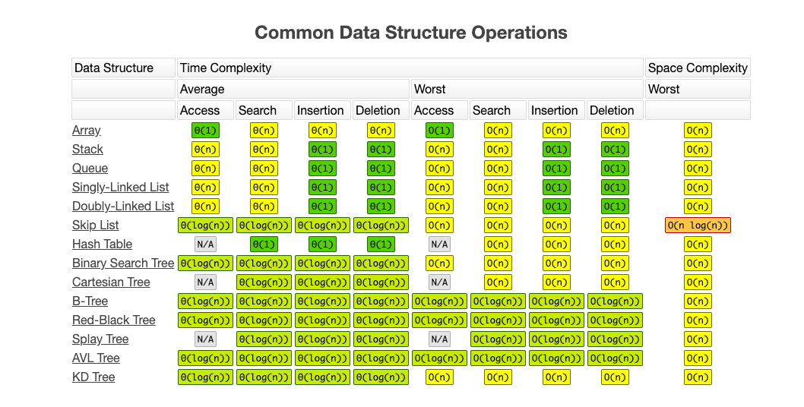

# 数据结构

::: tip 导语

I will, in fact, claim that the difference between a bad programmer and a good one is whether he considers his code or his data structures more important. Bad programmers worry about the code. Good programmers worry about data structures and their relationships.

Linus Torvalds(creator of Linux)——

:::

## 简单的时间复杂度分析

大$O$描述的是算法的运行时间和输入数据之间的关系。

- 具体点
  - 大$O$在表述上，是个`忽略常数`的概念。
  - 大$O$描述的是`n`趋向于无穷的情况，所以又可以称为`渐进时间复杂度`。

- 常见：

  - 数组、链表、栈、队列、散列表、二叉树、堆、跳表、图、Trie 树；

  - [Know Thy Complexities!](http://www.bigocheatsheet.com/)`

  

  - 注意空间复杂度的概念：是指除了`原本的数据存储空间外`，算法运行还需要`额外的存储空间`。

- 导向：
  **来历**，**自身的特点**，**适合解决的问题**，**实际的应用场景**。
