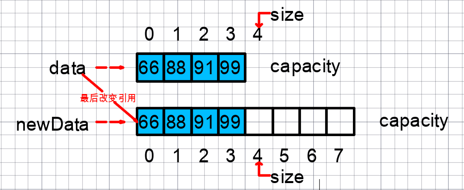

# 数组(Array)

数组（Array）是一种线性表数据结构。它用一组连续的内存空间，来存储一组具有相同类型的数据。
这也是数组最大特点：**支持随机访问**的原因。

一维数组寻址：`a[i]_address = base_address + i * data_type_size`。

二维数组寻址：对于 m * n 的数组，a [ i ][ j ] (i < m, j < n)的地址
`address = base_address + ( i * n + j) * data_type_size`。

在Python中，数组支持负数下标。

## 最大优点：快速查询

- 访问操作

  下标`随机访问`，时间复杂度为$O(1)$；若使用搜索：二分查找，时间复杂度为$O(logn)$；

- 插入、删除操作，时间复杂度为$O(n)$

  最好时间复杂度为$O(1)$，最坏时间复杂度为$O(n)$，平均时间复杂度为$\sum_{i=1}^n{i/n} = \frac{1+2+...+n}{n} = O(n)$。

## 访问越界问题

根据数组寻址公式，且访问数组的本质就是访问一段连续内存，
只要数组通过偏移计算得到的内存地址是可用的，那么程序就可能不会报任何错误。反之会报错，

``` py
a = [1, 2]
a[2] = 4

发生异常: IndexError
list assignment index out of range
```

那么在索引没有语义，如何表示没有元素？又如何添加元素？如何删除元素？

这里以`Java`语言的数组为例（即静态数组），如何封装`动态数组`（即Java的`java.util.ArrayList`）？



[Java的静态数组](https://github.com/vfa25/dataStructure-algorithm/blob/master/datastructure/src/array/StaticArray.java)，
现在改写一下链接中的Array类的add方法

```java
public class Array<E> {
    private E[] data;
    private int size;
    // 为数组在指定索引index添加元素e
    public void add(int index, E e) {
        if (index < 0 || index > size)
            throw new IllegalArgumentException("Add failed. Requrie index >= 0 and index <= size.");
        if (size == data.length)
            resize(2 * data.length);

        for (int i = size - 1; i >= index; i --)
            data[i + 1] = data[i];
        data[index] = e;
        size ++;
    }
    // 从数组中删除索引index的元素，返回删除的元素
    public E remove(int index) {
        if (index < 0 || index > size)
            throw new IllegalArgumentException("Remove failed. Requrie index >= 0 and index <= size.");
        E ret = data[index];
        for(int i = index + 1; i < size; i ++)
            data[i - 1] = data[i];
        size --;

        // 防止复杂度震荡
        if (size == data.length / 4 && data.length / 2 != 0)
            resize(data.length / 2);
        return ret;
    }
    // 动态扩容/缩容，系数
    private void resize(int newCapacity) {
        E[] newData = (E[])new Object[newCapacity];
        for(int i = 0; i < size; i ++)
            newData[i] = data[i];
        data = newData;
    }
}
```

### 数据存储和使用泛型

从数组存储的内存模型上来看，数组“下标”最确切的定义应该是“偏移（offset）”。

在`Java`中，解决数组元素多样化的方式是`使用泛型`：

- 让数组这一数据结构可以放置“任何”数据类型。
- 不可以是基本数据类型，只能是类对象。
  > 基本类型包括 boolean, byte, char, 整形: short/int/long, 浮点型: float/double。
- 每个基本数据类型都有对应的包装类（autoboxing机制）。
  > 对应的包装类：Boolean, Byte, Char, Short, Integer, Long, Float, Double。


## JVM（Java虚拟机）应用

- 出发点：
  如果每次的删除操作并不是真正地搬移数据，只是记录数据已经被删除。当数组没有更多空间存储数据时，再触发执行一次真正的删除操作，这样就大大减少了删除操作导致的数据搬移。
- JVM标记清除算法：
  大多数主流虚拟机采用可达性分析算法来判断对象是否存活，在标记阶段，会遍历所有 GC ROOTS，将所有 GC ROOTS 可达的对象标记为存活。只有当标记工作完成后，清理工作才会开始。

  不足：
    1. 效率问题。标记和清理效率都不高，但是当知道只有少量垃圾产生时会很高效。
    2. 空间问题。会产生不连续的内存空间碎片。
