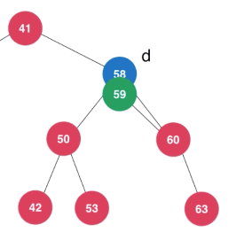
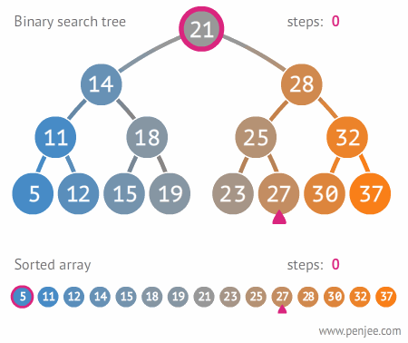
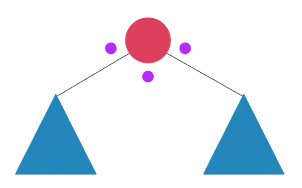
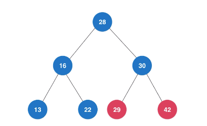

# 二叉搜索树(Binary Search Tree)

## 特点

- 二叉搜索树也是二叉树。
- 二叉搜索树的每个结点的值：大于其左子树的所有结点的值；同时小于其右子树的所有结点的值。
- 每一棵子树也是二叉搜索树。

## 概念

- 高度（Height，从下往上）：结点到叶子结点的最长路径（边数）。
- 深度（Depth，从上往下）：根结点到该结点所经历的边的个数。
- 层（Level）：结点的深度 + 1。

## 原则（条件）

- 具有顺序性。
- 存储的元素必须有可比较性（在实际的软件开发中，在二叉查找树中存储的，是一个包含很多字段的对象。利用对象的某个字段作为键值来构建二叉查找树，而其他字段叫作卫星数据）。

## 常见操作的时间复杂度

访问、搜索、插入、删除，全为$O(logn)$的最好情况时间复杂度。

> 本章节不考虑树中重复元素。处理重复元素两种思路：一是借助链表或动态数组，把值相同的数据存储在一个结点；二是一个结点仍只存储一个数据，若在查找插入位置时，值相同，则当作大于这个结点的值来处理。

[二叉搜索树实现（Java）](https://github.com/vfa25/dataStructure-algorithm/blob/master/datastructure/src/tree/BST.java)

### 插入

[图片来源](https://mp.weixin.qq.com/s/dAmOl1i3_0uXe2cWO9jSdA)

二叉搜索树的插入操作和链表较为类似，但多了`比较`和`left/right指针选择`。

- 递归方式，结束条件为`目标位置（左子结点或右子结点）为null`，伪代码：

```js
Node add(node, e) {
  if node == null then return new Node(e)

  if e < node.e
    then node.left := add(node.left, e)
  elseif e > node.e
    then node.right := add(node.right, e)

  return node
}
```

### 删除

- 若待删除结点仅有左子结点或右子结点，均可以以后者直接替换前者。
- 若目标同时存在左右子结点，使用`Hibbard Deletion`方法（以后继结点替换待删除结点的位置）：

  - 在待删除结点`d`的右子树中，查找后继结点`s`（与待删除结点最相近的叶子节点），即`s = min(d -> right)`。
  - 找到后继结点`s`，其将替换待删除结点`d`的位置，即`s -> right = removeMin(d -> right)`、`s -> left = d -> left`。
  - 最后删除`d`，`s`成为新的子树的根。



```js
Node remove(node, e) {
  if node == null then return null
  if e < node.e
    then node.left := remove(node.left, e)
  elseif e > node. e)
    then node.right := remove(node.right, e)
  else
    if node.left == null
      then
        rightNode := node.right
        node.right := null
        size--
        return rightNode
    elseif node.right == null
      then
        leftNode := node.left
        node.left := null
        size--
        return leftNode
    else
      // 关键
      successor := minimum(node.right)
      successor.right := removeMin(node.right)
      successor.left := node.left

      node.left := node.right := null
      return successor
}
```

### 搜索



和`插入操作`类似。

- 递归方式，结束条件为`匹配到结点`或`查找到null`，伪代码：

```js
boolean contains(node, e) {
  if node == null then return false
  if e == node.e then return true

  if e < node.e
    then return contains(node.left, e)
  elseif e > node.e
    then return contains(node.right, e)
}
```

### 求floor值

二叉搜索树有顺序性，获取floor值也变为可能。

```js
Node floor(node, e) {
  if node == null then return null

  if e == node.e
    then return node
  elseif e < node.e
    then return floor(node.left, e)
  else
    result := floor(node.right, e)
    if result == null
      then return node
    else
      return result
}
```

### 遍历

每一个结点，都会有三次造成访问时间点，即`node.left`，`node.right`，`node操作`。

根据`访问结点`与`对左右子树递归遍历`的`时间点`不同，有以下三种



```js
void traverse(Node node) {
  if node == null then return

  访问该结点? /*前序遍历*/
  traverse(node.left)
  访问该结点? /*中序遍历*/
  traverse(node.right)
  访问该结点? /*后序遍历*/
}
```

- 前序遍历

最自然、常用的遍历方式

- 中序遍历

特点及应用场景：结果总是顺序的。

- 后序遍历

特点：会先处理某个结点的左子树及右子树，再处理结点本身，是一个从叶子结点开始的过程。

应用场景：为二叉搜索树释放内存。

### 二叉搜索树的 DFS 和 BFS

无论前中后序遍历，均是深度优先遍历。以下以迭代方式实现，仅学习用。



***深度优先遍历（维护栈结构）***

1. 维护一个栈结构，其标识**未遍历**。

    ```java
    import java.util.Stack;
    public void preOrderNR() {
        Stack<Node> stack = new Stack<>();
        stack.push(root);
        while(!stack.isEmpty()) {
            Node cur = stack.pop();
            System.out.println(cur.e);

            if (cur.right != null)
                stack.push(cur.right);
            if (cur.left != null)
                stack.push(cur.left);
        }
    }
    ```

2. 维护一个栈结构，其标识**已遍历**。

    |   栈起始   |       压栈     |    出栈    |    结果   |
    | --------- | ------------- | ---------- | -------- |
    | 空        | 28 -> 16 -> 13 |    13     | 28 -> 16 |
    | 28 -> 16  | -> 22         |    22、16  |     28   |
    | 28        | -> 30 -> 29   |    29      | 28 -> 30 |
    | 28 -> 30  | -> 42         |  42、30、28 |    空    |

    ```java
    import java.util.Stack;
    public void preOrderDFS() {
        Stack<Node> stack = new Stack<>();
        Node cur = root;
        Node right = null;
        while(cur != null || !stack.isEmpty()) {
            // 一直找到当前结点最左端的叶子结点
            while (cur != null) {
                System.out.println(cur.e);
                stack.push(cur);
                cur = cur.left;
            }
            cur = stack.pop();
            // while循环：如果当前结点 cur 没有右结点 或 缓存的right结点是当前的右结点（即左右子树均已遍历）
            // 标记一下，再度cur = stack.pop()，即返回父结点
            while (cur.right == null || cur.right == right) {
                right = cur;
                if (stack.isEmpty()) {
                    return;
                }
                cur = stack.pop();
            }
            stack.push(cur);
            cur = cur.right;
        }
    }
    ```

***广度优先遍历，即层序遍历（维护队列结构）***

```java
import java.util.LinkedList;
import java.util.Queue;
public void preOrderBFS() {
    Queue<Node> queue = new LinkedList<Node>();
    queue.offer(root);
    while(!queue.isEmpty()) {
        Node cur = queue.poll();
        System.out.println(cur.e);

        if (cur.left != null)
            queue.offer(cur.left);
        if (cur.right != null)
            queue.offer(cur.right);
    }
}
```
