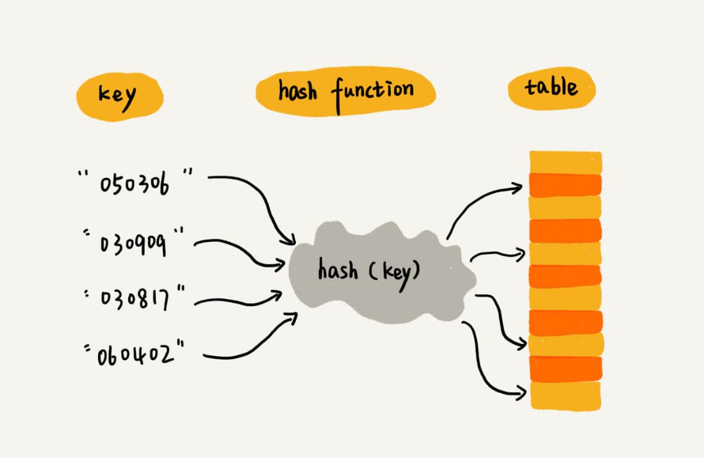

# 散列表(Hash Table)

俗称“哈希表”或“Hash 表”。

**散列表用的是数组支持按照下标随机访问数据的特性，所以散列表其实就是数组的一种扩展，由数组演化而来。可以说，如果没有数组，就没有散列表。**

**散列思想**：用一个被称作`键`或`关键字`的编号来标识一个信息。用编号转化为数组下标的映射方法就叫作`散列函数`，而散列函数计算得到的值就叫作`散列值`。

散列表用的就是数组支持按照下标随机访问的时候，时间复杂度是$O(1)$的特性。通过散列函数把元素的键值映射为下标，然后将数据存储在数组中对应下标的位置。当按照键值查询元素时，用同样的散列函数，将键值转化数组下标，从对应的数组下标的位置取数据。

## 散列函数

该函数可以将其定义为`hash(key)`，其中key标识元素的键值，hash(key) 的值表示经过散列函数计算得到的散列值。

**该如何构造散列函数？**

1. 散列函数计算得到的散列值是一个非负整数；
2. 如果 key1 = key2，那 hash(key1) == hash(key2)；
3. 如果 key1 ≠ key2，那 hash(key1) ≠ hash(key2)。

第三点是理想状态，在真实的情况下，要想找到一个不同的 key 对应的散列值都不一样的散列函数，几乎是不可能的。即便像业界著名的MD5、SHA、CRC等哈希算法，也无法避免这种**散列冲突**。而且，因为数组的存储空间有限，也会加大散列冲突的概率。

### 散列冲突

常用的散列冲突解决方法有两类，开放寻址法（open addressing）和链表法（chaining）。

**开放寻址法** 核心思想：如果出现了散列冲突，就重新探测一个空闲位置，将其插入。

那如何重新探测新的位置?

1. 线性探测(Linear Probing)
