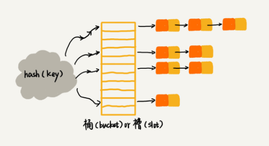

# 散列表(Hash Table)

- 特性

  散列表用的是数组支持按照下标随机访问数据的特性，所以散列表其实就是数组的一种扩展，由数组演化而来。可以说，如果没有数组，就没有散列表。

- **散列思想**
  
  用一个被称作`键`或`关键字`的编号来标识一个信息。用编号转化为数组下标的映射方法就叫作`散列函数`，而散列函数计算得到的值就叫作`散列值`。

- 实现方式

  散列表用的就是数组支持按照下标随机访问的时候，时间复杂度是$O(1)$的特性。
  通过散列函数把元素的键值映射为下标，然后将数据存储在数组中对应下标的位置。
  当按照键值查询元素时，用同样的散列函数，将键值转化数组下标，从对应的数组下标的位置取数据。

## 散列函数设计

该函数可以将其定义为`hash(key)`，其中key标识元素的键值，hash(key) 的值表示经过散列函数计算得到的散列值。

**该如何构造散列函数？**

1. 散列函数计算得到的散列值是一个非负整数；
2. 如果 key1 = key2，那 hash(key1) == hash(key2)；
3. 如果 key1 ≠ key2，那 hash(key1) ≠ hash(key2)。

第三点是理想状态，在真实的情况下，要想找到一个不同的 key 对应的散列值都不一样的散列函数，几乎是不可能的。
即便像业界著名的
[MD5](https://zh.wikipedia.org/wiki/MD5)、
[SHA](https://zh.wikipedia.org/wiki/SHA家族)、
[CRC](https://zh.wikipedia.org/wiki/循環冗餘校驗)等哈希算法，也无法避免这种**散列冲突**。
而且，因为数组的存储空间有限，也会加大散列冲突的概率。

## 散列冲突解决

常用的散列冲突解决方法有两类，开放寻址法（open addressing）和链表法（chaining）。

- 开放寻址法。核心思想：如果出现了散列冲突，就重新探测一个空闲位置，将其插入。

  How?

  1. 线性探测（Linear Probing）

  `插入操作`，如果某个数据经过散列函数散列之后，存储位置已经被占用了，
  就从当前位置开始，依次往后查找，查看是否有空闲位置，直到找到为止。

  `查找操作`同理。先通过散列函数求出要查找元素的键值对应的散列值，然后比较数组中下标为散列值的元素和要查找的元素。
  如果相等，则说明就是要找的元素；否则就顺序往后依次查找。
  在当遍历到数组中的空闲位置，还没有找到，就说明要查找的元素并没有在散列表中。

  `删除操作`较特殊。可以将删除的元素，特殊标记为deleted（要兼顾`查找操作`的逻辑）。当线性探测查找的时候，遇到标记为deleted的空间，并不是停下来，而是继续往下探测。

  在特殊情况下，以上三种操作，会探测整个数组；最坏情况时间复杂度为$O(n)$。

  2. 二次探测（Quadratic probing），感觉这个不太明显，毕竟不是有序数组。

  跟线性探测很像，线性探测每次探测的步长是1，那它探测的下标序列就是$hash(key)+0$，$hash(key)+1$，$hash(key)+2...$

  而二次探测探测的步长就变成了原来的”二次方“，即它探测的下标序列就是$hash(key)+0$，$hash(key)+1^2$，$hash(key)+2^2...$

  3. **双重散列**（Double hashing）

  不仅要使用一个散列函数。而是使用一组散列函数$hash1(key)$，$hash2(key)$，$hash3(key)...$

  先用第一个散列函数，如果计算得到的存储位置已经被占用，再用第二个散列函数，依次类推，直到找到空闲的存储位置。

  > 当散列表中空闲位置不多时，散列冲突的概率总会大大提高。
  
  为了尽可能保证散列表的操作效率，一般情况下，会尽可能保证散列表中有一定比例的空闲槽位。用**装载因子**（load factor）来表示空位的多少。

  ```md
  散列表的装载因子 = 填入表中的元素个数 / 散列表的长度
  ```

  装载因子越大，说明空闲位置越少，冲突越多，散列表的性能会下降。

- 链表法。

  链表法是一种更加常用且相对简单的散列冲突解决办法。

  如下图示，在散列表中，每个`桶（bucket）`或者`槽（slot）`会对应一条链表，所有散列值相同的元素都放到相同槽位对应的链表中。

  

  - 当插入元素时，通过散列函数计算出对应的散列槽位，将其插入到对应链表中即可。时间复杂度是$O(1)$。
  - 当查找或删除时，同样通过散列函数计算出对应的槽，然后遍历链表查找或者删除。时间复杂度是$O(k)$，其中k为链表的长度。

## 应用场景

- Word文档中单词拼写检查。

  将常用的20万个单词存储在散列表中，平均每个单词10个字母，即10个字节，总数也不过2MB。
  在当用户输入某个英文单词时，拿用户输入的单词去散列表中查找。
  如果查到，则说明拼写正确；如果没有查到，则说明拼写可能有误并给予提示。
