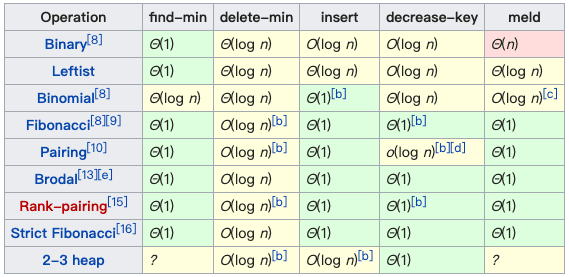
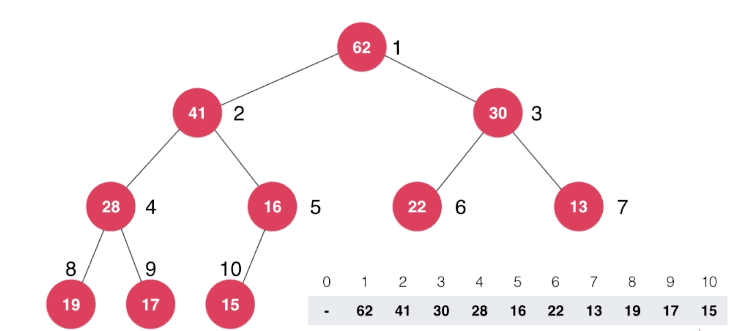
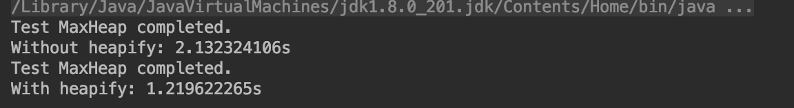

# 堆(Heap)



图片来源：[维基百科](https://en.wikipedia.org/wiki/Heap_(data_structure))

## 二叉堆（大顶堆、最大堆）

[大顶堆实现（Java）](https://github.com/vfa25/dataStructure-algorithm/blob/master/datastructure/src/maxheap/MaxHeap.java)

- 是一棵`完全二叉树`（通俗的讲就是每一层都是从左及右的尽量填满，区别于`满二叉树`）。
- 堆中某个结点的值总是不大于其父结点的值。

同理，对应的可以定义`小顶堆`。



可以使用数组这种数据结构，来存储二叉堆元素，对于图示，是从索引1开始存储元素。关系结点索引：

```js
parent(i) := i/2

left child (i) := 2*i
right child (i) := 2*i + 1
```

### 时间复杂度

增、删都是$O(logn)$的平均时间复杂度，由于二叉堆是个完全二叉树，即永远不会退化为链表。

### 关系结点获取索引（从数组的索引0开始存储元素）

```js
parent(i) := (i - 1)/2

left child (i) := 2*i + 1
right child (i) := 2*i + 2
```

### 添加操作

元素`Sife Up`（上浮）：即在数组末尾添加元素，同时开始向上一级循环比较临近元素的值。

```js
data := new Array(capacity)
void add(e) {
  data.addLast(e) // 在数组末尾存储该元素，以备上浮
  siftUp(data.length - 1) // 上浮操作
}

void siftUp(k) {
  // 如果索引存在 且 当前结点的值大于父结点的值，两两对换，同时维护变量 索引k
  while k > 0 AND data[parent(k)] < data[k])
    do
      swap(k, parent(k))
      k := parent(k)
  end
}
```

### 删除操作

元素`Sift Down`（下沉）：取出堆顶元素，将末尾元素移项到堆顶，此时该元素开始下沉，它将比较下一级所有相邻元素的值并找出最大值，二者移项，以此类推，循环比较。

```js
// 取出堆顶元素，并将数组最后一个元素完成下沉
Node extractMax() {
  max := data[0]
  data.swap(0, data.length-1)
  data.remove(data.length - 1)
  siftDown(0)
  return max
}

void siftDown(k) {
  while leftChild(k) < data.length // 该结点的子结点索引未越界
    do
      j := leftChild(k) // 缓存左子结点索引
      if j + 1 < data.length AND data[j + 1] > data[j]
        then  j := j + 1
      // 至此，取出了子结点的最大值
      if data[k] > data[j] then break // 若该结点大于子结点最大值，退出循环
      data.swap(k, j) // 否则二者对换
      k = j // 同时维护变量k
  end
}
```

### Heapify

将任意数组整理成堆的形状；heapify（[$O(n)$](https://www.cnblogs.com/wongyi/p/7685061.html)的时间复杂度）区别于扫描一遍数组，元素分别调用add方法$O(nlogn)$；其优点在于开始即抛弃了所有的叶子结点的可能操作。

思路：将给定数组视作二叉堆，随后找到最后一个`非叶子结点`，从该结点向上，循环进行`Sift Down`操作。
至于怎么找到最后一个`非叶子结点`，只需拿到数组最后一个元素索引`i`，即可通过$\frac{i-1}{2}$求得其`父结点的索引`。



```js
// 只需在构造函数中遍历执行Sift Down即可
void MaxHeap(arr) {
  data := new ArrayList(arr) // 动态数组
  for i := k downto 0
    do siftDown(i)
  end
}
```
