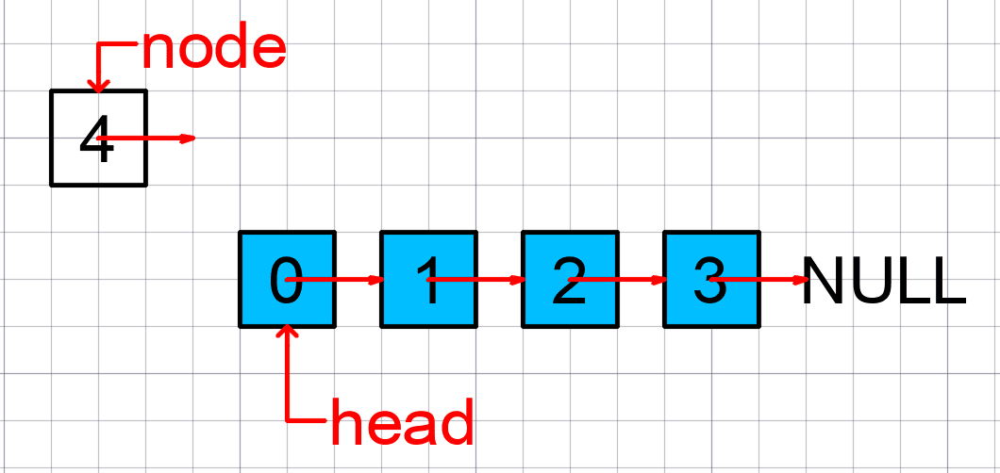

# 链表(Linked list)

<font color=purple size=5>真正的动态数据结构，也是最简单的动态数据结构，很重要！</font>

可以说是更高级动态数据结构的基石，如：二分搜索树、Trie字典树、平衡二叉树、AVL、红黑树等。

链表是`引用`（或称`指针`）概念的应用。同时也有`递归结构`的性质（如跳表`skipList`）。

## 什么是链表

数据存储在`结点（Node）`中：

```java
class Node {
  E e;
  Node next;
}
```



不同于数组喜欢在尾部添加元素，链表更倾向于在头部添加元素，因为有一个head变量维护头结点。

```md
node.next = head
head = node
```

## 链表与数组的区别

两者各自都有明显的优点。数组：支持随机访问；链表：动态。

- 数组的缺点是大小固定，一经声明就要占用整块连续内存空间。
如果声明的数组过大，系统可能没有足够的连续内存空间分配给它，导致“内存不足（out of memory）”。
如果声明的数组过小，则可能出现不够用的情况。
这时只能再申请一个更大的内存空间，把原数组拷贝进去，非常费时。
链表本身没有大小的限制，天然地支持动态扩容，我觉得这也是它与数组最大的区别。

- 除此之外，如果代码对内存的使用非常苛刻，那数组就更适合。数组连续的内存空间，对`CPU缓存`更友好。
链表中的每个结点都需要消耗额外的存储空间去存储一份指向下一个结点的指针，所以内存消耗会翻倍。
而且，对链表进行频繁的插入、删除操作，还会导致频繁的内存申请和释放，容易造成内存碎片，
如果是 Java 语言，就有可能会导致频繁的 GC（Garbage Collection，垃圾回收）。

## 应重点留意边界条件处理

- 如果链表为空时
- 如果链表只包含一个结点时
- 如果链表只包含两个结点时
- 代码逻辑在处理头结点和尾结点的时候

### 哨兵结点（虚拟头节点dummyHead）

通常表示一个空链表，以`head = null`表示链表中没有结点了，哨兵节点的概念类似于`head = new Node(null, null)`，即值为空，next指针也为空。

如果引入哨兵结点，在任何时候，不管链表是不是空，head 指针都会一直指向这个哨兵结点。有哨兵结点的链表叫**带头链表**。相反，没有哨兵结点的链表就叫**不带头链表**。

实际上，利用哨兵简化编程难度的技巧，在很多代码实现中都有用到，比如插入排序、归并排序、动态规划等。

## 常见的链表操作

- 单链表反转
- 链表中环的检测
- 两个有序的链表合并
- 删除链表倒数第 n 个结点
- 求链表的中间结点

## 如何使用链表实现LRU？

先来看下`缓存淘汰策略`：

- 先进先出策略 `FIFO`（First In，First Out）
- 最少使用策略 `LFU`（Least Frequently Used）
- 最近最少使用策略 `LRU`（Least Recently Used）

大致思路：维护一个有序单链表，越靠近链表尾部的结点是越早之前访问的。当有一个新的数据被访问时，就从链表头开始顺序遍历链表。

1. 如果此数据之前已经被缓存在链表中了，那么就遍历得到这个数据对应的结点，并将其从原来的位置删除，然后再插入到链表的头部。

2. 如果此数据没有在缓存链表中，又可以分为两种情况：

  - 如果此时缓存未满，则将此结点直接插入到链表的头部；

  - 如果此时缓存已满，则链表尾结点删除，将新的数据结点插入链表的头部。

前端框架Vue的内置组件`keep-alive`其实就是这么做的，只不过是基于数组。
无论是数组还是链表，都需要遍历，缓存访问的时间复杂度为 ***O(n)*** ，
而 ***散列表***（Hash table）将访问的时间复杂度降低为了 ***O(1)*** 。
