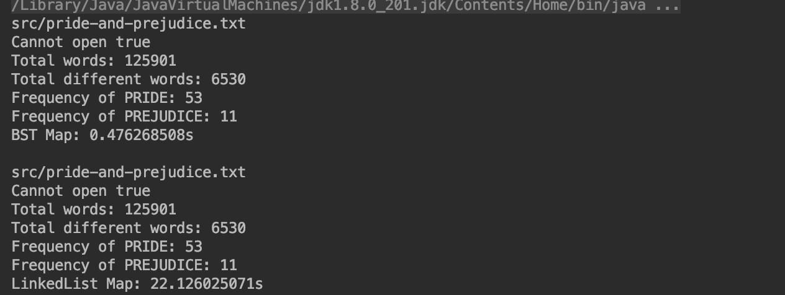

# 映射(Map)

**本章节暂不考虑`多重映射（键可以重复）`。**

或称字典（dict），能表示一一对应关系的数据结构（如数据库中，以id对应信息）。

- 存储（键，值）数据对的数据结构（Key，Value）。
- 根据键（Key），寻找值（Value）。

```java
// 映射接口
public interface Map<K, V> {
    void add(K, V);
    V remove(K);
    boolean contains(K);
    V get(K);
    void set(K, V);
    int getSize();
    boolean isEmpty();
}
```

## 时间复杂度

[Map实现比较：基于二叉搜索树 VS 基于链表](https://github.com/vfa25/dataStructure-algorithm/blob/master/datastructure/src/map/TestMap.java)

O(logn) VS O(n)，对于12万单词的文章，单词字典统计耗时：

|             | [LinkedListMap](https://github.com/vfa25/dataStructure-algorithm/blob/master/datastructure/src/map/LinkedListMap.java) | [BSTMap](https://github.com/vfa25/dataStructure-algorithm/blob/master/datastructure/src/map/BSTMap.java) |
|-------------|---------------| ----------- |
| 增 add      | O(n)          | O(h) 最好：O(logn) 最坏：O(n) |
| 删 remove   | O(n)          | O(h) 最好：O(logn) 最坏：O(n) |
| 改 set      | O(n)          | O(h) 最好：O(logn) 最坏：O(n) |
| 查 get      | O(n)          | O(h) 最好：O(logn) 最坏：O(n) |
| 查 contains | O(n)          | O(h) 最好：O(logn) 最坏：O(n) |
> 其中 h 为二叉搜索树深度

## 有序映射和无序映射

顾名思义，两者的差别就是`键`是否具有`顺序性`。

两者有各自的应用场景，在实现的层面，通常：

- 有序映射，基于`搜索树`实现。
- 无序映射，基于`哈希表`实现。
