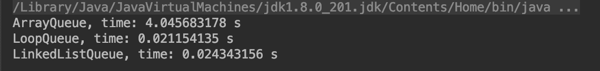
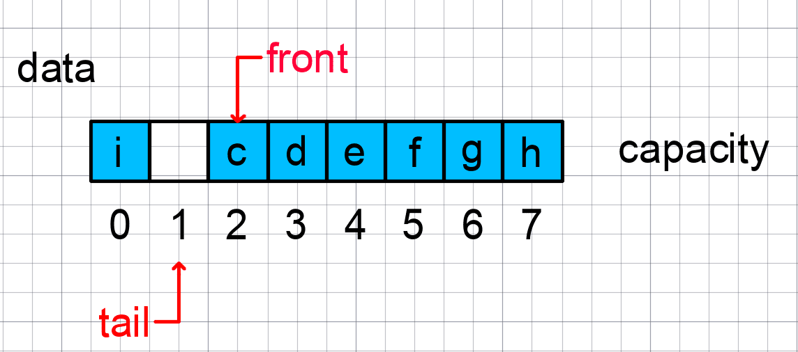

# 队列(Queue)

## Reference

- [Python之队列API](http://python.jobbole.com/87577/)

## 什么是“队列”

- 队列是一种操作受限的线性表数据结构。先进先出，First In First Out（FIFO）。
- 最基本的操作：入队 enqueue()，放一个数据到队列尾部；出队 dequeue()，从队列头部取一个元素。

## 语言提供的“队列”工具类

```py
from collections import deque（Python）
```

## 队列的常见形态

- 链表实现队列（出队操作`O(1)`的时间复杂度）

[Java版链表队列](https://github.com/vfa25/dataStructure-algorithm/blob/master/datastructure/src/queue/LinkedListQueue.java)

- 数组实现循环队列（避免数据搬移的解决方案，出队操作`O(1)`的时间复杂度）

  先来看一下处理 100000 个数据的用时，[测试普通队列和循环队列](https://github.com/vfa25/dataStructure-algorithm/blob/master/datastructure/src/queue/TestQueue.java)。
  

  关键是**确定好队空和队满的判定条件**。

  ```py
    class CircularQueue:
      def __init__(self, capacity):
          # 创建circularQueue
          self.items = [None]*capacity
          self.n = capacity
          self.head = 0
          self.tail = 0
      # 入队
      def enqueue(self, item):
          if (self.tail + 1) % self.n == self.head:
              return False
          self.items[self.tail] = item
          self.tail = (self.tail + 1) % self.n
          return True
      # 出队
      def dequeue(self):
          if self.tail == self.head:
              return None
          ret = self.items[self.head]
          self.head = (self.head + 1) % self.n
          return ret
    if __name__ == '__main__':
        circularQueue = CircularQueue(5)
        circularQueue.enqueue(3)
        circularQueue.enqueue(2)
        circularQueue.enqueue(1)
        print(circularQueue.head, circularQueue.tail) # 0, 3
        circularQueue.dequeue()
        print(circularQueue.head, circularQueue.tail) # 1, 3
  ```

  

  在用数组实现的循环队列中:
  - 队满的判断条件是 `(tail+1)%n == head`，队空的判断条件是 `head == tail`。
  - 其实，当队列满时，tail 指向的位置实际上是没有存储数据的。即`循环队列会浪费一个数组的存储空间`。

  [Java版循环队列](https://github.com/vfa25/dataStructure-algorithm/blob/master/datastructure/src/queue/LoopQueue.java)，在链接中的方法中，注解一下扩容/缩容方法`LoopQueue.resize`：

  ```java
  private void resize(int newCapacity) {
      // 注册新的容量
      E[] newData = (E[])new Object[newCapacity + 1];
      // 数据搬移：由于原队列front不一定为0；进行front索引归零，并防止索引越界
      for (int i = 0; i < size; i ++)
          newData[i] = data[(i + front) % data.length];

      data = newData;
      front = 0;
      tail = size;
  }
  ```

  显然，循环队列的遍历方法是起点为`i = front`，步长为`(i + 1) % 容量长度`，终点为`tail`。

- 阻塞队列

  1. 在队列的基础上增加阻塞操作，就成了阻塞队列。
  2. 阻塞队列就是在队列为空的时候，从队头取数据会被阻塞，因为此时还没有数据可取，直到队列中有了数据才能返回；如果队列已经满了，那么插入数据的操作就会被阻塞，直到队列中有空闲位置后再插入数据，然后在返回。
  3. 从上面的定义可以看出这就是一个“生产者-消费者模型”。这种基于阻塞队列实现的“生产者-消费者模型”可以有效地协调生产和消费的速度。当“生产者”生产数据的速度过快，“消费者”来不及消费时，存储数据的队列很快就会满了，这时生产者就阻塞等待，直到“消费者”消费了数据，“生产者”才会被唤醒继续生产。不仅如此，基于阻塞队列，我们还可以通过协调“生产者”和“消费者”的个数，来提高数据处理效率，比如配置几个消费者，来应对一个生产者。

- 并发队列

  1. 在多线程的情况下，会有多个线程同时操作队列，这时就会存在线程安全问题。能够有效解决线程安全问题的队列就称为并发队列。
  2. 并发队列简单的实现就是在enqueue()、dequeue()方法上加锁，但是锁粒度大并发度会比较低，同一时刻仅允许一个存或取操作。
  3. 实际上，基于数组的循环队列利用`CAS`原子操作，可以实现非常高效的并发队列。这也是循环队列比链式队列应用更加广泛的原因。

- 有限资源池(如数据库连接池)

  在资源有限的场景下，当没有空闲资源时，基本上都可以通过“队列”这种数据结构来实现请求排队。

## 优先队列

实现机制：

- Heap（Binary、Binomial多项式、Fibonacci)
- Binary Search Tree
