在《算法导论》第3版中是这样定义红黑树的：

A red-black tree is a binary tree that satisfies the following **red-black properties**:

1. Every node is either red or black.
2. The root is black.（注：若根结点存在，那么对应2-3树将是个2-结点或3-结点；反之，请看第3条）
3. Every leaf(NIL) is black.（注：叶子结点为空且为黑色结点，即叶子结点不存数据；这个特殊特性是为简化红黑树的代码实现而设计的，与**怎么样去进行调整有关，包括旋转、颜色**）
4. （红色性质）If a node is red, then both its children are black.（即红色结点是被黑色结点隔开的）
5. （黑色性质）For each node, all simple paths from the node
to descendant leaves contain the same number of black nodes.
（核心。已知2-3树是棵绝对平衡树，那么任一结点到叶子结点的深度将相同。易推导出：红黑树每经过一个黑色结点，将等价于2-3树的结点经过。**红黑树是保持`黑平衡`的二叉树**，严格意义上，它牺牲了平衡性，即并不是平衡二叉树）

在《算法(第4版)》（作者之一`Robert Sedgewick`正是红黑树的主要发明人）中是这样介绍的：
绕开了红黑树的这些基本性质，转而探索了另外一种平衡树`2-3树`（第3.3章节），这两者是有`等价性`的。

## 等价的2-3树

- 满足（二叉）搜索树的基本性质
- 结点可以存放一个元素（2-结点）或两个元素（3-结点）
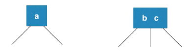
- 每个结点有2个或3个孩子结点，如图所示
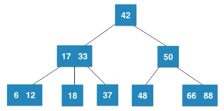
- **2-3树是一棵绝对平衡（从根结点到后代叶子结点，所经过的结点数量相同）的树**

### 2-3树的绝对平衡性

- 结点融合

  以添加操作为例，**恒不添加到一个空的位置（NIL）**，只会和最后找到的叶子结点作融合。
  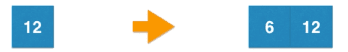
- 结点拆解

  - 当叶子结点短暂形成`4-结点`（含3个元素）临界，将拆解为3个`2-结点`（含1个元素）的子树。
  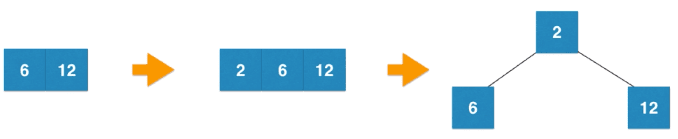
  - 若拆解后，整体树已不满足绝对平衡性，新的子树的根结点将向其父结点进行`结点融合`；
    1. 若后者原本是个`2-结点`，其将会融合为一个3-结点，此时整体树绝对平衡。
    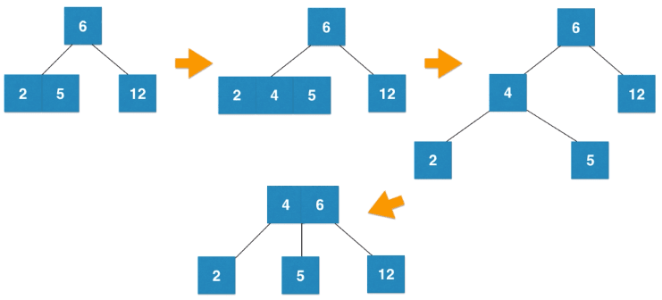
    2. 若后者原本是个`3-结点`，其将会短暂融合形成4-结点，临界拆解，此时整体树亦绝对平衡。
    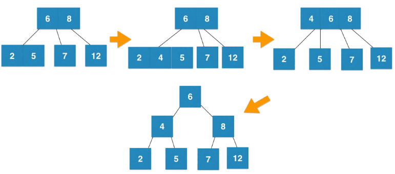

## 关联红黑树

- 假令我们先结识了2-3树，那红黑树对`2-结点`和`3-结点`如何表征
  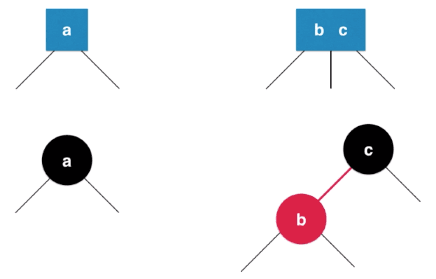

  - 图示中，元素b和元素c`在2-3树中是种并列关系`，这`在红黑树中以一条红色的边线`来表示。
  - 已知，每个结点与其父结点的连接，仅有一条边线；没有且无需为这条边线创建新的类。
  - 将结点b作红色标识，以表示它与父结点的连接，对应`在2-3树中并列关系`的特殊性。
  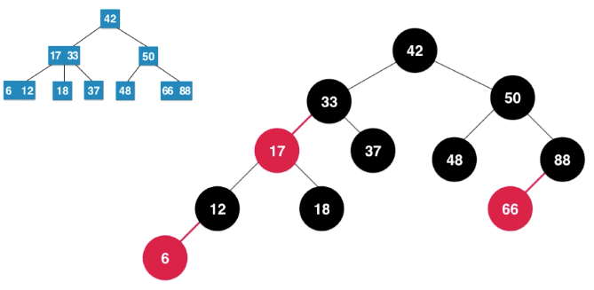

- 总结
  - **引入红色结点（即在结点上进行特殊定义），它将与父结点作为一个整体，来表征`2-3树的3-结点`的并列关系。**
  - **从定义角度上，红色的结点，恒向左倾斜。**

这时候再回到[该章节首部](#在《算法导论》第3版中是这样定义红黑树的)，再来看红黑树的五个特性就容易理解了。

### 红黑树的性能

由于`规则5`，可知红黑树的最大高度为$2logn$，那么增删改查也将是$O(logn)$的时间复杂度。

::: details 红黑树的高度计算
已知完全二叉树的高度近似$log_2{n}$（请看[这里](./binarySearchTree.html#时间复杂度分析)）。

假设将红黑树的红结点拿开，那么该树将变成多叉树，由于`规则5`，且由于其高度要低于完全二叉树，所以去掉红色结点的“黑树”的高度也不会超过$log_2{n}$。

根据`规则4`（即红色结点是被黑色结点隔开的），在加入红色结点之后，最长路径不会超过$2log_2{n}$。
:::

红黑树相比AVL树：优势在于增删，弱势在于查询。因为AVL树是一种高度平衡的二叉树，为了维持这种高度的平衡，在插入、删除操作时要付出更多的代价。

总而言之，红黑树**统计性能更优**（综合增删改查所有的操作）。

## 重点来了：添加元素

已知，红黑树的插入、删除操作会破坏红黑树的定义，即会破坏红黑树的平衡。所以，红黑树在插入、删除数据之后，如何调整平衡，继续当一棵合格的红黑树的？这里以插入操作为例。

### 添加新元素默认为红色结点

红黑树规定：往红黑树中添加元素，那么默认其为`红色结点`。Why？

这可以从两点切入理解，一是根据本章节开篇的5条规则，二是根据与2-3树的等价性。

1. 结合红黑树规则，插入黑色结点会改变黑色高度，必然违背`规则5`；插入红色结点只有一半几率违背`规则4`。
2. 等价2-3树的添加元素——融合进已有结点。因为2-3树添加一个新元素时
    - 要么添加进2-结点，形成一个3-结点
    - 要么添加进3-结点，暂时形成一个4-结点

### 颜色翻转（flipColors）

这里依然可以从两个角度

- 结合红黑树规则

  有这样两种特殊情况，非常好处理：

  1. 如果是首次插入，由于原树为空，将只会违反`规则2`，此时仅需涂黑根结点即可；
  2. 如果插入结点的父结点是黑色的，将不违背红黑树的规则，什么也不需要做。

  但是除此之外，就要开始**左右旋转**和**改变颜色**了：

  1. 插入结点的父结点和其叔叔结点（祖父结点的另一个子结点）均为红色的；
  2. 插入结点的父结点是红色，叔叔结点是黑色，且插入结点是其父结点的右子结点；
  3. 插入结点的父结点是红色，叔叔结点是黑色，且插入结点是其父结点的左子结点。

- 等价2-3树

  **约定：红黑树中，所有红色结点都是左倾斜的；即左倾红黑树**（注：该约定是为了后续操作简单，并非红黑树规则，红黑树的规则只有开篇的5个，即右倾红黑树可存在）。

  已知2-3树在添加元素时，一旦某个结点形成临时4-结点，其将拆解为三个2-结点构成的子树。
  那么这个子树的根结点将会涂成红色（因为其将向上融合），
  在当其恰巧是整颗树的根结点时，则需保持整棵树的根结点是黑色的。

  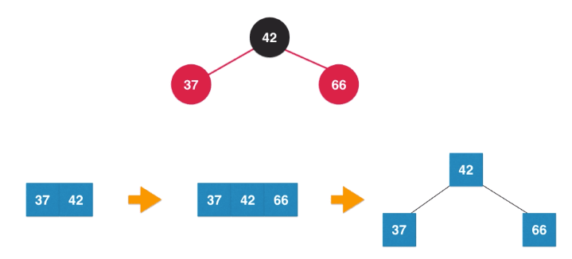

  那么此时仅需将结点42的两个子结点涂黑即可，而这棵子树的根结点要向上融合，故而涂为红色。

  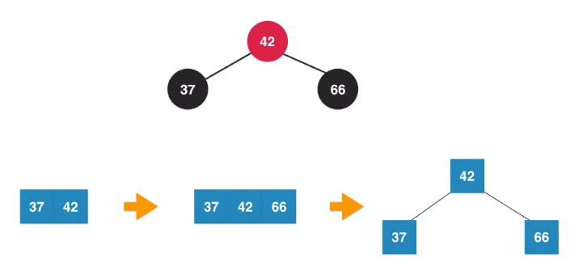

  ```js
  void flipColors(Node node) {
    node.color := RED
    node.left.color := BLACK
    node.right.color := BLACK
  }
  ```

::: warning
本篇将继续以等价2-3树的思路。以下旋转时机，请务必代入2-3的特性（对于结合红黑树规则的思路，参考文末链接）。
:::

### 调整平衡

对于等价2-3树中的3-结点添加元素，无外乎以下三种路径方式。

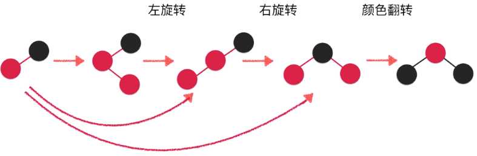

```js
// 维护黑平衡
if isRed(node.right) and !isRed(node.left)
  then node := leftRotate(node)

if isRed(node.left) and isRed(node.left.left)
  then node := rightRotate(node)

if isRed(node.left) and isRed(node.right)
  then flipColors(node)
```

维护时机：添加结点后回溯向上维护。

> 丐版红黑树实现请看[这里](https://github.com/vfa25/dataStructure-algorithm/blob/master/datastructure/src/tree/RedBlackTree.java)。

### 左旋转

左旋转：即围绕图示`node结点`的左旋。

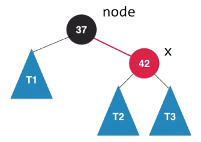
$\Rightarrow$
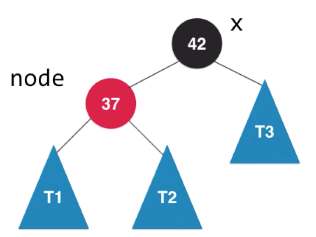

```js
Node leftRotate(Node node) {
  x := node.right

  node.right := x.left
  x.left := node

  x.color := node.color // node原来的颜色，左旋转过程中暂不维护红黑树的性质（If a node is red, then both its children are black.）
  node.color := RED

  return x
}
```

### 右旋转

右旋转：即围绕图示`node结点`的右旋。

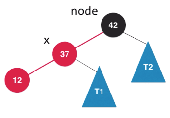
$\Rightarrow$
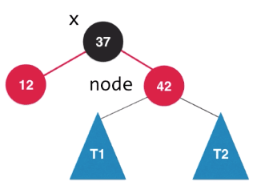

```js
Node rightRotate(Node node) {
  x := node.left

  node.left := x.right
  x.right := node

  x.color := node.color
  node.color := RED

  return x
}
```

### 更多关于红黑树

基于红黑树的Map和Set等等，都作为很多后端语言的标准库存在，如Java的TreeMap和TreeSet。

作为统计性能更优的代表，并列的还有：

- 伸展树(Splay Tree)。
  局部性原理：刚被访问的内容下次高概率被再次访问。

## Reference

[【数据结构和算法05】 红-黑树](https://blog.csdn.net/eson_15/article/details/51144079)
