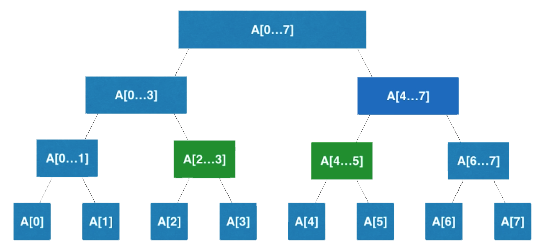

# 线段树(Segment Tree)

<font color=purple size=4>
线段树更多的是种思想，如何通过树这种数据结构，将大的数据单元拆解为小的数据单元，递归的通过数组或链表进行表征，进而高效的访问或更新操作。
</font>

即区间树。线段树不是完全二叉树，但是是平衡二叉树（即最大深度与最小深度之差不大于1）。

它在存储的时候很有意思，尽管并非满二叉树，但却可以构建为满二叉树，只不过部分叶子节点为null。

通过定制merge方法，其适用场景更加广泛。

## Why使用线段树

对于给定（固定）区间，其先天优势在于处理动态数据，即存在`更新操作`的区间。

- 更新：更新区间中的一个元素或者一个区间的值
- 查询：查询一个区间[i, j]的最大值，最小值，或者区间数字和。

## 应用场景

- 区间查询。即基于区间的统计查询。

如2018年注册用户中消费最高的用户。

如图，查询[2, 5]区间内的数据和:


## 拓展

进阶有很多较复杂的逻辑或场景，如懒惰更新、动态创建，（链式）动态线段树、二维（矩阵）线段树。

- 专注区间的数据结构：，区间操作另外一个重要的数据结构：树状数组（Binary Index Tree）。
- 区间相关经典问题：RMQ（Range Minimum Query）问题。

## 实现方式（静态数组）

如果区间内有n个元素，若选用数组表示需要有多少结点？

1. 根据等比数列求和，易知一个满二叉树一共有2<sup>h</sup>-1（其中h为深度）个结点；而最后一层有2<sup>h-1</sup>个结点；
即最后一层的结点数约等于前面所有层结点的和。
2. 如果n恰巧是2的整数次幂，那么只需要2n的空间即可（因为仅在叶子节点会真实存储数据，联想结论1易知）。
3. 如果最坏情况，则需要另外新加一层，故`4n`的静态空间即可完全保证。

[Java版线段树](https://github.com/vfa25/dataStructure-algorithm/blob/master/datastructure/src/segtree/SegmentTree.java)

### 创建线段树：O(n)

```pascal
// 已知数据源的拷贝data，去创建线段树tree
n := data.length
tree := new Array(4 * n) // 为线段树开辟4n的空间
buildSegmentTree(0, 0, n - 1)

Function buildSegmentTree(treeIndex, l, r)
  if l == r
    then return tree[treeIndex] := data[l]
  
  leftTreeIndex := 2 * treeIndex + 1 // 左子结点索引
  rightTreeIndex := 2 * treeIndex + 2 // 右子结点索引

  mid := l + (r - l) / 2
  buildSegmentTree(leftTreeIndex, l, mid) // 递归构建左子树
  buildSegmentTree(rightTreeIndex, mid + 1, r) // 递归构建右子树

  // 定制传入合并方法
  tree[treeIndex] := merger.merge(tree[leftTreeIndex], tree[rightTreeIndex])
End buildSegmentTree
```

### 区间查询：O(logn)

```pascal
// 已知线段树tree和数据源的拷贝data，查询区间[queryL...queryR]的值
query(0, 0, data.length - 1, queryL, queryR);

// 在以treeID为根的线段树中[l...r]的范围内，搜索区间[queryL...queryR]的值
Function query(int treeIndex, int l, int r, int queryL, int queryR)
  if l == queryL AND r == queryR
    then return tree[treeIndex]
  mid := l + (r - l) / 2
  leftTreeIndex = 2 * treeIndex + 1
  rightTreeIndex = 2 * treeIndex + 2

  if queryL >= mid + 1
    then return query(rightTreeIndex, mid + 1, r, queryL, queryR)
  else if queryR <= mid
    then return query(leftTreeIndex, l, mid, queryL, queryR)

  // 分支二路，分别继续查找左子树和右子树
  leftResult := query(leftTreeIndex, l, mid, queryL, mid)
  rightResult := query(rightTreeIndex, mid + 1, r, mid + 1, queryR)
  // 定制传入合并函数
  return merger.merge(leftResult, rightResult)
End query
```

### put更新操作：O(logn)

**后序遍历思想**。
更新操作的关键点是找到数据源的索引index，所对应的线段树上的`叶子结点索引`，最后根据后序遍历思想，回溯时访问结点并merge结果。

```pascal
data[index] := e // 更新数据源索引
set(0, 0, data.length - 1, index, e)

Function set(int treeIndex, int l, int r, int index, E e)
  if l == r
    then return tree[treeIndex] = e

  mid := l + (r - l) / 2
  leftTreeIndex := leftChild(treeIndex)
  ightTreeIndex := rightChild(treeIndex)

  if index >= mid + 1
    then set(rightTreeIndex, mid + 1, r, index, e)
  else
    set(leftTreeIndex, l, mid, index, e)

  // 更新父级结点
  tree[treeIndex] := merger.merge(tree[leftTreeIndex], tree[rightTreeIndex])
End set
```
