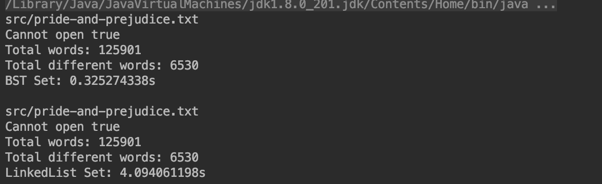

# 集合(Set)

**本章节暂不考虑`多重集（集合中的元素可以重复）`。**

前端的ES6引入了集合的概念，这种数据结构天然实现`去重`操作。

实现`集合`的方式可以有多种，而`二叉搜索树`就是个非常好的实现`集合`的数据结构。

```java
// 集合接口
public interface Set<E> {
  void add(E); // 不会添加重复元素
  void remove(E);
  boolean contains(E);
  int getSize();
  boolean isEmpty();
}
```

## 应用场景

- 客户统计
- 词汇量统计

## 时间复杂度

[Set实现比较：基于二叉搜索树 VS 基于链表](https://github.com/vfa25/dataStructure-algorithm/blob/master/datastructure/src/set/TestSet.java)

O(logn) VS O(n)，对于12万单词的文章，非重单词统计耗时：

|             | [LinkedListSet](https://github.com/vfa25/dataStructure-algorithm/blob/master/datastructure/src/set/LinkedListSet.java) | [BSTSet](https://github.com/vfa25/dataStructure-algorithm/blob/master/datastructure/src/set/BSTSet.java) |
|-------------|---------------| ----------- |
| 增 add      | O(n)          | O(h) 最好：O(logn) 最坏：O(n) |
| 查 contains | O(n)          | O(h) 最好：O(logn) 最坏：O(n) |
| 删 remove   | O(n)          | O(h) 最好：O(logn) 最坏：O(n) |
> 其中 h 为二叉搜索树深度

## 有序集合和无序集合

顾名思义，两者的差别就是元素是否具有`顺序性`。

两者有各自的应用场景，在实现的层面，通常：

- 有序集合，基于`搜索树`实现（能力更大的同时效率稍差，`O(logn)`的平均时间复杂度）；内置工具类，是以平衡二叉树实现的。
- 无序集合，基于`哈希表`实现（对于增删查，是无敌的`O(1)`时间复杂度）。
