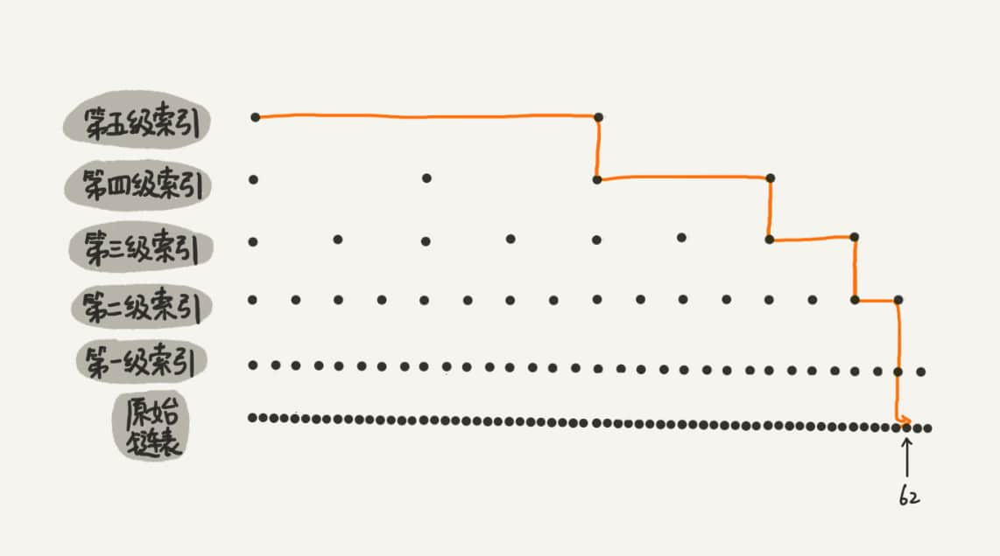

# 跳表(Skip List)

## 结构：链表与递归

作为一种`动态数据结构`，可以支持快速的插入、删除、查找操作，甚至可以替代`红黑树`。

Redis 中的有序集合`Sorted Set`的就是用跳表来实现的（还用到了哈希表）。

跳表示意图：

**这种链表加多级索引的结构，就是跳表**。

## 应用场景及优势

Redis的有序集合支持的操作主要有：

- 插入一个数据；
- 删除一个数据；
- 查找一个数据；
- 按照区间查找数据（比如查找值在[100, 365]之间的数据）；
- 迭代输出有序序列

增删改查，平衡二叉树也可以完成，而`跳表`的优势就在这个`按照区间查找数据`，跳表可以做到$O(logn)$的时间复杂度定位到区间的起点，然后在原始链表中顺序往后遍历就可以了。这非常高效。

另外：

- 相对红黑树，跳表更容易代码实现
- 跳表更加灵活，它可以通过改变索引构建策略，有效平衡执行效率和内存消耗。

## 时间复杂度

图示：若总数为`n`，第`k`级索引的结点个数是第`k-1`级索引的结点个数的$1/m$，则第`k`级索引结点的个数就是$n/m^k$。

- 假设索引有 h 级，最高级的索引有 2 个结点。通过该公式，可以得到$n/2^h=2$；移项可得$h=log_2{n-1}$，加上原始链表，那么整个跳表高度为$log_2{n}$；
- 此时若查询某一数据，如果每一层都要遍历 m 个结点，那在跳表中查询一个数据的时间复杂度就是$O(m*logn)$。
- 这里`m`的具体值，如以`二分结点`为例，当`k`级索引到`结点y`时满足`大于y且小于z（同级的后一结点）`，根据down指针下降到索引级`k-1`，此时是需要遍历3个结点的的（包括左y,中,右z）。那么时间复杂度即$O(logn)$。

## 空间复杂度

等比数列求和，$\sum_{i=1}^n{n/2^i} = n/2 + n/4 + n/8 + ... + 8 + 4 + 2 = n - 2$，即空间复杂度为$o(n)$。

## 特点

***高效的动态插入和删除***

跳表不仅支持查找操作，还支持动态的插入、删除操作，且时间复杂度也是$O(logn)$。

跳表本质上就是链表，所以仅插作，插入和删除操时间复杂度就为$O(1)$，但在实际情况中，要插入或删除某个节点，需要先查找到指定位置，而这个查找操作比较费时。

插入操作：查找操作$O(logn)$ * 插入操作$O(1)$。

删除操作：如果这个结点在索引中也有出现，除了要删除原始链表中的结点，还要删除索引中的。在查找要删除的结点的时候，还需要获取前驱结点，然后通过指针操作完成删除。

***跳表索引动态更新***

**出发点**：如果不停的往跳表中插入数据，也不更新索引，就有可能出现某 2 个索引结点之间数据非常多的情况。极端情况下，跳表还会退化成单链表。

**平衡性**：如同红黑树、AVL 树这样平衡二叉树，它们是通过左右旋的方式保持左右子树的大小平衡，而跳表是通过`随机函数`来维护“平衡性”。

往跳表中插入数据的时候，可以选择同时将这个数据插入到部分索引层中。

**How？** 通过一个随机函数，来决定将这个结点插入到哪几级索引中，比如随机函数生成了值 K，就将这个结点添加到第1级到第 K 级索引中。
