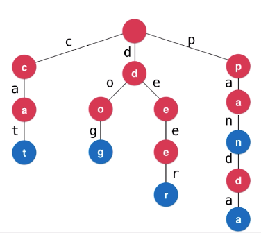

# 字典树(Trie)

又称前缀树，它更像是专门为字符串设计的集合和映射。

前景提要：起初被设计来做通讯录；将每个英文姓名作为字符串条目以构建Trie，在`isWord == true`结点保存每一条目的详细信息。

根据前面章节对字典（Map）的底层结构分析，在当使用搜索树时（有序映射，键可比较），其时间复杂度为$O(logn)$。
但是，Tire可以做到**查询每个条目的时间复杂度，和一共有多少条目无关，而是与查询的字符串长度相关，其时间复杂度为$O(w)$**。



- 每个结点有若干个指向下一个结点的指针
- 考虑不同的语言，不同的情境

```java
// 此处next指针以TreeMap或哈希表映射子结点
class Node {
  // char c; 甚至无需存储char值：字符，因为在查找前已经知道这个char了，直接next以映射方式找到结点即可
  boolean isWord; // 标志是否单词结束
  Map<char, Node> next; // 和二叉树左右指针类似，以映射存储多指针，更确切的说是以字符映射到结点，区别仅此而已
}
```

## Trie的局限性

**空间**。

从👆的Node类易知，每个结点仅存储了一个字符的信息，消耗的空间不免增大；同时当前字符映射到下一字符，也要为TreeMap开辟承载指针的空间。

## 拓展

- 更多的数据结构
  - 压缩字典树（Compressed Trie）：实现方式即预处理（动态拆分），以使每个结点存储多字符；在空间成本减少的同时，其副作用是，会增加维护成本。
  - 三分搜索树（Ternary Search Trie）：实现方式即next指针三分（对于一根结点a，根据compare，以$<a$、$==a$、$>a$作三分区）。
  - 后缀树：同样作为字符串模式识别。
- 更多字符串问题
  - 子串查询（如文本中的关键词搜索）：KMP、Boyer-Moore、Rabin-Karp。
  - 模式匹配（正则表达式引擎）。
  - 文件压缩
  - 编译原理
  - 生物科学领域：DNA。

## 基本操作

[Java实现Trie](https://github.com/vfa25/dataStructure-algorithm/blob/master/datastructure/src/trie/Trie.java)

### 添加操作

向Trie中添加新的单词word，迭代实现。

```pascal
Function add(String word)
  cur = root
  for i := 0 to word.length
    do
      c := word.charAt(i);
      if cur.next.get(c) == null
        then cur.next.put(c, new Node())
      cur := cur.next.get(c)

  // 标记单词结束，维护size
  if !cur.isWord
    then
      cur.isWord := true
      size ++
End add
```

### 查询操作

查询单词word是否在Trie中，迭代实现。

```pascal
Function boolean contains(String word)
  cur = root
  for i := 0 to word.length
    do
      c := word.charAt(i);
      if cur.next.get(c) == null
        then return false
      cur := cur.next.get(c)
  return cur.isWord
End contains
```

### 删除操作

首先查找到该预删除字符串的`isWord == true`结点；

- 如果这是个叶子结点，直接回溯上去，若同时满足父级结点没有其他的next指针，删除后者。
- 如果这不是个叶子结点，仅删除`isWord == true`的标记位即可。

```pascal
// 删除word，返回是否删除成功
Function boolean remove(String word)
  // 将搜索沿途的结点放入栈中，以备删除
  stack := new Stack()
  stack.push(root)
  for i := 0 to word.length()-1
    do
      if !stack.peek().next.containsKey(word.charAt(i))
        then return false
      stack.push(stack.peek().next.get(word.charAt(i)))

  if !stack.peek().isWord
    then return false

  // 将该结尾的isWord置空
  stack.peek().isWord = false
  size --

  // 如果单词最后一个字母的结点的next非空，
  // 说明trie还存储了其他以该单词为前缀的单词，直接返回
  if stack.peek().next.size() > 0 then return true
  else
    stack.pop()

  // 自底向上删除
  for i := word.length()-1 to 0
    do
      stack.peek().next.remove(word.charAt(i))
      // 如果一个结点的isWord为true，或者是其他单词的前缀，直接返回
      if stack.peek().isWord OR stack.peek().next.size() > 0 then return true
      stack.pop()
  
  return true
End remove
```
