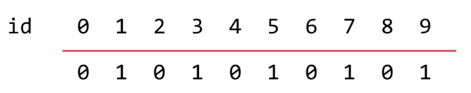
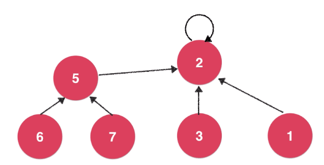
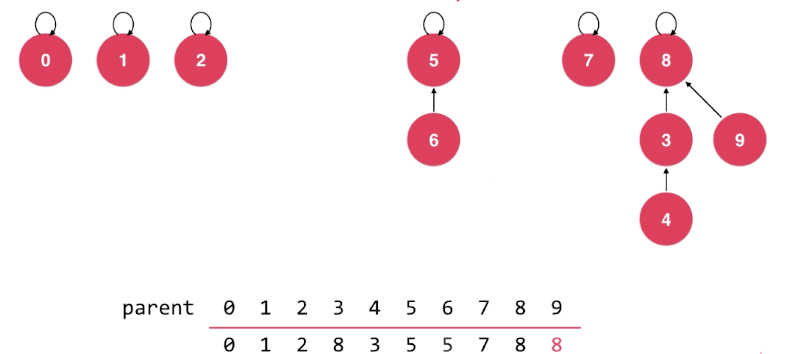
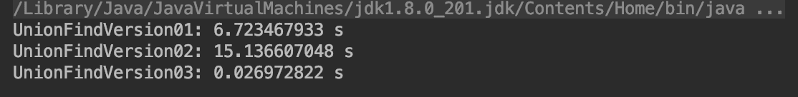
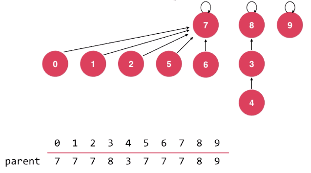
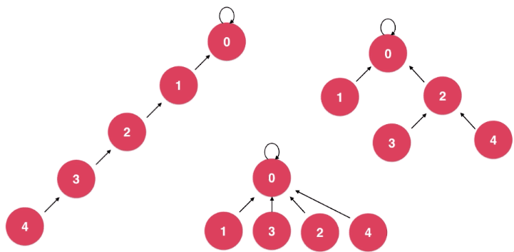

# 并查集(Union Find)

一种很不一样的树形结构。由子结点指向父结点，用以解决`连接问题（Connectivity Problem）`。

**什么是连接问题？**

- 网络中结点间的连接状态
  - 网络是个抽象的概念：用户之间形成的网络
- 数学中的集合类实现
  - 并集和查询

注：连接问题并非路径问题，前者要回答的问题往往较少，毕竟维护更多的信息会有额外的性能消耗。

并查集连接问题示意：指定两点是否连通。


## 基本动作

顾名思义，对于一组数据，主要支持两个动作：

- union(p, q) 集合并集
- isConnected(p, q) 给定数据是否属于一个集合
  - find(p) == find(q) 查询id是否在同一集合

## Quick Find（数组简单模拟）

图示中，以红线上方的数字表示元素id，红线下方表示前者所在的集合id。



- 查询连接操作，时间复杂度为$O(1)$。
- 并集操作，例如`union(1, 4)`，那么1或者4，其原有的集合也会连接。这样在修改时需要遍历操作，因此时间复杂度为$O(n)$。

数组简单实现：[并查集第1版（Java）](https://github.com/vfa25/dataStructure-algorithm/blob/master/datastructure/src/unionfind/UnionFindVersion01.java)

## Quick Union

注：这种子级指向父级的结构，有时被称为森林结构，该章节还是统一称为树结构。

将每个元素，看做是一个结点，它都将指向根结点（根结点则指向自己）。

- 若单个新结点，将要向已有结点树上任一结点进行合并操作，只需要将`前者`指向`后者的根结点`即可。
- 若新结点数上的任一结点，将要向已有结点树上任一结点进行合并操作，只需要将`前者的根结点`指向`后者的根结点`即可。



其实每个结点都有且仅有一个指针，因此可以以数组的方式存储。

- 如下图所示，每个结点id都保有父级结点的id映射。
- 当初始化时，每个结点均指向自身。
- 经过`union(4, 3)`、`union(3, 8)`、`union(6, 5)`、`union(9, 4)`后应如下图所示；
  在当执行`union(9, 4)`时，需先查询到`id==4的根结点`，再将`id==9`指向该根结点；
  这可以防止树状结构退化成链表。



- 查询连接操作，时间复杂度为$O(h)$，其中h为树状结构的深度
- 并集操作，时间复杂度为$O(h)$，其中h为树状结构的深度

```js
class UnionFind {
  // 构造函数，每个结点指针均指向自身
  constructor(int size) {
    this.parent := new Array(size)
    for i := 0 to size-1 do parent[i] = i end
  }

  // 辅助函数，用于查找根结点
  int find(int p) {
    if p < 0 OR p >= parent.length
        throw new Error("p is out of bound.")
    while p != parent[p]
      do
        p := parent[p]
    end
    return p
  }

  // 接口实现，两个结点间是否连接
  boolean isConnected(int p, int q)
    return find(p) == find(q)

  // 接口实现，并集操作
  void unionElements(int p, int q) {
    pRoot := find(p)
    qRoot := find(q)

    if pRoot == qRoot then return
    parent[pRoot] := qRoot
  }
}
```

树状结构实现：[并查集第2版（Java）](https://github.com/vfa25/dataStructure-algorithm/blob/master/datastructure/src/unionfind/UnionFindVersion02.java)

## size优化

上部分构建树结构时，有个很大的隐患，
就是在并集时，没有对两个参数的已有结构作判断，
其可能会使退化为链表的概率大幅增高，增加树的深度。

概括就是：将较小的树合并到较大的树上面。

```js
+ // 对union方法进行优化，首先全局维护私有数组 sz，初始化时元素均为 1，用以存储以索引i为根的集合中的元素个数
void unionElements(int p, int q) {
  pRoot := find(p)
  qRoot := find(q)

  if pRoot == qRoot then return
- parent[pRoot] := qRoot

+ // 根据两个元素所在树的元素个数不同判断合并方向
+ // 将元素个数少的集合合并到元素个数多的集合上
+ if sz[pRoot] < sz[qRoot]
+   then
+     parent[pRoot] := qRoot
+     sz[qRoot] += sz[pRoot]
+ else
+   parent[qRoot] := pRoot
+   sz[pRoot] += sz[qRoot]
}
```

树状结构size优化：[并查集第3版（Java）](https://github.com/vfa25/dataStructure-algorithm/blob/master/datastructure/src/unionfind/UnionFindVersion03.java)

图示为生成0-10万的随机整数，并执行10万次并和查操作用时：


## rank优化

如下图所示，此时若执行`union(4, 2)`，则结点8会指向结点7（后者结点数更多），层数直接变为4。
所以更优的合并方案是结点7指向结点8，因此，记录以某一结点为根的树的层数的思路，才是更优解。



注意rank的语义，表示排位、排名。概括以下几点

- 基于rank的优化，rank[i]表示根结点为i的树的层数。
- 在后续中，并不再维护rank的语意，即rank的值在路径压缩的过程中，有可能不再是树的层数值。
- 这也是称为rank，而不是height或者depth的原因, 它仅是作为一个比较的标准。
- 在路径压缩中，会出现同层结点rank不同的情况，但整体（root）的大小参考关系依然客观存在。
- 毕竟，维护“深度”这个语义，也会带来性能消耗，而且没有必要。

```js
+ // 对union方法进行优化，首先全局维护私有数组 rank，初始化时元素均为 1，用以存储以索引i为根的集合所表示的树的层数
void unionElements(int p, int q) {
  pRoot := find(p)
  qRoot := find(q)

  if pRoot == qRoot then return
- parent[pRoot] := qRoot

+ // 根据两个元素所在树的rank不同判断合并方向
+ // 将rank低的集合合并到rank高的集合上
+ if rank[pRoot] < rank[qRoot] then parent[pRoot] := qRoot
+ if rank[pRoot] > rank[qRoot] then parent[qRoot] := pRoot
+ else
+   parent[qRoot] := pRoot
+   rank[pRoot] ++
}
```

树状结构rank优化：[并查集第4版（Java）](https://github.com/vfa25/dataStructure-algorithm/blob/master/datastructure/src/unionfind/UnionFindVersion04.java)

## 路径压缩（Path Compression）

如下图所示，在表征连接时，它们并无区别。因此，只要能使树的深度降低，总是更优解。



思路既定，这时有一个结构设计问题——在什么时候进行路径压缩

考虑到性能开销和LRU（最近最少使用），这里选择在`find操作`时，顺便进行路径压缩。

- while循环优化，结果是每次while循环均会使出发结点到根结点的深度降低一层，并会趋向于直接指向根结点（其实这个更快，楼下递归方法，性能差一点点）

  [并查集第5版（Java）](https://github.com/vfa25/dataStructure-algorithm/blob/master/datastructure/src/unionfind/UnionFindVersion05.java)

  ```js
  int find(int p) {
    if p < 0 OR p >= parent.length
        throw new Error("p is out of bound.")
    while p != parent[p]
      do
  +     parent[p] := parent[parent[p]]
        p := parent[p]
    end
    return p
  }
  ```

- 递归实现优化，结果是一次性将深度降到最低（出发结点一次性指向根结点）

  [并查集第6版（Java）](https://github.com/vfa25/dataStructure-algorithm/blob/master/datastructure/src/unionfind/UnionFindVersion06.java)

  ```js
  int find(int p) {
    if p < 0 OR p >= parent.length
        throw new Error("p is out of bound.")

  - while p != parent[p]
  -   do
  -     p := parent[p]
  - end
  - return p
  + if p != parent[p] then parent[p] := find(parent[p])
  + return parent[p]
  }
  ```

## 时间复杂度

正如前文提到，并集和查询操作，时间复杂度均为$O(h)$，其中h为树状结构的深度。

严格意义上，并查集的时间复杂度结论为$O(log^*{n})$（iterated logarithm，并非一般的logn）。

<font size=6>$log^*{n} = \{^{\qquad0\qquad\qquad\qquad if(n\leq1)}_{1+log^*(logn)\qquad if(n>1)}$</font>

当n>1时，该式会一直递归，这是个比$O(logn)$还快的时间复杂度，近乎是$O(1)$级别。
