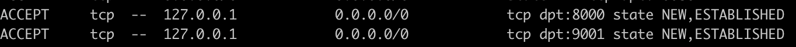
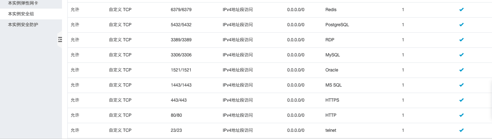

# 服务器安全防护

设置更严格的登录权限，比如修改登录端口甚至关闭掉密码登录的方式，来最大程度的守护服务器的账号安全，这是最基本的服务器防护方式。

购买新服务器后，建议取消默认22端口，取消密码直登，并更换服务器默认账号，使用自定义账号。

## 修改服务器登录默认端口

Linux默认22端口，透明即不安全，出于安全考虑，需要修改下默认端口。

0 ~ 65536端口号都是可用范围，但避免使用0 ~ 1024，通常会被系统程序占用，且需要root权限启动。

* 服务器配置文件编辑

  ``` sh
  sudo vim /etc/ssh/sshd_config
  ```

* 修改以下配置，其他配置项暂且不要修改

  ```bash
  # 不允许空密码
  PermitEmptyPasswords no
  # 密码验证登录，是否开关要看情况，
  # 通常前提是已经使用了 ssh 密钥验证方式（RSAAuthentication和PubkeyAuthentication）登录
  PasswordAuthentication yes
  # 如果你在服务器上手动添加了用户并将用户分配到 root 用户组，可以考虑禁止root用户登录
  PermitRootLogin no

  # 允许 pubkey 登录
  PubkeyAuthentication yes

  # Expect .ssh/authorized_keys2 to be disregarded by default in future.
  AuthorizedKeysFile      .ssh/authorized_keys .ssh/authorized_keys2

  # 登录的端口号
  Port 30000
  UseDNS no
  AllowUsers my_manager
  # 只允许 ip4
  AddressFamily inet
  ```

* 重启ssh服务

  ``` sh
  sudo service ssh restart
  ```

* 随后新开端口，ssh登录`ssh my_manager@47.110.224.7 -p 30000`即可

## iptables 防火墙配置

注：CentOS操作系统是有自带的firewalld，如果需要配置iptables需要先关了默认firewalld。

同样，Ubuntu也有ufw，此处不再累述，配置：[如何在Ubuntu 18.04上使用UFW设置防火墙](https://www.linuxidc.com/Linux/2018-06/152881.htm)。

iptables配置完成后，规则是自动立即生效的，但是机器重启动后，规则会丢失，配置：[Ubuntu 14.04 配置iptables防火墙](https://www.linuxidc.com/Linux/2017-02/140556.htm)。

Ubuntu下可以通过以下步骤保存iptables设置，并实现开机自动加载。

* 更新一下操作系统

  ``` sh
  sudo apt-get update && sudo apt-get upgrade
  ```

  如果出现以下报错

  ``` sh
  E: Could not get lock /var/lib/dpkg/lock - open (11 Resource temporarily unavailable)
  E: Unable to lock the administration directory (/var/lib/dpkg/) is another process using it? 
  ```

  可以采用

  ```sh
  ps aux | grep apt

  root      1531  0.0  0.0  53340  3732 ?        S    16:24   0:00 sudo apt-get upgrade
  root      1532  0.0  1.8 106184 75992 ?        S    16:24   0:07 apt-get upgrade
  ```

  找到`apt-get`开头的，执行`sudo kill -9 1531 && sudo kill -9 1532`，再重新更新。如果还失败，再`sudo rm /var/lib/dpkg/lock && sudo rm /var/cache/apt/archives/lock`，再重新更新。

* 规则配置
  * 先将原规则清空

    ``` sh
    iptables -F
    ```

  * Ubuntu默认没有iptables配置文件，需先生成自定义配置文件：

    iptables配置文件路径及文件名建议为`/etc/network/iptables.up.rules`，因为执行iptables-apply默认指向该文件，执行后者的原因是：Ubuntu 没有重启iptables的命令，需执行`iptables-apply`方能使配置生效（该命令也可以通过-w参数指定文件）；

    另外，如果配置文件设置了其他路径，可以执行命令`sudo iptables-restore < /etc/otherpath/iptables.up.rules`，然后执行`iptables-apply`使防火墙规则生效。

    现在来编辑一下配置文件：

    ``` sh
    sudo vi /etc/network/iptables.up.rules
    ```

    注：允许策略一定要写到拒绝的上面，否则没用

    ```bash
    *filter

    # Accepts all established inbound connections
    -A INPUT -m state --state ESTABLISHED,RELATED -j ACCEPT

    # Allows all outbound traffic
    # You could modify this to only allow certain traffic
    -A OUTPUT -j ACCEPT

    # Allows HTTP and HTTPS connections from anywhere (the normal ports for websites)
    -A INPUT -p tcp --dport 443 -j ACCEPT
    -A INPUT -p tcp --dport 80 -j ACCEPT
    # Allows SSH connections for script kiddies
    # THE -dport NUMBER IS THE SAME ONE YOU SET UP IN THE SSHD_CONFIG FILE
    -A INPUT -p tcp -m state --state NEW --dport 30000 -j ACCEPT

    # Now you should read up on iptables rules and consider whether ssh access
    # for everyone is really desired. Most likely you will only allow access from certain IPs.

    # 允许 ping
    -A INPUT -p icmp -m icmp --icmp-type 8 -j ACCEPT

    # Mongodb 开启端口访问权限
    -A INPUT -s 127.0.0.1 -p tcp --destination-port 27017 -m state --state NEW,ESTABLISHED -j ACCEPT
    -A OUTPUT -d 127.0.0.1 -p tcp --source-port 27017 -m state --state ESTABLISHED -j ACCEPT

    # log iptables denied calls (access via 'dmesg' command)
    -A INPUT -m limit --limit 5/min -j LOG --log-prefix "iptables denied: " --log-level 7

    # Drop incoming connections if IP make more than 150 connection attempts to port 80 within 60 seconds
    -A INPUT -p tcp --dport 80 -i eth0 -m state --state NEW -m recent --set
    -A INPUT -p tcp --dport 80 -i eth0 -m state --state NEW -m recent --update --seconds 60  --hitcount 150 -j DROP

    COMMIT
    ```

    以上述方法是配置规则并生效后，`iptables -L -n`查看，我这里截屏了入方向（阿里云服务器本身也有出入方向规则配置，这两个双放行才行）：

    

* Ubuntu iptables默认重启服务器后清空，配置开机自启动。
  [Ubuntu的iptables保存和重启后自动生效的方法](https://blog.csdn.net/u011355981/article/details/52288215)

  首先，如果用过CentOS，会发现它有个/etc/sysconfig目录，但Ubuntu没有。

  两种方案：
  1. OS启动生效：须要iptables的生效脚本保存到init.d目录。

    利用工具：`iptables-persistent`。这是一个开机启动脚本，在/etc/init.d/目录下。查看可知，它会将自定义的配置保存到文件：/etc/iptables/rules.v4或/etc/iptables/rules.v6。

    ***只需安装iptables-persistent，按提示保存***

    ``` sh
    apt-get install iptables-persistent
    # 重新保存
    sudo netfilter-persistent save
    ```

  2. 网卡启动时生效（下面分别是两种方法，但是我这里阿里云Ubuntu这俩方式测试均无效）：

    * `sudo vi /etc/network/interfaces`写入

      ```md
      pre-up iptables-restore < /etc/network/iptables.up.rules
      ```

    * `sudo vi /etc/network/if-up.d/iptables`，甚至`/etc/network/if-pre-up.d/iptables`写入

      ```bash
      #!/bin/sh
      iptables-restore /etc/network/iptables.up.rules
      ```

      给予`/etc/network/if-up.d/iptables`可执行的权限

      ``` sh
      chmod +x /etc/network/if-up.d/iptables
      ```

* 常用命令

  ``` sh
  # 启动
  modprobe ip_tables
  # 查看iptables策略：
  iptables -L -n
  # 保存策略到指定文件（后面文件路径及文件名可自定义）：
  iptables-save > /etc/network/iptables.up.rules
  # 应用策略
  iptables-apply，并输入y
  # 关闭
  iptalbes -F
  iptables -X
  iptables -Z
  iptables -P INPUT ACCEPT
  iptables -P OUTPUT ACCEPT
  iptables -P FORWARD ACCEPT
  modprobe -r ip_tables
  ```

## Fail2Ban 防御动作配置

Fail2Ban 可以看做是防御性的动作库，通过监控系统的日志文件，根据检测到的任何可疑的行为，自动触发不同的防御动作，如将产生可疑行为的目标，执行 IP 锁定等。

* 安装

  ``` sh
  sudo apt-get install fail2ban
  sudo apt-get install nginx sendmail iptables-persistent

  /etc/iptables/rules.v4
  ```

* 拷贝一份新的配置文件出来，重新编辑这个配置文件：

  ```md
  awk '{ printf "# "; print; }' /etc/fail2ban/jail.conf | sudo tee /etc/fail2ban/jail.local
  ```

* 打开`/etc/fail2ban/jail.conf`：

  ```md
  [DEFAULT]
  ignoreip = 127.0.0.1/8
  # host 被禁止的秒数。
  bantime  = 1h
  # host 被禁止之前的失败次数。
  maxretry = 3
  destemail = youemail@domain.com
  # 选择一种action模式
  action = %(action_mw)s

  [ssh]

  enabled  = true
  port     = ssh
  filter   = sshd
  logpath  = /var/log/auth.log
  maxretry = 3
  ```

## 阿里云服务器安全组配置

  
